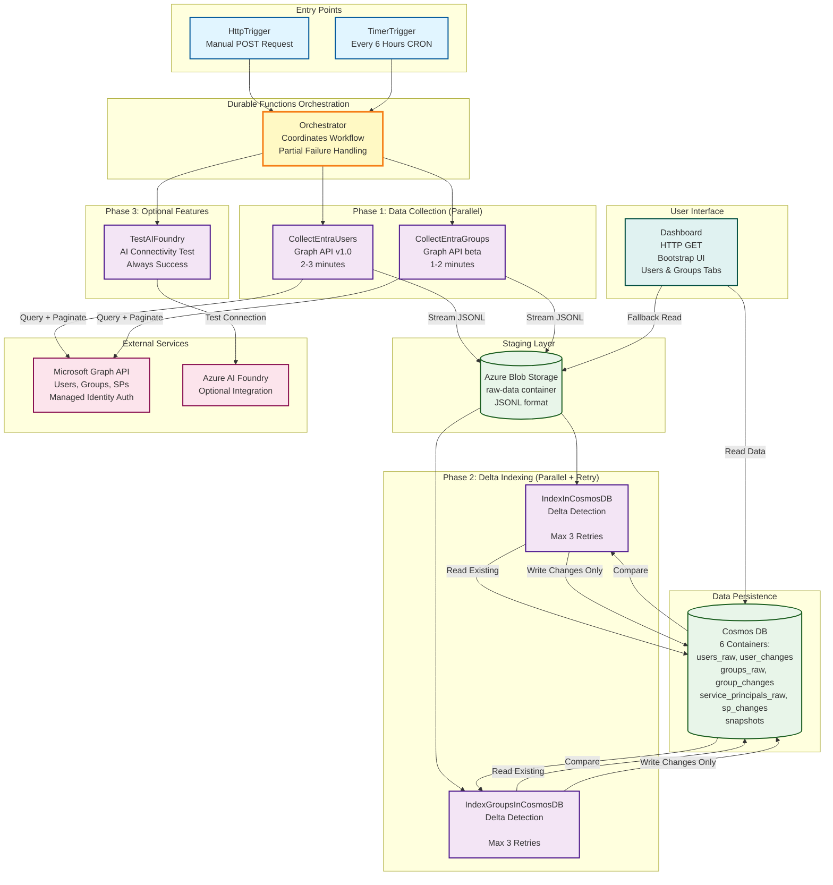
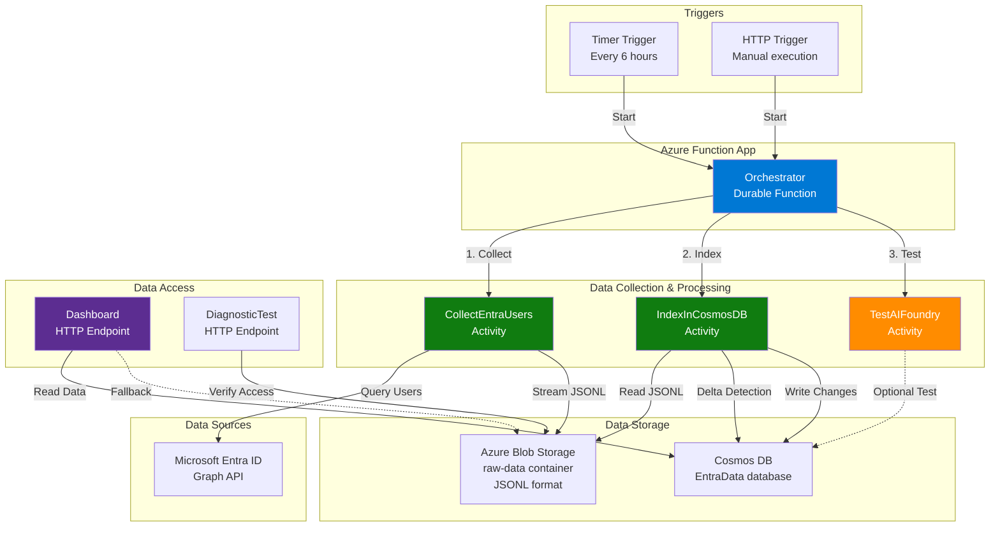
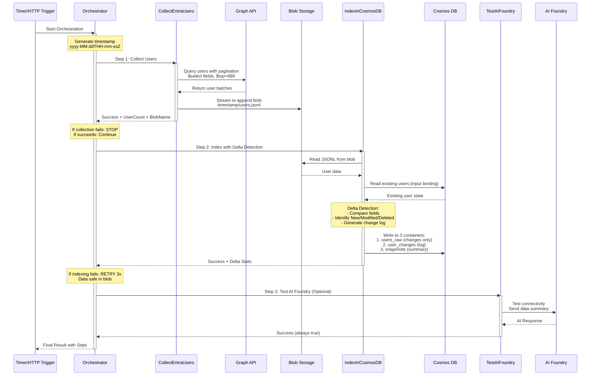

Entry Points: HTTP and Timer triggers that start the orchestration
Orchestrator: Central coordinator with partial failure handling
Phase 1 - Data Collection (Parallel):
CollectEntraUsers → Graph API v1.0
CollectEntraGroups → Graph API beta
Both stream to Blob Storage in JSONL format
Staging Layer: Azure Blob Storage as checkpoint/buffer
Phase 2 - Delta Indexing (Parallel with Retry):
IndexInCosmosDB with delta detection
IndexGroupsInCosmosDB with delta detection
Data Persistence: Cosmos DB with 6 containers
Phase 3 - Optional: AI Foundry connectivity test
UI: Dashboard for viewing user and group data
External Integrations: Microsoft Graph API and Azure AI Foundry
Workflow Understanding:
The system follows a modern delta architecture:
Triggers initiate the Orchestrator
Parallel collection streams data to Blob Storage (fast staging)
Parallel indexing with delta detection compares new vs existing data
Only changes (new/modified/deleted) written to Cosmos DB
Dashboard provides web UI for viewing the data

# Diagrams

## High-Level Architecture/Workflow Diagram

—————

