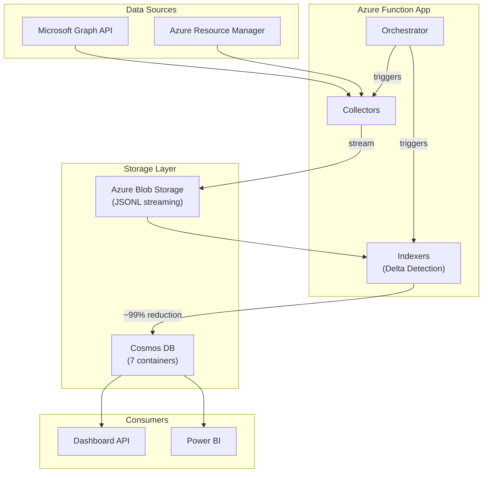
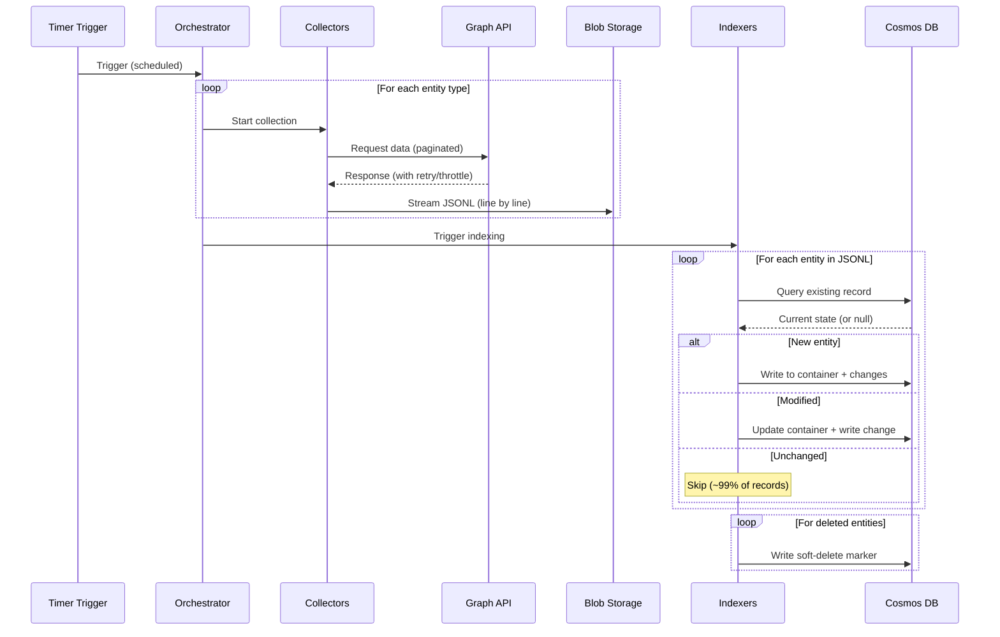
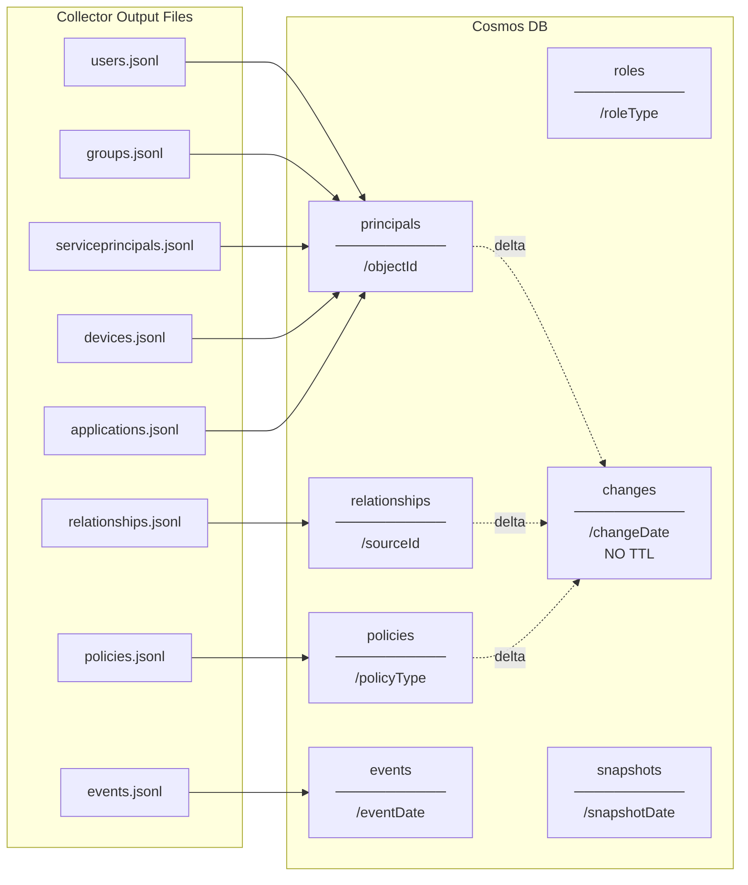
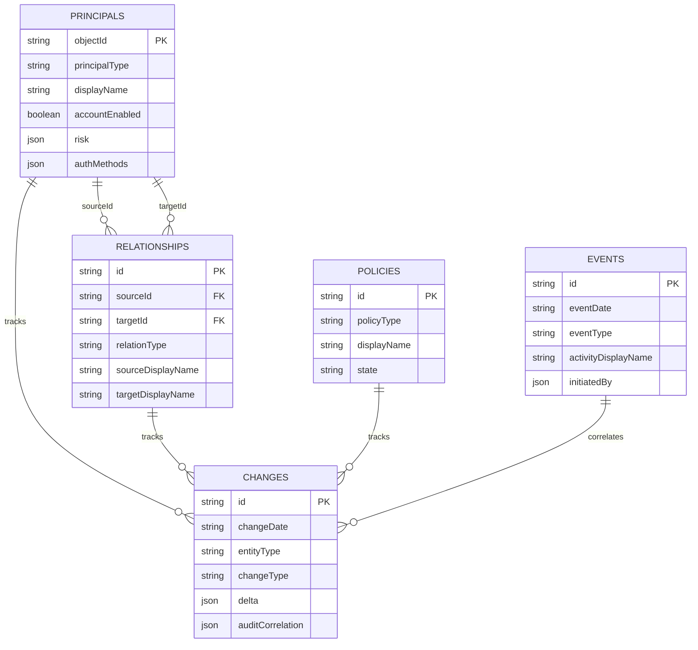
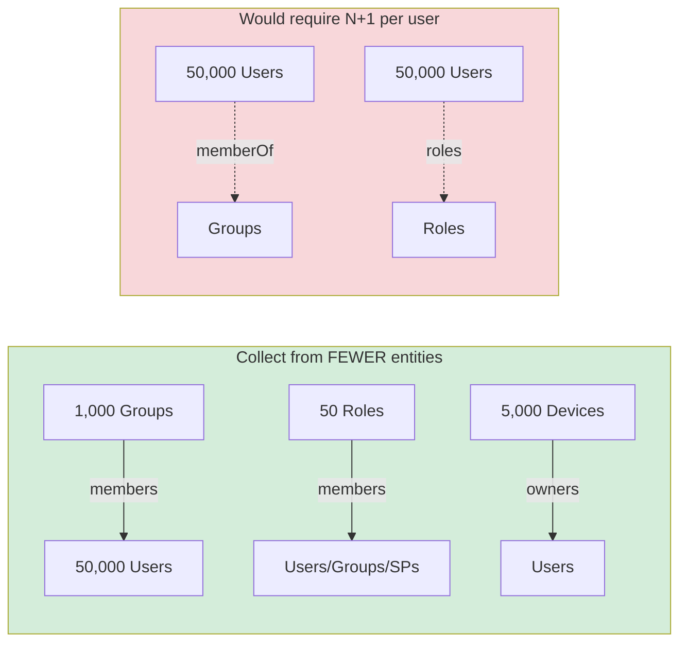
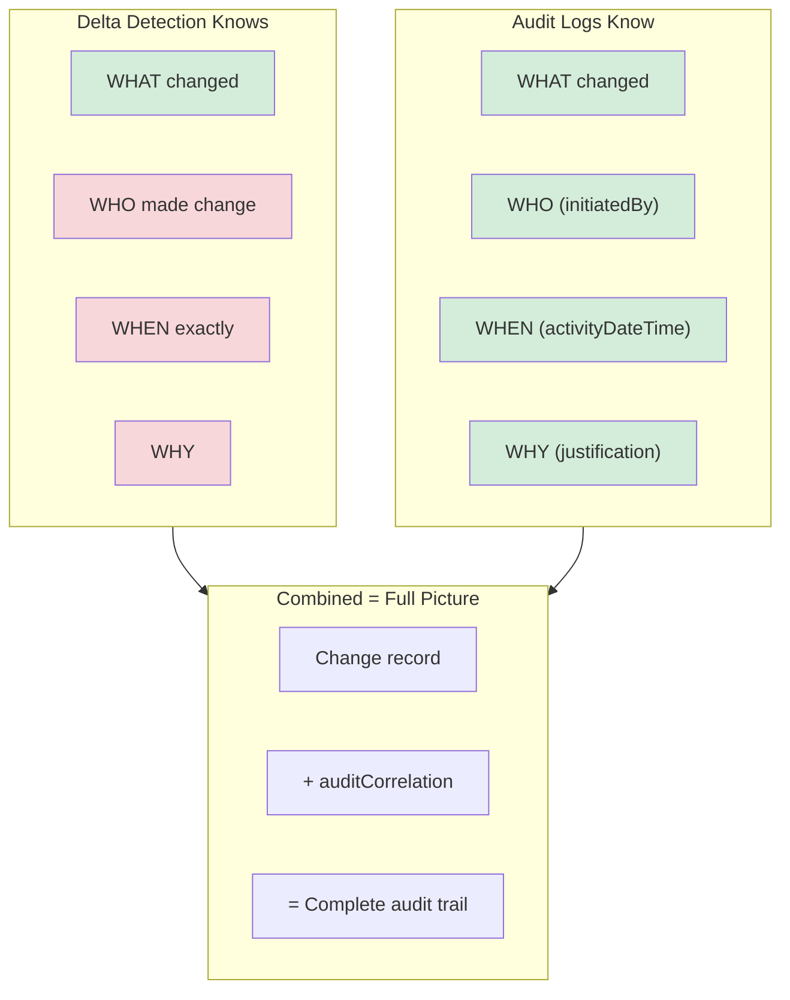

# Entra Risk Data Architecture

> **Purpose:** Architecture specification for the Entra Risk data collection and analysis platform.

---

## Overview

A data collection and analysis platform that:
- Collects Entra ID and Azure security data via Microsoft Graph API
- Stores data in Cosmos DB with intelligent delta detection (~99% write reduction)
- Enables historical trend analysis and audit correlation
- Powers dashboards and Power BI reporting

### High-Level Architecture



---

## Design Principles

| # | Principle | Description |
|---|-----------|-------------|
| 1 | **Collect Everything** | All properties, all relationships - comprehensive data capture |
| 2 | **Collect Once** | Each relationship from the most efficient API direction only |
| 3 | **Denormalize Generously** | Include displayNames and filter fields in relationships |
| 4 | **Wide Tables** | Minimize joins, maximize queryability for Power BI |
| 5 | **Delta Detection** | Only write changes to Cosmos (~99% reduction after first run) |
| 6 | **Historical Tracking** | Keep ALL changes permanently - enable trend analysis over years |

**Key insight:** ObjectIDs are immutable (never change), making them ideal for partition keys and stable references. DisplayNames are denormalized for convenience but relationships are keyed by ObjectID.

---

## Data Flow



### Key Patterns
- **Streaming to blob** - Memory efficient, handles any data volume
- **Delta detection** - Field-based comparison, ~99% write reduction
- **Retry with backoff** - Handles Graph API throttling gracefully
- **Parallel collection** - Multiple collectors run concurrently

---

## Storage Structure

### Cosmos DB Containers (7)



| Container | Partition Key | Contents |
|-----------|---------------|----------|
| `principals` | `/objectId` | Users, Groups, Service Principals, Apps, Devices, Admin Units |
| `relationships` | `/sourceId` | All memberships, roles, permissions, licenses |
| `roles` | `/roleType` | Directory roles, Azure roles, License SKUs (reference data) |
| `policies` | `/policyType` | CA policies, role management policies, named locations |
| `events` | `/eventDate` | Sign-ins, audits, risk detections |
| `changes` | `/changeDate` | Unified change log - **NO TTL** (permanent history) |
| `snapshots` | `/snapshotDate` | Collection run metadata |

### Type Discriminators

Every document includes a type discriminator field:
- **Principals:** `principalType` = `user | group | servicePrincipal | application | device | administrativeUnit`
- **Relationships:** `relationType` = `groupMember | directoryRole | pimEligible | azureRbac | ...`
- **Events:** `eventType` = `signIn | audit | riskDetection`

### Entity Relationship Model



---

## Schemas

### Principals Container

All principals share common fields plus type-specific fields.

#### Common Fields
```json
{
  "id": "{objectId}",
  "objectId": "{objectId}",
  "principalType": "user | group | servicePrincipal | application | device | administrativeUnit",
  "displayName": "...",
  "createdDateTime": "ISO-8601",
  "deleted": false,
  "deletedDateTime": null,
  "collectionTimestamp": "ISO-8601",
  "snapshotId": "run-timestamp"
}
```

#### User-Specific Fields
```json
{
  "principalType": "user",

  "userPrincipalName": "john@contoso.com",
  "mail": "john@contoso.com",
  "mailNickname": "john",
  "userType": "Member | Guest",
  "accountEnabled": true,

  "givenName": "John",
  "surname": "Doe",
  "jobTitle": "Engineer",
  "department": "IT",
  "companyName": "Contoso",
  "officeLocation": "Building A",
  "city": "Seattle",
  "state": "WA",
  "country": "US",
  "usageLocation": "US",

  "lastSignInDateTime": "ISO-8601",
  "lastNonInteractiveSignInDateTime": "ISO-8601",

  "onPremisesSyncEnabled": true,
  "onPremisesSamAccountName": "jdoe",
  "onPremisesUserPrincipalName": "jdoe@contoso.local",
  "onPremisesSecurityIdentifier": "S-1-5-...",
  "onPremisesLastSyncDateTime": "ISO-8601",

  "externalUserState": "Accepted | PendingAcceptance | null",
  "passwordPolicies": "DisablePasswordExpiration | ...",

  "managerId": "manager-object-id",
  "managerDisplayName": "Jane Manager",
  "managerUserPrincipalName": "jane@contoso.com",

  "risk": {
    "level": "none | low | medium | high | hidden",
    "state": "none | confirmedSafe | remediated | dismissed | atRisk | confirmedCompromised",
    "detail": "...",
    "lastUpdatedDateTime": "ISO-8601"
  },

  "authMethods": {
    "perUserMfaState": "disabled | enabled | enforced",
    "hasAuthenticator": true,
    "hasPhone": true,
    "hasFido2": false,
    "hasEmail": true,
    "hasPassword": true,
    "hasTap": false,
    "hasWindowsHello": false,
    "methodCount": 4,
    "methods": [...]
  }
}
```

#### Group-Specific Fields
```json
{
  "principalType": "group",

  "description": "All engineers",
  "mail": "engineering@contoso.com",
  "mailNickname": "engineering",
  "mailEnabled": true,
  "securityEnabled": true,
  "groupTypes": ["Unified", "DynamicMembership"],
  "membershipRule": "user.department -eq \"Engineering\"",
  "membershipRuleProcessingState": "On | Paused",
  "visibility": "Private | Public | HiddenMembership",
  "classification": "Confidential | Internal | Public",
  "isAssignableToRole": false,
  "resourceProvisioningOptions": ["Team"],

  "onPremisesSyncEnabled": true,
  "onPremisesSecurityIdentifier": "S-1-5-...",
  "onPremisesSamAccountName": "engineering",
  "onPremisesLastSyncDateTime": "ISO-8601",

  "memberCountDirect": 25,
  "memberCountTransitive": 150
}
```

#### Service Principal-Specific Fields
```json
{
  "principalType": "servicePrincipal",

  "appId": "app-guid",
  "appDisplayName": "Contoso API",
  "servicePrincipalType": "Application | ManagedIdentity | Legacy | SocialIdp",
  "accountEnabled": true,
  "appRoleAssignmentRequired": true,
  "appOwnerOrganizationId": "tenant-id",
  "homepage": "https://app.contoso.com",
  "loginUrl": "https://app.contoso.com/login",
  "logoutUrl": "https://app.contoso.com/logout",
  "replyUrls": ["https://app.contoso.com/callback"],
  "servicePrincipalNames": ["api://contoso", "https://app.contoso.com"],
  "tags": ["WindowsAzureActiveDirectoryIntegratedApp"],
  "notificationEmailAddresses": ["admin@contoso.com"],

  "oauth2PermissionScopes": [...],
  "appRoles": [...],

  "spCredentials": {
    "passwordCredentials": [...],
    "keyCredentials": [...],
    "federatedIdentityCredentials": [...],
    "hasExpiredCredentials": false,
    "hasExpiringCredentials": true,
    "earliestExpiry": "ISO-8601"
  }
}
```

#### Application-Specific Fields
```json
{
  "principalType": "application",

  "appId": "app-guid",
  "signInAudience": "AzureADMyOrg | AzureADMultipleOrgs | ...",
  "publisherDomain": "contoso.com",
  "verifiedPublisher": {
    "displayName": "Contoso Inc",
    "verifiedPublisherId": "..."
  },

  "credentials": {
    "secrets": [
      {
        "keyId": "...",
        "displayName": "Production Secret",
        "startDateTime": "ISO-8601",
        "endDateTime": "ISO-8601",
        "status": "active | expired | expiring_soon"
      }
    ],
    "certificates": [...],
    "secretCount": 2,
    "certificateCount": 1,
    "hasExpiredCredentials": false,
    "hasExpiringCredentials": true,
    "earliestExpiry": "ISO-8601"
  }
}
```

#### Device-Specific Fields
```json
{
  "principalType": "device",

  "deviceId": "device-guid",
  "operatingSystem": "Windows | iOS | Android | macOS | Linux",
  "operatingSystemVersion": "10.0.22621",
  "trustType": "AzureAd | ServerAd | Workplace",
  "profileType": "RegisteredDevice | SecureVM | Printer | Shared | IoT",
  "isCompliant": true,
  "isManaged": true,
  "isRooted": false,
  "managementType": "MDM | EAS",
  "manufacturer": "Microsoft Corporation",
  "model": "Surface Pro",
  "approximateLastSignInDateTime": "ISO-8601",
  "registrationDateTime": "ISO-8601"
}
```

#### Administrative Unit-Specific Fields
```json
{
  "principalType": "administrativeUnit",

  "description": "Users and devices in Seattle",
  "membershipType": "Assigned | Dynamic",
  "membershipRule": "user.city -eq \"Seattle\"",
  "membershipRuleProcessingState": "On | Paused",
  "visibility": "Public | HiddenMembership"
}
```

---

### Relationships Container

All relationships share common fields plus type-specific and denormalized fields.

#### Common Fields
```json
{
  "id": "{sourceId}_{targetId}_{relationType}",
  "sourceId": "source-object-id",
  "sourceType": "user | group | servicePrincipal | device",
  "sourceDisplayName": "John Doe",
  "targetId": "target-object-id",
  "targetType": "group | directoryRole | azureRole | device | application | license | user | administrativeUnit",
  "targetDisplayName": "Engineering Team",
  "relationType": "groupMember | directoryRole | pimEligible | pimActive | azureRbac | license | manager | appRoleAssignment | oauth2PermissionGrant",
  "collectionTimestamp": "ISO-8601",
  "snapshotId": "run-timestamp",
  "deleted": false
}
```

#### Denormalized Source Fields

**When source is USER:**
```json
{
  "sourceUserPrincipalName": "john@contoso.com",
  "sourceAccountEnabled": true,
  "sourceUserType": "Member | Guest"
}
```

**When source is GROUP:**
```json
{
  "sourceSecurityEnabled": true,
  "sourceMailEnabled": false,
  "sourceIsAssignableToRole": false
}
```

**When source is SERVICE PRINCIPAL:**
```json
{
  "sourceAppId": "app-guid",
  "sourceServicePrincipalType": "Application | ManagedIdentity",
  "sourceAccountEnabled": true
}
```

#### Denormalized Target Fields

**When target is GROUP:**
```json
{
  "targetSecurityEnabled": true,
  "targetMailEnabled": false,
  "targetVisibility": "Private | Public",
  "targetIsAssignableToRole": false
}
```

**When target is DIRECTORY ROLE:**
```json
{
  "targetRoleTemplateId": "62e90394-69f5-4237-9190-012177145e10",
  "targetIsPrivileged": true,
  "targetIsBuiltIn": true
}
```

**When target is AZURE ROLE:**
```json
{
  "targetRoleDefinitionId": "/providers/Microsoft.Authorization/roleDefinitions/...",
  "targetRoleDefinitionName": "Contributor",
  "scope": "/subscriptions/sub-id/resourceGroups/rg-name",
  "scopeType": "ManagementGroup | Subscription | ResourceGroup | Resource",
  "scopeDisplayName": "My Resource Group"
}
```

**When target is LICENSE:**
```json
{
  "targetSkuId": "sku-guid",
  "targetSkuPartNumber": "SPE_E5",
  "assignmentSource": "direct | inherited",
  "inheritedFromGroupId": "group-id",
  "inheritedFromGroupName": "Licensed Users"
}
```

#### Relationship-Specific Fields

**groupMember / groupMemberTransitive:**
```json
{
  "membershipType": "Direct | Transitive",
  "inheritancePath": ["group-a-id", "group-b-id"]
}
```

**directoryRole:**
```json
{
  "roleTemplateId": "...",
  "isBuiltIn": true,
  "isPrivileged": true
}
```

**pimEligible / pimActive:**
```json
{
  "assignmentType": "eligible | active",
  "memberType": "Direct | Group",
  "status": "Provisioned | PendingApproval | ...",
  "scheduleInfo": {
    "startDateTime": "ISO-8601",
    "expiration": {
      "type": "afterDateTime | afterDuration | noExpiration",
      "endDateTime": "ISO-8601",
      "duration": "P365D"
    }
  }
}
```

**manager:**
```json
{
  "targetUserPrincipalName": "manager@contoso.com",
  "targetJobTitle": "Director",
  "targetDepartment": "IT"
}
```

**appRoleAssignment:**
```json
{
  "appRoleId": "role-guid",
  "appRoleDisplayName": "User.Read.All",
  "appRoleDescription": "Read all users",
  "resourceId": "microsoft-graph-sp-id",
  "resourceDisplayName": "Microsoft Graph"
}
```

**oauth2PermissionGrant:**
```json
{
  "consentType": "AllPrincipals | Principal",
  "scope": "User.Read Mail.Read offline_access",
  "clientId": "client-app-sp-id",
  "clientDisplayName": "My App"
}
```

---

### Changes Container

Tracks all changes to principals, relationships, and policies permanently.

```json
{
  "id": "change-unique-id",
  "changeDate": "2024-06-15",
  "changeTimestamp": "2024-06-15T14:00:00Z",
  "snapshotId": "2024-06-15T14:00:00Z",

  "entityType": "principal | relationship | policy",
  "entitySubType": "user | group | groupMember | directoryRole | ...",
  "changeType": "new | modified | deleted",

  "objectId": "affected-object-id",
  "principalType": "user",
  "displayName": "John Doe",

  "sourceId": "user-object-id",
  "targetId": "group-object-id",
  "relationType": "groupMember",

  "delta": {
    "accountEnabled": { "old": true, "new": false }
  },

  "auditCorrelation": {
    "auditEventId": "audit-guid",
    "initiatedBy": "admin@contoso.com",
    "activityDateTime": "2024-06-15T10:30:00Z"
  }
}
```

**Critical:** No TTL on changes container. Partition by `/changeDate` for efficient time-range queries.

---

## Relationship Collection

### Collection Direction Principle

Always collect from the entity type with FEWER instances:



### Relationship Types

| Type | Source | Target | Collection Direction | API |
|------|--------|--------|---------------------|-----|
| `groupMember` | user/group | group | Groups → members | `/groups/{id}/members` |
| `groupMemberTransitive` | user | group | Groups → transitiveMembers | `/groups/{id}/transitiveMembers` |
| `groupOwner` | user | group | Groups → owners | `/groups/{id}/owners` |
| `directoryRole` | user/group/SP | role | Roles → members (bulk) | `/directoryRoles?$expand=members` |
| `pimEligible` | user/group | role | Bulk | `/roleManagement/directory/roleEligibilitySchedules` |
| `pimActive` | user/group | role | Bulk | `/roleManagement/directory/roleAssignmentSchedules` |
| `pimGroupEligible` | user | group | Bulk | `/identityGovernance/privilegedAccess/group/eligibilitySchedules` |
| `pimGroupActive` | user | group | Bulk | `/identityGovernance/privilegedAccess/group/assignmentSchedules` |
| `azureRbac` | user/group/SP | azureRole | Per subscription | Azure RM API |
| `appRoleAssignment` | user/group/SP | SP | Bulk or per SP | `/servicePrincipals/{id}/appRoleAssignedTo` |
| `oauth2PermissionGrant` | user | SP | Bulk | `/oauth2PermissionGrants` |
| `manager` | user | user | FREE with users | `/users?$expand=manager` |
| `license` | user | license | Per user | `/users/{id}/licenseDetails` |
| `deviceOwner` | user | device | Devices → owners | `/devices/{id}/registeredOwners` |
| `appOwner` | user/SP | application | Apps → owners | `/applications/{id}/owners` |
| `adminUnitMember` | user/group/device | AU | AUs → members | `/administrativeUnits/{id}/members` |

---

## Audit Log Integration

### Why Correlate Changes with Audit Logs



| Aspect | Delta Detection | Audit Logs |
|--------|-----------------|------------|
| What changed | Yes | Yes |
| Who made change | Unknown | initiatedBy |
| Exact time | Collection time only | activityDateTime |
| Why | Unknown | Justification (PIM) |

### Integration Strategy

1. Collect audit logs to `events` container
2. During indexing, correlate detected changes with audit events
3. Store `auditCorrelation` in change records when matched
4. Query-time: join changes with full audit details as needed

### Useful Audit Categories
- `GroupManagement` - Add/remove member
- `UserManagement` - Create/delete user
- `RoleManagement` - Role assignments
- `ApplicationManagement` - App permissions
- `Policy` - CA policy changes

---

## Delta Detection

### How It Works

Delta detection is **field-based**, not container-based. The system compares specific fields to determine if a record has changed.

```
1. Collector writes JSONL (streaming to blob)
   - All entities with type discriminator

2. Indexer triggered
   - Input binding: SELECT fields FROM container
   - Reads JSONL from blob

3. For each entity in blob:
   - Exists in Cosmos?
     - No → NEW (write to container + changes)
     - Yes → Compare fields
       - Different → MODIFIED (update container + write change)
       - Same → UNCHANGED (skip)

4. For each entity in Cosmos not in blob:
   - DELETED (write soft-delete marker to container + changes)
```

### IndexerConfigs.psd1

```powershell
@{
    principals = @{
        EntityType = 'principals'
        CompareFields = @(
            'displayName'
            'accountEnabled'
            'deleted'
            'userPrincipalName'
            'userType'
            'lastSignInDateTime'
            'risk'
            'authMethods'
            'groupTypes'
            'membershipRule'
            'securityEnabled'
            'servicePrincipalType'
            'spCredentials'
        )
        ArrayFields = @('groupTypes', 'servicePrincipalNames', 'tags')
        EmbeddedObjectFields = @('risk', 'authMethods', 'credentials', 'spCredentials')
        PartitionKey = 'objectId'
        WriteDeletes = $true
        IncludeDeleteMarkers = $true
    }

    relationships = @{
        EntityType = 'relationships'
        CompareFields = @(
            'sourceDisplayName'
            'sourceAccountEnabled'
            'targetDisplayName'
            'relationType'
            'membershipType'
            'assignmentType'
            'status'
            'scheduleInfo'
            'deleted'
        )
        ArrayFields = @('inheritancePath')
        EmbeddedObjectFields = @('scheduleInfo')
        PartitionKey = 'sourceId'
        WriteDeletes = $true
        IncludeDeleteMarkers = $true
    }
}
```

### Type-Aware Comparison

Delta detection handles null fields gracefully:
- User document: `userPrincipalName = "john@contoso.com"`
- Group document: `userPrincipalName = null`
- Comparison: `null -ne null` → false (no change)

This enables unified containers without changes to delta logic.

---

## Example Queries

### "How many times was User X added to a group in 8 months?"

From changes:
```sql
SELECT COUNT(1) FROM changes c
WHERE c.entityType = 'relationship'
  AND c.relationType = 'groupMember'
  AND c.sourceId = 'user-x-object-id'
  AND c.changeType = 'new'
  AND c.changeDate >= '2024-05-01'
```

From audit (exact timing):
```sql
SELECT * FROM events e
WHERE e.eventType = 'audit'
  AND e.category = 'GroupManagement'
  AND e.activityDisplayName = 'Add member to group'
  AND ARRAY_CONTAINS(e.targetResources, {'id': 'user-x-object-id'}, true)
```

### "Who granted Global Admin in last 30 days?"

```sql
SELECT e.targetResources[0].displayName as grantedTo,
       e.initiatedBy.user.displayName as grantedBy,
       e.activityDateTime
FROM events e
WHERE e.eventType = 'audit'
  AND e.activityDisplayName LIKE '%role%'
  AND e.targetResources[0].displayName = 'Global Administrator'
```

### "User X's complete access history"

```sql
SELECT * FROM changes c
WHERE c.sourceId = 'user-x-id'
  AND c.entityType = 'relationship'
ORDER BY c.changeTimestamp DESC
```

### "All disabled users with privileged roles"

```sql
SELECT r.sourceDisplayName, r.sourceUserPrincipalName,
       r.targetDisplayName, r.relationType
FROM relationships r
WHERE r.sourceAccountEnabled = false
  AND r.targetIsPrivileged = true
  AND r.deleted = false
```

---

## Dashboard

Dashboard queries use type discriminators to present familiar views:

```
Users | Groups | SPs | Devices | Roles | Policies | Changes | Events
```

### Backend Queries

```sql
-- Users tab
SELECT * FROM principals WHERE principalType = 'user'

-- Groups tab
SELECT * FROM principals WHERE principalType = 'group'

-- Roles tab
SELECT * FROM relationships
WHERE relationType IN ('directoryRole', 'pimEligible', 'pimActive')

-- Privileged Access view (all role types)
SELECT * FROM relationships
WHERE targetIsPrivileged = true
```

### Capabilities
- **Principal 360:** All relationships for one objectId
- **Privileged Access:** All role types in one view
- **Change Timeline:** All changes for any entity over time
- **Audit Correlation:** Changes + who made them + when

---

## Summary

| Aspect | Value |
|--------|-------|
| Cosmos containers | 7 |
| Partition strategy | ObjectID for principals, SourceID for relationships |
| Delta detection | ~99% write reduction |
| Historical tracking | Permanent (no TTL on changes) |
| Denormalization | DisplayNames + filter fields in relationships |
| Audit integration | Correlated with change records |

### Key Architectural Decisions

1. **ObjectID as partition key** - Immutable, stable reference
2. **Denormalize displayNames in relationships** - Power BI doesn't need joins
3. **No TTL on changes** - Enable historical queries over months/years
4. **Partition changes by /changeDate** - Efficient time-range queries
5. **Correlate with audit logs** - Know who/when/why for changes
6. **Collect relationships from efficient direction** - Groups → members, not users → groups

---

**End of Architecture Document**
