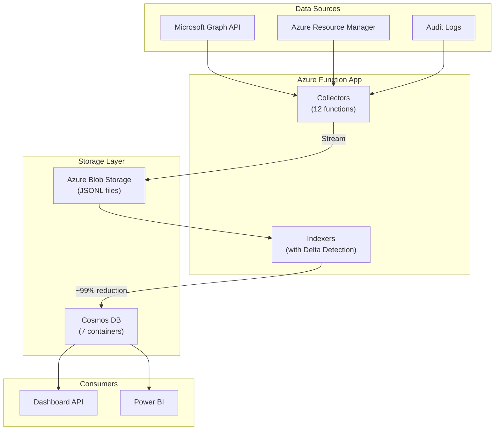
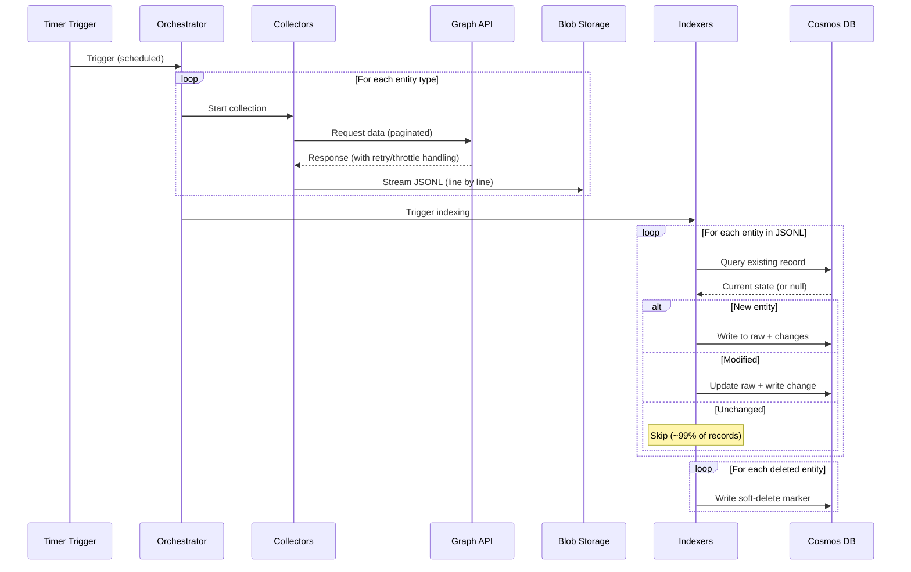
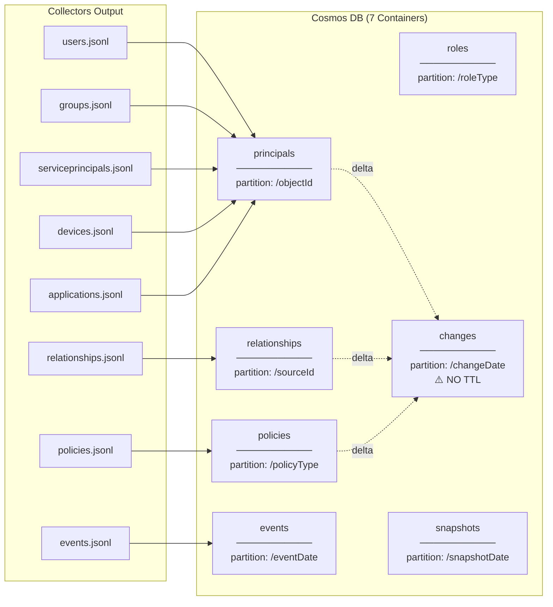
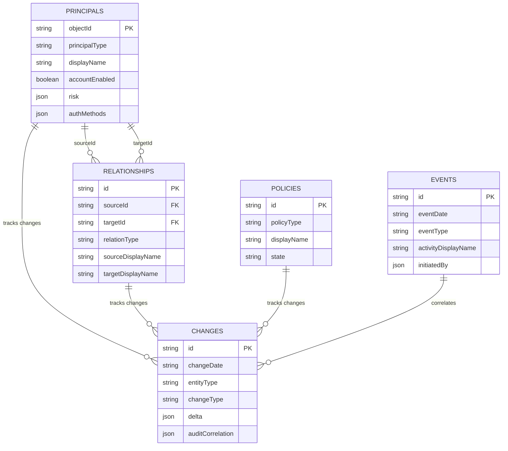
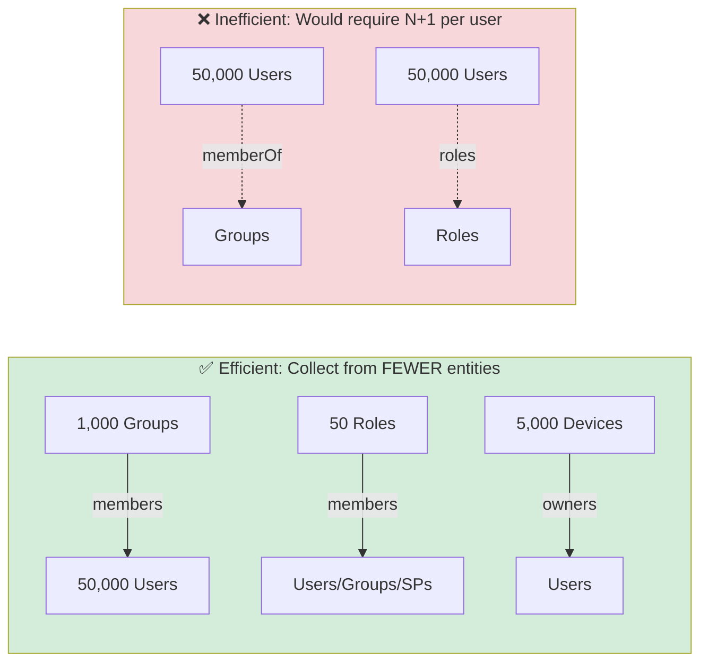
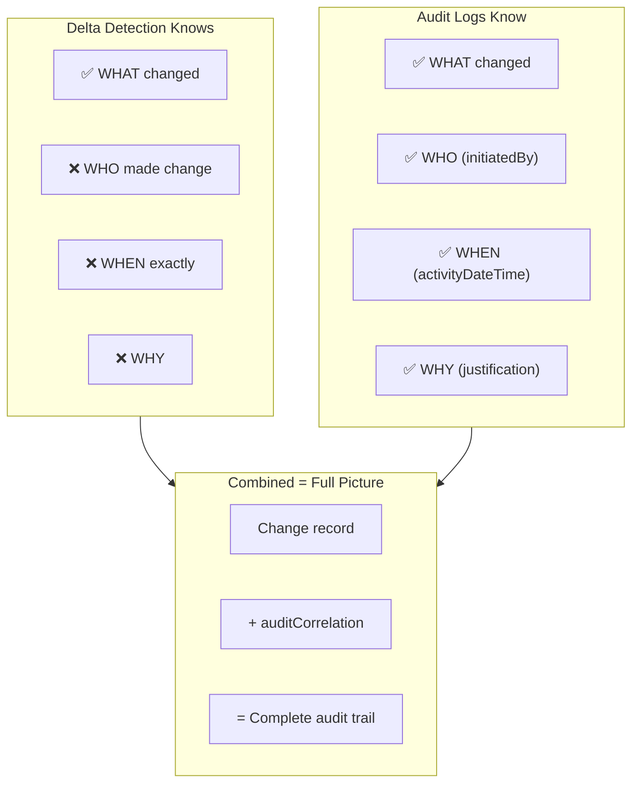

# Entra Risk Data Architecture - Handover Document

> **Purpose:** Complete architectural specification for redesigning the Entra Risk data collection system. This document contains all decisions, schemas, and implementation guidance needed to continue development.

---

## Executive Summary

**What we're building:** A data collection and analysis platform that collects Entra ID security data, stores it in Cosmos DB with delta detection, and enables historical trend analysis via Power BI.

**Key redesign goals:**
- Consolidate 28+ Cosmos containers → 7
- Add missing relationship data (group memberships, app permissions, etc.)
- Enable historical queries over months/years (not just 90 days)
- Integrate audit logs for "who did what when" context

### High-Level Architecture



---

## Design Philosophy

These 6 principles guide ALL architectural decisions:

| # | Principle | Description |
|---|-----------|-------------|
| 1 | **Collect Everything** | All properties, all relationships - don't be stingy |
| 2 | **Collect Once** | Each relationship from the most efficient API direction only |
| 3 | **Denormalize Generously** | Include displayNames, filter fields in relationships for Power BI |
| 4 | **Wide Tables** | Minimize joins, maximize queryability for Power BI developers |
| 5 | **Delta Detection** | Only write changes to Cosmos (~99% reduction after first run) |
| 6 | **Historical Tracking** | Keep ALL changes forever - enable trend analysis over months/years |

**Key insight on partition keys:** ObjectIDs are immutable (never change), making them ideal for partition keys. DisplayNames are denormalized for convenience but the relationships are keyed by ObjectID.

---

## Current State (What Exists)

### Current Collectors (12)
| Collector | Output |
|-----------|--------|
| CollectUsersWithAuthMethods | users.jsonl, userauthMethods.jsonl |
| CollectEntraGroups | groups.jsonl |
| CollectEntraServicePrincipals | serviceprincipals.jsonl |
| CollectRiskyUsers | riskyusers.jsonl |
| CollectDevices | devices.jsonl |
| CollectConditionalAccessPolicies | ca-policies.jsonl |
| CollectAppRegistrations | app-registrations.jsonl |
| CollectDirectoryRoles | directory-roles.jsonl |
| CollectPimData | pim-roles.jsonl, pim-groups.jsonl, role-policies.jsonl |
| CollectAzureRbacAssignments | azure-rbac.jsonl |
| CollectSignInLogs | signinlogs.jsonl |
| CollectDirectoryAudits | directory-audits.jsonl |

### Current Containers (28+)
Each entity type has `{entity}_raw` + `{entity}_changes` containers.

### Current Flow



### What Works Well (PRESERVE)
- Streaming to blob (memory efficient)
- Delta detection via IndexerConfigs.psd1
- Retry logic with exponential backoff
- Parallel collection with throttling

---

## Proposed State (What We're Building)

### Container Structure: 28+ → 7



| Container | Partition Key | Contents |
|-----------|---------------|----------|
| `principals` | `/objectId` | Users, Groups, SPs, Apps, Devices, Admin Units |
| `relationships` | `/sourceId` | All memberships, roles, permissions, licenses |
| `roles` | `/roleType` | Directory roles, Azure roles, License SKUs (reference data) |
| `policies` | `/policyType` | CA policies, role management policies |
| `events` | `/eventDate` | Sign-ins, audits, risk detections |
| `changes` | `/changeDate` | Unified change log - **NO TTL** (permanent) |
| `snapshots` | `/snapshotDate` | Collection run metadata |

### Type Discriminators

Every document has a discriminator field:
- **Principals:** `principalType = "user" | "group" | "servicePrincipal" | "application" | "device" | "administrativeUnit"`
- **Relationships:** `relationType = "groupMember" | "directoryRole" | "pimEligible" | "azureRbac" | ...`
- **Events:** `eventType = "signIn" | "audit" | "riskDetection"`

### Entity Relationship Model



---

## Gap Analysis

### Currently Collected → Preserved
| Data | Maps To |
|------|---------|
| Users + Auth Methods + Risky Users | principals (embedded authMethods, risk) |
| Groups | principals |
| Service Principals | principals |
| App Registrations | principals (as application) |
| Devices | principals |
| Directory Roles | roles (definitions) + relationships (assignments) |
| PIM Roles | relationships |
| PIM Groups | relationships |
| Role Policies | policies |
| CA Policies | policies |
| Azure RBAC | relationships |
| Sign-in Logs | events |
| Audit Logs | events |

### NEW - To Be Added
| Data | API | Priority | Notes |
|------|-----|----------|-------|
| **Group Memberships** | `/groups/{id}/members` | Critical | N+1 per group |
| **Manager Relationships** | `/users?$expand=manager` | High | FREE with $expand |
| **App Permissions (appRoleAssignment)** | `/servicePrincipals/{id}/appRoleAssignedTo` | High | Who has what API permissions |
| **Delegated Permissions (oauth2)** | `/oauth2PermissionGrants` | High | Bulk endpoint |
| **Administrative Units** | `/administrativeUnits` | Medium | Single call |
| **Licenses** | `/users/{id}/licenseDetails` | Medium | N+1 per user |
| **Device Ownership** | `/devices/{id}/registeredOwners` | Medium | N+1 per device |
| **App Ownership** | `/applications/{id}/owners` | Medium | N+1 per app |

### Structural Changes
| Change | From | To |
|--------|------|-----|
| Directory Roles | members[] embedded in role doc | Separate relationship docs |
| Changes TTL | 90 days | **Permanent** (no TTL) |
| Changes partition | /snapshotId | **/changeDate** |

---

## Schemas

### Principals Container

```json
{
  "id": "{objectId}",
  "objectId": "{objectId}",
  "principalType": "user | group | servicePrincipal | application | device | administrativeUnit",
  "displayName": "...",
  "accountEnabled": true,
  "createdDateTime": "ISO-8601",
  "deleted": false,
  "collectionTimestamp": "ISO-8601",

  // === USER-SPECIFIC (null for non-users) ===
  "userPrincipalName": "john@contoso.com",
  "mail": "john@contoso.com",
  "userType": "Member | Guest",
  "jobTitle": "Engineer",
  "department": "IT",
  "lastSignInDateTime": "ISO-8601",
  "onPremisesSyncEnabled": true | false | null,
  "externalUserState": "Accepted | PendingAcceptance | null",

  // Manager (denormalized from $expand)
  "managerId": "manager-object-id",
  "managerDisplayName": "Jane Manager",

  // Risk (embedded)
  "risk": {
    "level": "none | low | medium | high",
    "state": "none | atRisk | remediated | dismissed",
    "lastUpdatedDateTime": "ISO-8601"
  },

  // Auth Methods (embedded)
  "authMethods": {
    "perUserMfaState": "disabled | enabled | enforced",
    "hasAuthenticator": true,
    "hasPhone": true,
    "hasFido2": false,
    "methodCount": 3
  },

  // === GROUP-SPECIFIC (null for non-groups) ===
  "securityEnabled": true,
  "mailEnabled": false,
  "groupTypes": ["DynamicMembership"],
  "membershipRule": "user.department -eq 'IT'",
  "isAssignableToRole": false,
  "visibility": "Private | Public",
  "memberCountDirect": 25,
  "memberCountTransitive": 150,

  // === SP-SPECIFIC (null for non-SPs) ===
  "appId": "guid",
  "servicePrincipalType": "Application | ManagedIdentity",
  "appRoleAssignmentRequired": true,
  "spCredentials": {
    "hasExpiringCredentials": true,
    "earliestExpiry": "ISO-8601"
  },

  // === DEVICE-SPECIFIC (null for non-devices) ===
  "deviceId": "guid",
  "operatingSystem": "Windows",
  "isCompliant": true,
  "isManaged": true,
  "trustType": "AzureAd"
}
```

### Relationships Container

```json
{
  "id": "{sourceId}_{targetId}_{relationType}",
  "sourceId": "user-object-id",
  "sourceType": "user | group | servicePrincipal | device",
  "sourceDisplayName": "John Doe",
  "targetId": "group-object-id",
  "targetType": "group | directoryRole | azureRole | license | user | application",
  "targetDisplayName": "Engineering Team",
  "relationType": "groupMember | directoryRole | pimEligible | pimActive | azureRbac | license | manager | appRoleAssignment | oauth2PermissionGrant",
  "collectionTimestamp": "ISO-8601",
  "deleted": false,

  // === DENORMALIZED SOURCE FIELDS (for Power BI filtering) ===
  "sourceUserPrincipalName": "john@contoso.com",      // if source is user
  "sourceAccountEnabled": true,
  "sourceUserType": "Member | Guest",
  "sourceAppId": "guid",                               // if source is SP
  "sourceServicePrincipalType": "Application",

  // === DENORMALIZED TARGET FIELDS ===
  "targetSecurityEnabled": true,                       // if target is group
  "targetRoleTemplateId": "62e90394-...",             // if target is role
  "targetIsPrivileged": true,
  "targetRoleDefinitionName": "Contributor",           // if target is Azure role
  "scope": "/subscriptions/.../resourceGroups/...",
  "scopeType": "Subscription | ResourceGroup | Resource",

  // === RELATIONSHIP-SPECIFIC FIELDS ===
  "membershipType": "Direct | Transitive",             // for groupMember
  "assignmentType": "eligible | active",               // for PIM
  "scheduleInfo": { "startDateTime": "...", "expiration": {...} },
  "appRoleDisplayName": "User.Read.All",               // for appRoleAssignment
  "consentType": "AllPrincipals | Principal"           // for oauth2PermissionGrant
}
```

### Changes Container (Enhanced)

```json
{
  "id": "change-unique-id",
  "changeDate": "2024-06-15",
  "changeTimestamp": "2024-06-15T14:00:00Z",
  "snapshotId": "2024-06-15T14:00:00Z",

  "entityType": "principal | relationship | policy",
  "entitySubType": "user | group | groupMember | directoryRole | ...",
  "changeType": "new | modified | deleted",

  // For principals
  "objectId": "affected-object-id",
  "principalType": "user",
  "displayName": "John Doe",

  // For relationships
  "sourceId": "user-object-id",
  "targetId": "group-object-id",
  "relationType": "groupMember",

  // What changed (for modified)
  "delta": {
    "accountEnabled": { "old": true, "new": false }
  },

  // Audit correlation (when matched)
  "auditCorrelation": {
    "auditEventId": "audit-guid",
    "initiatedBy": "admin@contoso.com",
    "activityDateTime": "2024-06-15T10:30:00Z"
  }
}
```

**CRITICAL:** No TTL on changes container. Partition by `/changeDate` for time-range queries.

---

## Relationship Types (Complete List)

### Collection Direction Principle



| Type | Source | Target | Collection Direction | API |
|------|--------|--------|---------------------|-----|
| `groupMember` | user/group | group | Groups → members | `/groups/{id}/members` |
| `groupMemberTransitive` | user | group | Groups → transitiveMembers | `/groups/{id}/transitiveMembers` |
| `groupOwner` | user | group | Groups → owners | `/groups/{id}/owners` |
| `directoryRole` | user/group/SP | role | Roles → members (bulk) | `/directoryRoles?$expand=members` |
| `pimEligible` | user/group | role | Bulk | `/roleManagement/directory/roleEligibilitySchedules` |
| `pimActive` | user/group | role | Bulk | `/roleManagement/directory/roleAssignmentSchedules` |
| `pimGroupEligible` | user | group | Per group | `/identityGovernance/privilegedAccess/group/eligibilitySchedules` |
| `pimGroupActive` | user | group | Per group | `/identityGovernance/privilegedAccess/group/assignmentSchedules` |
| `azureRbac` | user/group/SP | azureRole | Per subscription | Azure RM API |
| `appRoleAssignment` | user/group/SP | SP | Bulk or per SP | `/servicePrincipals/{id}/appRoleAssignedTo` |
| `oauth2PermissionGrant` | user | SP | Bulk | `/oauth2PermissionGrants` |
| `manager` | user | user | FREE with users | `/users?$expand=manager` |
| `license` | user | license | Per user | `/users/{id}/licenseDetails` |
| `deviceOwner` | user | device | Devices → owners | `/devices/{id}/registeredOwners` |
| `appOwner` | user/SP | application | Apps → owners | `/applications/{id}/owners` |
| `adminUnitMember` | user/group/device | AU | AUs → members | `/administrativeUnits/{id}/members` |

---

## Audit Log Integration

### Why It Matters



| Aspect | Delta Detection | Audit Logs |
|--------|-----------------|------------|
| What changed | ✅ Yes | ✅ Yes |
| Who made change | ❌ Unknown | ✅ initiatedBy |
| Exact time | ❌ Collection time only | ✅ activityDateTime |
| Why | ❌ Unknown | ✅ Justification (PIM) |

### Integration Strategy

1. Collect audit logs to `events` container
2. During indexing, correlate detected changes with audit events
3. Store `auditCorrelation` in change records when matched
4. Query-time: join changes with full audit details as needed

### Useful Categories
- `GroupManagement` - Add/remove member
- `UserManagement` - Create/delete user
- `RoleManagement` - Role assignments
- `ApplicationManagement` - App permissions
- `Policy` - CA policy changes

---

## Example Queries

### "How many times was User X added to a group in 8 months?"

From changes:
```sql
SELECT COUNT(1) FROM changes c
WHERE c.entityType = 'relationship'
  AND c.relationType = 'groupMember'
  AND c.sourceId = 'user-x-object-id'
  AND c.changeType = 'new'
  AND c.changeDate >= '2024-05-01'
```

From audit (exact):
```sql
SELECT * FROM events e
WHERE e.eventType = 'audit'
  AND e.category = 'GroupManagement'
  AND e.activityDisplayName = 'Add member to group'
  AND ARRAY_CONTAINS(e.targetResources, {'id': 'user-x-object-id'}, true)
```

### "Who granted Global Admin in last 30 days?"

```sql
SELECT e.targetResources[0].displayName as grantedTo,
       e.initiatedBy.user.displayName as grantedBy,
       e.activityDateTime
FROM events e
WHERE e.eventType = 'audit'
  AND e.activityDisplayName LIKE '%role%'
  AND e.targetResources[0].displayName = 'Global Administrator'
```

### "User X's complete access history"

```sql
SELECT * FROM changes c
WHERE c.sourceId = 'user-x-id'
  AND c.entityType = 'relationship'
ORDER BY c.changeTimestamp DESC
```

---

## Dashboard UX

Storage consolidation ≠ UI change. Dashboard tabs stay familiar:

```
Users | Groups | SPs | Devices | Roles | Policies | Changes | Events
```

Backend queries use type discriminators:
```
Users tab    → SELECT * FROM principals WHERE principalType = 'user'
Groups tab   → SELECT * FROM principals WHERE principalType = 'group'
Roles tab    → SELECT * FROM relationships WHERE relationType IN ('directoryRole', 'pimEligible')
```

### New Capabilities Enabled
- **Principal 360:** All relationships for one objectId
- **Privileged Access:** All role types in one view
- **Change Timeline:** All changes for any entity over time
- **Audit Correlation:** Changes + who made them + when

---

## Implementation Phases

```mermaid
flowchart LR
    subgraph P1["Phase 1: Schema & Config"]
        P1A["IndexerConfigs.psd1"]
        P1B["Cosmos containers"]
        P1C["Remove TTL"]
    end

    subgraph P2["Phase 2: Collectors"]
        P2A["Add principalType"]
        P2B["Add relationType"]
        P2C["New collectors"]
        P2D["$expand=manager"]
    end

    subgraph P3["Phase 3: Indexers"]
        P3A["IndexPrincipals"]
        P3B["IndexRelationships"]
        P3C["Update delta logic"]
    end

    subgraph P4["Phase 4: Dashboard"]
        P4A["Update bindings"]
        P4B["Type discriminator queries"]
        P4C["New views"]
    end

    P1 --> P2 --> P3 --> P4

    style P1 fill:#e3f2fd
    style P2 fill:#fff3e0
    style P3 fill:#e8f5e9
    style P4 fill:#fce4ec
```



### Phase 1: Schema & Config
- Update IndexerConfigs.psd1 with `principals` and `relationships` configs
- Create new Cosmos containers (or reconfigure existing)
- Remove TTL from changes container

### Phase 2: Collectors
- Add `principalType` discriminator to all principal collectors
- Add `relationType` discriminator to relationship collectors
- Add new collectors: GroupMemberships, AppPermissions, Licenses, etc.
- Add `$expand=manager` to users collection

### Phase 3: Indexers
- Create IndexPrincipals (unified)
- Create IndexRelationships (unified)
- Update delta detection for new schemas

### Phase 4: Dashboard
- Update input bindings for new containers
- Update queries to use type discriminators
- Add new views (Principal 360, etc.)

---

## Summary

| Metric | Current | Proposed |
|--------|---------|----------|
| Cosmos containers | 28+ | 7 |
| Dashboard bindings | 38 | 7 |
| Power BI joins needed | Many | Minimal |
| Historical tracking | 90 days | **Permanent** |
| Group memberships | ❌ Missing | ✅ Collected |
| App permissions | ❌ Missing | ✅ Collected |
| Audit correlation | Siloed | **Integrated** |

---

## Key Decisions Made

1. **ObjectID as partition key** - Immutable, stable reference
2. **Denormalize displayNames in relationships** - Power BI doesn't need joins
3. **No TTL on changes** - Enable historical queries over months/years
4. **Partition changes by /changeDate** - Better for time-range queries
5. **Correlate with audit logs** - Know who/when/why for changes
6. **Collect relationships from most efficient direction** - Groups → members, not users → groups

---

**End of Handover Document**
