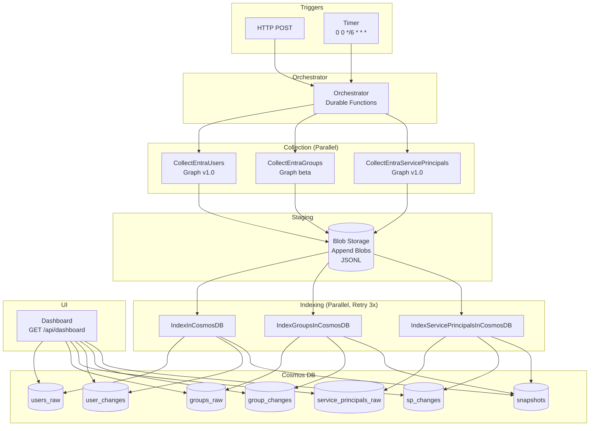

# Entra ID Risk Monitor

Collects Microsoft Entra ID identity data (users, groups, service principals), detects changes via delta comparison, and maintains immutable audit trails in Cosmos DB.

Runs every 6 hours. Only writes changed records to Cosmos DB (~95% write reduction in stable environments).

## Architecture



### Workflow

1. **Timer/HTTP** triggers **Orchestrator**
2. **Orchestrator** starts 3 collection activities in parallel (users, groups, service principals)
3. Each **Collection** function queries Graph API with pagination, streams JSONL to **Blob Storage** in 1MB chunks
4. **Orchestrator** starts 3 indexing activities in parallel (with retry logic)
5. Each **Indexing** function reads blob, compares to existing Cosmos data, writes only changes
6. **Dashboard** reads from Cosmos DB and displays current state + recent changes

### Failure Handling

| Component | On Failure |
|-----------|------------|
| User collection | Stop orchestration (critical) |
| Group collection | Continue with users only |
| SP collection | Continue with users only |
| User indexing | Retry 3x with 60s delay, then fail |
| Group/SP indexing | Retry 3x with 60s delay, then fail |
| TestAIFoundry | Always succeeds (graceful skip) |

---

## Prerequisites

- Azure subscription
- PowerShell 7.4+
- Az PowerShell module
- [Azure Functions Core Tools v4](https://learn.microsoft.com/en-us/azure/azure-functions/functions-run-local) (optional, for deployment)

### Graph API Permissions

The Function App's managed identity needs these **application permissions**:

| Permission | Purpose |
|------------|---------|
| `User.Read.All` | Read all users and sign-in activity |
| `Group.Read.All` | Read all groups |
| `Application.Read.All` | Read service principals |

Grant in Entra ID → Enterprise Applications → [Function App name] → API Permissions → Grant admin consent.

---

## Deployment

```powershell
cd Infrastructure

./deploy-pilot.ps1 `
    -SubscriptionId "your-subscription-id" `
    -TenantId "your-tenant-id" `
    -ResourceGroupName "rg-entrarisk-001" `
    -Location "swedencentral" `
    -Environment "dev" `
    -BlobRetentionDays 7
```

### Parameters

| Parameter | Required | Default | Description |
|-----------|----------|---------|-------------|
| `SubscriptionId` | Yes | - | Azure subscription GUID |
| `TenantId` | Yes | - | Entra ID tenant GUID |
| `ResourceGroupName` | No | `rg-entrarisk-pilot-001` | Resource group name |
| `Location` | No | `swedencentral` | Azure region |
| `Environment` | No | `dev` | dev/test/prod |
| `BlobRetentionDays` | No | `7` | Days before blob lifecycle transitions |

### What Gets Deployed

| Resource | SKU | Purpose |
|----------|-----|---------|
| Storage Account | Standard_LRS | Blob staging, Durable Functions state |
| Cosmos DB | Serverless | Persistent storage |
| Function App | Consumption (Y1) | Compute |
| Key Vault | Standard | Secrets |
| Log Analytics | PerGB2018 | Logging |
| Application Insights | - | APM |
| AI Foundry Hub + Project | Basic | Optional AI analysis |

### Manual Code Deployment

If Azure Functions Core Tools isn't installed:

```bash
cd FunctionApp
func azure functionapp publish <function-app-name> --powershell
```

---

## Configuration

Set automatically by Bicep. For local development, create `FunctionApp/local.settings.json`:

```json
{
  "IsEncrypted": false,
  "Values": {
    "FUNCTIONS_WORKER_RUNTIME": "powershell",
    "AzureWebJobsStorage": "UseDevelopmentStorage=true",
    "TENANT_ID": "your-tenant-id",
    "STORAGE_ACCOUNT_NAME": "your-storage-account",
    "COSMOS_DB_ENDPOINT": "https://your-cosmos.documents.azure.com:443/",
    "COSMOS_DB_DATABASE": "EntraData",
    "CosmosDbConnectionString": "AccountEndpoint=...;AccountKey=...",
    "ENABLE_DELTA_DETECTION": "true",
    "BATCH_SIZE": "999"
  }
}
```

### Environment Variables

| Variable | Required | Default | Description |
|----------|----------|---------|-------------|
| `TENANT_ID` | Yes | - | Entra ID tenant |
| `STORAGE_ACCOUNT_NAME` | Yes | - | Storage account name |
| `COSMOS_DB_ENDPOINT` | Yes | - | Cosmos DB endpoint URL |
| `COSMOS_DB_DATABASE` | Yes | - | Database name |
| `CosmosDbConnectionString` | Yes | - | Connection string for bindings |
| `ENABLE_DELTA_DETECTION` | No | `true` | Enable delta comparison |
| `BATCH_SIZE` | No | `999` | Graph API page size |
| `STORAGE_CONTAINER_RAW_DATA` | No | `raw-data` | Blob container name |

---

## How It Works

### Data Collection

Each collection function:

1. Validates required environment variables
2. Gets cached managed identity tokens (55-min cache)
3. Queries Graph API with pagination (999 items/page)
4. Transforms to camelCase with `objectId` as key
5. Streams to append blob (flushes every ~1MB)
6. Returns count and blob path

#### Graph API Queries

**Users** (`/v1.0/users`):
```
$select=userPrincipalName,id,accountEnabled,userType,createdDateTime,
        signInActivity,displayName,passwordPolicies,usageLocation,
        externalUserState,externalUserStateChangeDateTime,
        onPremisesSyncEnabled,onPremisesSamAccountName,
        onPremisesUserPrincipalName,onPremisesSecurityIdentifier
```

**Groups** (`/beta/groups`) - beta required for `isAssignableToRole`:
```
$select=displayName,id,classification,deletedDateTime,description,
        groupTypes,mailEnabled,membershipRule,securityEnabled,
        isAssignableToRole,createdDateTime,visibility,
        onPremisesSyncEnabled,onPremisesSecurityIdentifier,mail
```

**Service Principals** (`/v1.0/servicePrincipals`):
```
$select=id,appDisplayName,accountEnabled,addIns,displayName,appId,
        appRoleAssignmentRequired,deletedDateTime,description,
        oauth2PermissionScopes,resourceSpecificApplicationPermissions,
        servicePrincipalNames,servicePrincipalType,tags,notes
```

### Delta Detection

Each indexing function:

1. Reads JSONL from blob into hashtable (keyed by `objectId`)
2. Reads existing records from Cosmos via input binding
3. Compares field-by-field:
   - In current but not existing → **NEW**
   - In existing but not current → **DELETED** (soft delete with 90-day TTL)
   - In both, fields differ → **MODIFIED**
   - In both, fields same → **UNCHANGED** (skip write)
4. Writes changed records via output binding
5. Writes change log entries with delta details
6. Writes snapshot summary

#### Compared Fields

| Entity | Fields |
|--------|--------|
| Users | `accountEnabled`, `userType`, `lastSignInDateTime`, `userPrincipalName`, `displayName`, `passwordPolicies`, `usageLocation`, `externalUserState`, `externalUserStateChangeDateTime`, `onPremisesSyncEnabled`, `onPremisesSamAccountName`, `onPremisesUserPrincipalName`, `onPremisesSecurityIdentifier` |
| Groups | `displayName`, `classification`, `description`, `groupTypes`, `mailEnabled`, `membershipRule`, `securityEnabled`, `isAssignableToRole`, `visibility`, `onPremisesSyncEnabled`, `mail` |
| Service Principals | `accountEnabled`, `appRoleAssignmentRequired`, `displayName`, `appDisplayName`, `servicePrincipalType`, `description`, `notes`, `deletedDateTime`, `addIns`, `oauth2PermissionScopes`, `resourceSpecificApplicationPermissions`, `servicePrincipalNames`, `tags` |

Array fields (`groupTypes`, `addIns`, `oauth2PermissionScopes`, etc.) are compared via JSON serialization.

### Soft Delete

Entities removed from Entra ID are marked as deleted, not removed:

```json
{
  "objectId": "...",
  "deleted": true,
  "deletedTimestamp": "2025-01-05T14:30:00Z",
  "ttl": 7776000
}
```

TTL of 7776000 seconds = 90 days. Cosmos DB auto-removes after TTL expires.

---

## Functions Reference

### Triggers

| Function | Type | Schedule/Route |
|----------|------|----------------|
| `TimerTrigger` | Timer | `0 0 */6 * * *` (every 6 hours) |
| `HttpTrigger` | HTTP POST | `/api/HttpTrigger` |
| `Dashboard` | HTTP GET | `/api/dashboard` |

### Activities

| Function | Input | Output |
|----------|-------|--------|
| `CollectEntraUsers` | `{Timestamp}` | `{Success, UserCount, BlobName, Summary}` |
| `CollectEntraGroups` | `{Timestamp}` | `{Success, GroupCount, BlobName, Summary}` |
| `CollectEntraServicePrincipals` | `{Timestamp}` | `{Success, ServicePrincipalCount, BlobName, Summary}` |
| `IndexInCosmosDB` | `{Timestamp, UserCount, BlobName}` | `{Success, TotalUsers, NewUsers, ModifiedUsers, DeletedUsers, UnchangedUsers, CosmosWriteCount}` |
| `IndexGroupsInCosmosDB` | `{Timestamp, GroupCount, BlobName}` | `{Success, TotalGroups, NewGroups, ModifiedGroups, DeletedGroups, UnchangedGroups, CosmosWriteCount}` |
| `IndexServicePrincipalsInCosmosDB` | `{Timestamp, ServicePrincipalCount, BlobName}` | `{Success, TotalServicePrincipals, ...}` |
| `TestAIFoundry` | `{Timestamp, ...}` | `{Success, Message, AIResponse}` |

---

## Data Model

### Raw Entity (users_raw, groups_raw, service_principals_raw)

```json
{
  "id": "objectId-value",
  "objectId": "12345678-...",
  "displayName": "John Doe",
  "accountEnabled": true,
  "lastModified": "2025-01-05T14:30:00Z",
  "snapshotId": "2025-01-05T14-30-00Z",
  "collectionTimestamp": "2025-01-05T14:30:00Z",
  "deleted": false
}
```

### Change Event (user_changes, group_changes, service_principal_changes)

```json
{
  "id": "guid",
  "objectId": "12345678-...",
  "changeType": "modified",
  "changeTimestamp": "2025-01-05T14:30:00Z",
  "snapshotId": "2025-01-05T14-30-00Z",
  "delta": {
    "accountEnabled": { "old": true, "new": false }
  },
  "previousValue": { "...full old object..." },
  "newValue": { "...full new object..." }
}
```

### Snapshot (snapshots)

```json
{
  "id": "2025-01-05T14-30-00Z",
  "snapshotId": "2025-01-05T14-30-00Z",
  "collectionType": "users",
  "collectionTimestamp": "2025-01-05T14:30:00Z",
  "totalUsers": 15000,
  "newUsers": 50,
  "modifiedUsers": 200,
  "deletedUsers": 10,
  "unchangedUsers": 14740,
  "cosmosWriteCount": 260,
  "blobPath": "2025-01-05T14-30-00Z/2025-01-05T14-30-00Z-users.jsonl",
  "deltaDetectionEnabled": true
}
```

---

## Infrastructure

### Cosmos DB Containers

| Container | Partition Key | Purpose |
|-----------|---------------|---------|
| `users_raw` | `/objectId` | Current user state |
| `user_changes` | `/snapshotId` | User audit trail |
| `groups_raw` | `/objectId` | Current group state |
| `group_changes` | `/snapshotId` | Group audit trail |
| `service_principals_raw` | `/objectId` | Current SP state |
| `service_principal_changes` | `/snapshotId` | SP audit trail |
| `snapshots` | `/id` | Collection metadata |

### Blob Lifecycle Policy

| Age | Action |
|-----|--------|
| 7 days | Move to Cool tier |
| 30 days | Move to Archive tier |
| 90 days | Delete (data safe in Cosmos DB) |

### Custom RBAC Role

The Function App gets a custom Cosmos DB role that **cannot delete records**:

```bicep
dataActions: [
  'Microsoft.DocumentDB/databaseAccounts/readMetadata'
  'Microsoft.DocumentDB/databaseAccounts/sqlDatabases/containers/items/read'
  'Microsoft.DocumentDB/databaseAccounts/sqlDatabases/containers/executeQuery'
  'Microsoft.DocumentDB/databaseAccounts/sqlDatabases/containers/items/create'
  'Microsoft.DocumentDB/databaseAccounts/sqlDatabases/containers/items/upsert'
  'Microsoft.DocumentDB/databaseAccounts/sqlDatabases/containers/items/replace'
  // NO delete permission - audit trail is immutable
]
```

### Diagnostic Logging

All Cosmos DB operations logged to Log Analytics:
- `DataPlaneRequests` - all read/write operations
- `QueryRuntimeStatistics` - query performance
- `ControlPlaneRequests` - admin operations
- `PartitionKeyStatistics` - partition usage

---

## PowerShell Module

`FunctionApp/Modules/EntraDataCollection/EntraDataCollection.psm1` exports:

| Function | Purpose |
|----------|---------|
| `Get-ManagedIdentityToken` | Get token from Azure IMDS |
| `Get-CachedManagedIdentityToken` | Token with 55-min cache |
| `Invoke-GraphWithRetry` | Graph API with exponential backoff |
| `Initialize-AppendBlob` | Create append blob |
| `Add-BlobContent` | Append to blob with retry |
| `Write-CosmosDocument` | Write single Cosmos document |
| `Write-CosmosBatch` | Sequential batch write |
| `Write-CosmosParallelBatch` | Parallel batch write (10 threads) |
| `Get-CosmosDocuments` | Query with callback pattern |

### Retry Logic

**Graph API** (`Invoke-GraphWithRetry`):
- 429 (rate limit): Wait for `Retry-After` header, doesn't count against retries
- 5xx errors: Exponential backoff (5s, 10s, 20s, 40s), max 3 retries

**Blob Storage** (`Add-BlobContent`):
- 429/408/5xx: Exponential backoff (2s, 4s, 8s), max 3 retries
- 429 doesn't count against retry limit

**Cosmos DB** (`Write-CosmosDocument`, `Write-CosmosParallelBatch`):
- 429: Wait for `x-ms-retry-after-ms`, doesn't count against retries
- 5xx: Exponential backoff, max 3 retries

---

## Dashboard

HTTP GET `/api/dashboard` returns an HTML page with:

- **Users tab**: All non-deleted users
- **Groups tab**: All non-deleted groups
- **Service Principals tab**: All non-deleted SPs
- **Recent Changes tab**: Last 100 changes across all entity types

Features:
- Click column headers to sort
- Delta changes shown as: <span style="color:red;text-decoration:line-through">old</span> → <span style="color:green">new</span>
- Null values displayed as gray "null"

---

## Triggering a Run

### Manual (HTTP)

```bash
# Get function key
FUNCTION_KEY=$(az functionapp function keys list \
    --name <function-app-name> \
    --resource-group <resource-group> \
    --function-name HttpTrigger \
    --query default -o tsv)

# Trigger
curl -X POST "https://<function-app-name>.azurewebsites.net/api/HttpTrigger?code=$FUNCTION_KEY"
```

Response includes status check URLs:
```json
{
  "id": "abc123...",
  "statusQueryGetUri": "https://.../instances/abc123",
  "terminatePostUri": "https://.../instances/abc123/terminate"
}
```

### Automatic (Timer)

Runs every 6 hours at :00 (midnight, 6am, noon, 6pm UTC).

Change schedule in `FunctionApp/TimerTrigger/function.json`:
```json
{
  "schedule": "0 0 */6 * * *"
}
```

---

## Troubleshooting

### "Cannot continue - data loss would occur"

Blob write failed after retries. Check:
- Storage account exists and is accessible
- Function App has `Storage Blob Data Contributor` role

### Empty Dashboard

- Check Cosmos containers have data
- Run a manual collection via HTTP POST
- Verify `CosmosDbConnectionString` in Function App settings

### Graph API 403

- Function App identity missing API permissions
- Admin consent not granted

### All Records Written (No Delta)

- `ENABLE_DELTA_DETECTION` not set to `true`
- Cosmos input binding not returning existing data (check function.json)

### Logs

```bash
# Stream Function App logs
func azure functionapp logstream <function-app-name>

# Application Insights
az monitor app-insights query \
    --app <app-insights-name> \
    --analytics-query "traces | where timestamp > ago(1h) | order by timestamp desc"
```

---

## Project Structure

```
FunctionApp/
├── CollectEntraUsers/
│   ├── function.json
│   └── run.ps1
├── CollectEntraGroups/
│   ├── function.json
│   └── run.ps1
├── CollectEntraServicePrincipals/
│   ├── function.json
│   └── run.ps1
├── IndexInCosmosDB/
│   ├── function.json
│   └── run.ps1
├── IndexGroupsInCosmosDB/
│   ├── function.json
│   └── run.ps1
├── IndexServicePrincipalsInCosmosDB/
│   ├── function.json
│   └── run.ps1
├── Orchestrator/
│   ├── function.json
│   └── run.ps1
├── HttpTrigger/
│   ├── function.json
│   └── run.ps1
├── TimerTrigger/
│   ├── function.json
│   └── run.ps1
├── Dashboard/
│   ├── function.json
│   └── run.ps1
├── TestAIFoundry/
│   ├── function.json
│   └── run.ps1
├── Modules/
│   └── EntraDataCollection/
│       ├── EntraDataCollection.psd1
│       └── EntraDataCollection.psm1
├── host.json
├── profile.ps1
└── requirements.psd1

Infrastructure/
├── main-pilot-delta.bicep
└── deploy-pilot.ps1
```

---

## License

MIT
