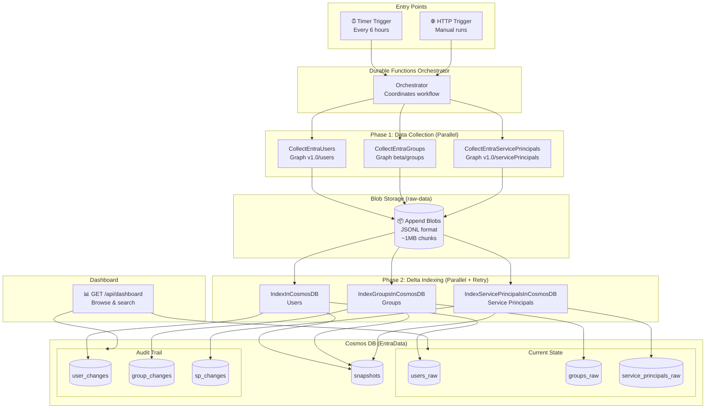
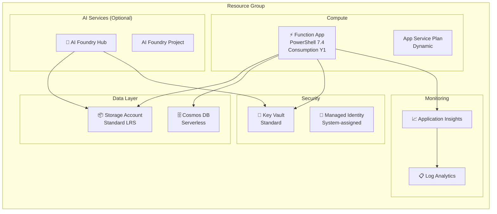
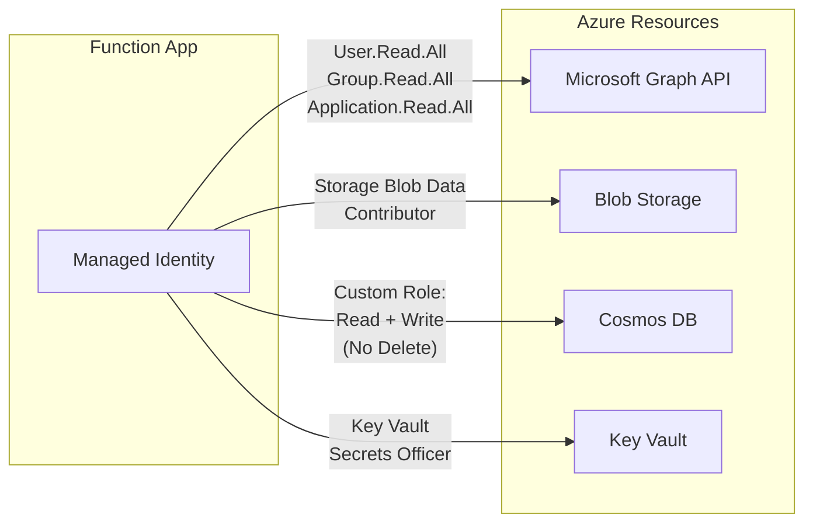

# Entra ID Risk Monitor

An Azure-native solution for monitoring Microsoft Entra ID identity changes. Collects users, groups, and service principals from Microsoft Graph API, detects changes via delta comparison, and maintains immutable audit trails in Cosmos DB.

## Key Features

- **Delta Change Detection**: Only writes changed records to Cosmos DB (~80-95% write reduction)
- **Immutable Audit Trail**: All changes tracked with before/after snapshots
- **Parallel Processing**: Collects and indexes all entity types simultaneously
- **Soft Deletes**: Deleted entities preserved for 90 days before automatic cleanup
- **Built-in Dashboard**: Web UI for browsing current state and recent changes
- **Serverless**: Consumption-based Function App scales automatically
- **Identity-Based Security**: Uses Azure Managed Identity (no stored credentials)

## Architecture Overview



## How It Works

### Workflow Phases

1. **Trigger**: Timer (every 6 hours) or HTTP POST starts the orchestration
2. **Collection** (Parallel): Three activities query Microsoft Graph API simultaneously
   - Each streams results as JSONL to Blob Storage in ~1MB chunks
   - Memory-efficient: handles 100K+ entities without memory issues
3. **Indexing** (Parallel + Retry): Three activities process the collected data
   - Compares new data against existing Cosmos DB records
   - Identifies: NEW, MODIFIED, DELETED, or UNCHANGED entities
   - Writes only changed records (delta detection)
   - Retries up to 3 times on transient failures
4. **Dashboard**: HTTP GET endpoint serves an interactive web UI

### Delta Change Detection

Instead of overwriting all records on each run, the system:

1. Reads collected JSONL from Blob Storage into memory (keyed by `objectId`)
2. Queries existing records from Cosmos DB
3. Compares field-by-field to detect changes:

| Detection | Condition | Action |
|-----------|-----------|--------|
| **NEW** | In current, not in existing | Insert with `changeType: "new"` |
| **MODIFIED** | In both, fields differ | Update + log delta details |
| **DELETED** | In existing, not in current | Soft delete (90-day TTL) |
| **UNCHANGED** | In both, fields identical | Skip write |

### Failure Handling

| Component | On Failure | Recovery |
|-----------|------------|----------|
| User collection | **Stop orchestration** | Users are critical - retry manually |
| Group/SP collection | Continue with other data | Groups/SPs optional |
| Indexing activity | Retry 3x with 60s delay | Data safe in blob |
| AI Foundry test | Always succeeds (graceful skip) | Optional feature |

---

## Prerequisites

- Azure subscription with Owner or Contributor + User Access Administrator role
- PowerShell 7.4+
- Azure CLI (`az`) installed and authenticated
- [Azure Functions Core Tools v4](https://learn.microsoft.com/en-us/azure/azure-functions/functions-run-local) (for code deployment)

### Required Graph API Permissions

The Function App's managed identity needs these **application permissions**:

| Permission | Purpose |
|------------|---------|
| `User.Read.All` | Read all users and sign-in activity |
| `Group.Read.All` | Read all groups and membership |
| `Application.Read.All` | Read service principals and app registrations |

> **Note**: The deployment script attempts to assign `User.Read.All` automatically. For `Group.Read.All` and `Application.Read.All`, grant admin consent manually in:
> Entra ID → Enterprise Applications → [Function App name] → API Permissions → Grant admin consent

---

## Deployment

### Quick Start

```powershell
cd Infrastructure

./deploy.ps1 `
    -SubscriptionId "your-subscription-id" `
    -TenantId "your-tenant-id" `
    -ResourceGroupName "rg-entrarisk-prod-001" `
    -Location "swedencentral" `
    -Environment "prod" `
    -BlobRetentionDays 30
```

### Parameters

| Parameter | Required | Default | Description |
|-----------|----------|---------|-------------|
| `SubscriptionId` | Yes | - | Azure subscription GUID |
| `TenantId` | Yes | - | Entra ID tenant GUID |
| `ResourceGroupName` | No | `rg-entrarisk-pilot-001` | Target resource group |
| `Location` | No | `swedencentral` | Azure region |
| `Environment` | No | `dev` | Environment tag: `dev`, `test`, or `prod` |
| `WorkloadName` | No | `entrarisk` | Base name for resources |
| `BlobRetentionDays` | No | `7` | Days before blob lifecycle tiering |

### What Gets Deployed



| Resource | SKU/Tier | Purpose |
|----------|----------|---------|
| Storage Account | Standard_LRS | Blob staging + Durable Functions state |
| Cosmos DB | Serverless | Persistent storage with audit trails |
| Function App | Consumption (Y1) | Serverless compute |
| Key Vault | Standard | Secrets management |
| Log Analytics | PerGB2018 (30 days) | Centralized logging |
| Application Insights | - | Performance monitoring |
| AI Foundry Hub + Project | Basic | Optional AI integration |

### Post-Deployment Steps

1. **Grant remaining Graph permissions** (if not using automated assignment):
   ```bash
   # Navigate to Azure Portal
   # Entra ID → Enterprise Applications → [Function App name]
   # API Permissions → Add permission → Microsoft Graph → Application permissions
   # Add: Group.Read.All, Application.Read.All
   # Grant admin consent
   ```

2. **Verify deployment**:
   ```bash
   # Test manual trigger
   FUNCTION_KEY=$(az functionapp function keys list \
       --name <function-app-name> \
       --resource-group <resource-group> \
       --function-name HttpTrigger \
       --query default -o tsv)

   curl -X POST "https://<function-app-name>.azurewebsites.net/api/HttpTrigger?code=$FUNCTION_KEY"
   ```

3. **Access dashboard**:
   ```
   https://<function-app-name>.azurewebsites.net/api/dashboard?code=<function-key>
   ```

---

## Configuration

### Environment Variables

Set automatically by Bicep deployment. For local development, create `FunctionApp/local.settings.json`:

```json
{
  "IsEncrypted": false,
  "Values": {
    "FUNCTIONS_WORKER_RUNTIME": "powershell",
    "AzureWebJobsStorage": "UseDevelopmentStorage=true",
    "TENANT_ID": "your-tenant-id",
    "STORAGE_ACCOUNT_NAME": "your-storage-account",
    "COSMOS_DB_ENDPOINT": "https://your-cosmos.documents.azure.com:443/",
    "COSMOS_DB_DATABASE": "EntraData",
    "CosmosDbConnectionString": "AccountEndpoint=...;AccountKey=...",
    "ENABLE_DELTA_DETECTION": "true",
    "BATCH_SIZE": "999"
  }
}
```

### All Variables

| Variable | Required | Default | Description |
|----------|----------|---------|-------------|
| `TENANT_ID` | Yes | - | Entra ID tenant for Graph API |
| `STORAGE_ACCOUNT_NAME` | Yes | - | Storage account for raw data |
| `COSMOS_DB_ENDPOINT` | Yes | - | Cosmos DB endpoint URL |
| `COSMOS_DB_DATABASE` | Yes | `EntraData` | Database name |
| `CosmosDbConnectionString` | Yes | - | Connection string for bindings |
| `ENABLE_DELTA_DETECTION` | No | `true` | Enable/disable change detection |
| `BATCH_SIZE` | No | `999` | Graph API page size (max 999) |
| `PARALLEL_THROTTLE` | No | `10` | Concurrent Cosmos DB writes |
| `STORAGE_CONTAINER_RAW_DATA` | No | `raw-data` | Blob container name |

### Timer Schedule

Default: Every 6 hours (`0 0 */6 * * *`). Modify in `FunctionApp/TimerTrigger/function.json`:

```json
{
  "schedule": "0 0 */6 * * *"
}
```

Common schedules:
- Every hour: `0 0 * * * *`
- Every 12 hours: `0 0 */12 * * *`
- Daily at midnight: `0 0 0 * * *`
- Every 15 minutes: `0 */15 * * * *`

---

## Security Model

### Authentication & Authorization



### Cosmos DB Audit Protection

The Function App receives a **custom RBAC role** that prevents deletion of audit records:

```bicep
// Allowed actions
dataActions: [
  'Microsoft.DocumentDB/databaseAccounts/readMetadata'
  'Microsoft.DocumentDB/databaseAccounts/sqlDatabases/containers/items/read'
  'Microsoft.DocumentDB/databaseAccounts/sqlDatabases/containers/executeQuery'
  'Microsoft.DocumentDB/databaseAccounts/sqlDatabases/containers/items/create'
  'Microsoft.DocumentDB/databaseAccounts/sqlDatabases/containers/items/upsert'
  'Microsoft.DocumentDB/databaseAccounts/sqlDatabases/containers/items/replace'
  // DELETE intentionally omitted - audit trail is immutable
]
```

### Resource Protection

| Resource | Protection | Purpose |
|----------|------------|---------|
| Storage Account | Soft delete (7 days) + Versioning | Recover deleted/overwritten blobs |
| Cosmos DB | Custom RBAC (no delete) | Immutable audit trail |
| Key Vault | Soft delete (7 days) + RBAC | Secrets recovery |

### Diagnostic Logging

All operations logged to Log Analytics:

| Source | Categories Captured |
|--------|---------------------|
| Cosmos DB | DataPlaneRequests, QueryRuntimeStatistics, ControlPlaneRequests |
| Function App | All traces, exceptions, dependencies |
| Storage | (Configure via diagnostic settings if needed) |

---

## Data Model

### Raw Entity Containers

Stored in `users_raw`, `groups_raw`, `service_principals_raw` (partition key: `/objectId`):

```json
{
  "id": "objectId-value",
  "objectId": "12345678-abcd-...",
  "displayName": "John Doe",
  "accountEnabled": true,
  "userPrincipalName": "john.doe@contoso.com",
  "lastModified": "2025-01-05T14:30:00Z",
  "snapshotId": "2025-01-05T14-30-00Z",
  "collectionTimestamp": "2025-01-05T14:30:00Z",
  "deleted": false
}
```

### Change Event Containers

Stored in `user_changes`, `group_changes`, `service_principal_changes` (partition key: `/snapshotId`):

```json
{
  "id": "change-guid",
  "objectId": "12345678-abcd-...",
  "changeType": "modified",
  "changeTimestamp": "2025-01-05T14:30:00Z",
  "snapshotId": "2025-01-05T14-30-00Z",
  "delta": {
    "accountEnabled": { "old": true, "new": false },
    "displayName": { "old": "John Doe", "new": "John D. Doe" }
  },
  "previousValue": { "...full previous object..." },
  "newValue": { "...full new object..." }
}
```

### Snapshot Container

Stored in `snapshots` (partition key: `/id`):

```json
{
  "id": "2025-01-05T14-30-00Z",
  "snapshotId": "2025-01-05T14-30-00Z",
  "collectionType": "users",
  "collectionTimestamp": "2025-01-05T14:30:00Z",
  "totalUsers": 15000,
  "newUsers": 50,
  "modifiedUsers": 200,
  "deletedUsers": 10,
  "unchangedUsers": 14740,
  "cosmosWriteCount": 260,
  "blobPath": "2025-01-05T14-30-00Z/2025-01-05T14-30-00Z-users.jsonl",
  "deltaDetectionEnabled": true
}
```

### Soft Delete

Entities removed from Entra ID are marked deleted, not removed:

```json
{
  "objectId": "...",
  "deleted": true,
  "deletedTimestamp": "2025-01-05T14:30:00Z",
  "ttl": 7776000
}
```

TTL of 7,776,000 seconds = 90 days. Cosmos DB auto-removes after TTL expires.

---

## Graph API Queries

### Users (`/v1.0/users`)

```
$select=userPrincipalName,id,accountEnabled,userType,createdDateTime,
        signInActivity,displayName,passwordPolicies,usageLocation,
        externalUserState,externalUserStateChangeDateTime,
        onPremisesSyncEnabled,onPremisesSamAccountName,
        onPremisesUserPrincipalName,onPremisesSecurityIdentifier
```

### Groups (`/beta/groups`)

Uses beta endpoint for `isAssignableToRole` property:

```
$select=displayName,id,classification,deletedDateTime,description,
        groupTypes,mailEnabled,membershipRule,securityEnabled,
        isAssignableToRole,createdDateTime,visibility,
        onPremisesSyncEnabled,onPremisesSecurityIdentifier,mail
```

### Service Principals (`/v1.0/servicePrincipals`)

```
$select=id,appDisplayName,accountEnabled,addIns,displayName,appId,
        appRoleAssignmentRequired,deletedDateTime,description,
        oauth2PermissionScopes,resourceSpecificApplicationPermissions,
        servicePrincipalNames,servicePrincipalType,tags,notes
```

---

## Compared Fields

Fields monitored for changes in each entity type:

| Entity | Fields |
|--------|--------|
| **Users** | `accountEnabled`, `userType`, `lastSignInDateTime`, `userPrincipalName`, `displayName`, `passwordPolicies`, `usageLocation`, `externalUserState`, `externalUserStateChangeDateTime`, `onPremisesSyncEnabled`, `onPremisesSamAccountName`, `onPremisesUserPrincipalName`, `onPremisesSecurityIdentifier` |
| **Groups** | `displayName`, `classification`, `description`, `groupTypes`*, `mailEnabled`, `membershipRule`, `securityEnabled`, `isAssignableToRole`, `visibility`, `onPremisesSyncEnabled`, `mail` |
| **Service Principals** | `accountEnabled`, `appRoleAssignmentRequired`, `displayName`, `appDisplayName`, `servicePrincipalType`, `description`, `notes`, `deletedDateTime`, `addIns`*, `oauth2PermissionScopes`*, `resourceSpecificApplicationPermissions`*, `servicePrincipalNames`*, `tags`* |

*Array fields are compared via JSON serialization after sorting.

---

## Functions Reference

### Trigger Functions

| Function | Type | Schedule/Route | Description |
|----------|------|----------------|-------------|
| `TimerTrigger` | Timer | `0 0 */6 * * *` | Scheduled runs every 6 hours |
| `HttpTrigger` | HTTP POST | `/api/HttpTrigger` | Manual trigger |
| `Dashboard` | HTTP GET | `/api/dashboard` | Web UI for browsing data |

### Activity Functions

| Function | Purpose | Output |
|----------|---------|--------|
| `CollectEntraUsers` | Query Graph API for users | `{Success, UserCount, BlobName}` |
| `CollectEntraGroups` | Query Graph API for groups | `{Success, GroupCount, BlobName}` |
| `CollectEntraServicePrincipals` | Query Graph API for service principals | `{Success, ServicePrincipalCount, BlobName}` |
| `IndexInCosmosDB` | Delta index users to Cosmos | `{Success, New, Modified, Deleted, Unchanged}` |
| `IndexGroupsInCosmosDB` | Delta index groups to Cosmos | `{Success, New, Modified, Deleted, Unchanged}` |
| `IndexServicePrincipalsInCosmosDB` | Delta index service principals to Cosmos | `{Success, New, Modified, Deleted, Unchanged}` |
| `TestAIFoundry` | Optional AI connectivity test | `{Success, Message}` |

---

## PowerShell Module

`FunctionApp/Modules/EntraDataCollection/EntraDataCollection.psm1` exports:

### Authentication

| Function | Description |
|----------|-------------|
| `Get-ManagedIdentityToken` | Acquire token from Azure IMDS |
| `Get-CachedManagedIdentityToken` | Token with 55-minute cache |

### Graph API

| Function | Description |
|----------|-------------|
| `Invoke-GraphWithRetry` | Graph API call with exponential backoff |
| `Get-GraphPagedResults` | Automatic pagination with `@odata.nextLink` |

### Blob Storage

| Function | Description |
|----------|-------------|
| `Initialize-AppendBlob` | Create append blob for streaming |
| `Add-BlobContent` | Append content with retry logic |

### Cosmos DB

| Function | Description |
|----------|-------------|
| `Write-CosmosDocument` | Write single document |
| `Write-CosmosBatch` | Sequential batch write |
| `Write-CosmosParallelBatch` | Parallel batch write (10 threads) |
| `Get-CosmosDocuments` | Query with callback pattern |

### Delta Detection

| Function | Description |
|----------|-------------|
| `Invoke-DeltaIndexing` | Generic delta detection for any entity type |

### Retry Logic

| Component | Strategy | Details |
|-----------|----------|---------|
| Graph API | Exponential backoff | 5s → 10s → 20s, max 3 retries |
| Blob Storage | Exponential backoff | 2s → 4s → 8s, max 3 retries |
| Cosmos DB | Exponential backoff | 2s → 4s → 8s, max 3 retries |
| Rate limiting (429) | Retry-After header | Doesn't count against retry limit |

---

## Cosmos DB Containers

| Container | Partition Key | TTL | Purpose |
|-----------|---------------|-----|---------|
| `users_raw` | `/objectId` | None | Current user state |
| `user_changes` | `/snapshotId` | None | User audit trail |
| `groups_raw` | `/objectId` | None | Current group state |
| `group_changes` | `/snapshotId` | None | Group audit trail |
| `service_principals_raw` | `/objectId` | None | Current SP state |
| `service_principal_changes` | `/snapshotId` | None | SP audit trail |
| `snapshots` | `/id` | None | Collection metadata |

---

## Blob Lifecycle Policy

| Age | Action |
|-----|--------|
| 7 days | Move to Cool tier |
| 30 days | Move to Archive tier |
| 90 days | Delete (data persisted in Cosmos DB) |

---

## Dashboard

Access at `GET /api/dashboard`. Features:

- **Tabbed interface**: Users, Groups, Service Principals, Recent Changes
- **Sortable columns**: Click headers to sort
- **Delta visualization**: Shows old → new values for modifications
- **Live data**: Reads directly from Cosmos DB

---

## Triggering a Run

### Manual (HTTP)

```bash
# Get function key
FUNCTION_KEY=$(az functionapp function keys list \
    --name <function-app-name> \
    --resource-group <resource-group> \
    --function-name HttpTrigger \
    --query default -o tsv)

# Trigger orchestration
curl -X POST "https://<function-app-name>.azurewebsites.net/api/HttpTrigger?code=$FUNCTION_KEY"
```

Response includes status check URLs:

```json
{
  "id": "abc123...",
  "statusQueryGetUri": "https://.../instances/abc123",
  "terminatePostUri": "https://.../instances/abc123/terminate"
}
```

### Check Orchestration Status

```bash
curl "https://<function-app-name>.azurewebsites.net/runtime/webhooks/durabletask/instances/abc123?code=<master-key>"
```

---

## Troubleshooting

### "Cannot continue - data loss would occur"

Blob write failed after retries.

**Check**:
- Storage account exists and is accessible
- Function App has `Storage Blob Data Contributor` role

### Empty Dashboard

**Check**:
- Verify Cosmos containers have data
- Run a manual collection via HTTP POST
- Confirm `CosmosDbConnectionString` in Function App settings

### Graph API 403 Forbidden

**Check**:
- Function App identity has required permissions
- Admin consent granted for all permissions
- Verify in: Entra ID → Enterprise Applications → [Function App] → API Permissions

### All Records Written (No Delta Detection)

**Check**:
- `ENABLE_DELTA_DETECTION` set to `"true"` (string, not boolean)
- Cosmos input binding returning existing data (check `function.json`)

### Logs

```bash
# Stream Function App logs
func azure functionapp logstream <function-app-name>

# Query Application Insights
az monitor app-insights query \
    --app <app-insights-name> \
    --analytics-query "traces | where timestamp > ago(1h) | order by timestamp desc | take 50"

# Query Cosmos DB operations
az monitor app-insights query \
    --app <app-insights-name> \
    --analytics-query "dependencies | where type == 'Azure DocumentDB' | order by timestamp desc"
```

---

## Project Structure

```
EntraAndAzureRisk/
├── FunctionApp/
│   ├── CollectEntraUsers/
│   │   ├── function.json
│   │   └── run.ps1
│   ├── CollectEntraGroups/
│   │   ├── function.json
│   │   └── run.ps1
│   ├── CollectEntraServicePrincipals/
│   │   ├── function.json
│   │   └── run.ps1
│   ├── IndexInCosmosDB/
│   │   ├── function.json
│   │   └── run.ps1
│   ├── IndexGroupsInCosmosDB/
│   │   ├── function.json
│   │   └── run.ps1
│   ├── IndexServicePrincipalsInCosmosDB/
│   │   ├── function.json
│   │   └── run.ps1
│   ├── Orchestrator/
│   │   ├── function.json
│   │   └── run.ps1
│   ├── HttpTrigger/
│   │   ├── function.json
│   │   └── run.ps1
│   ├── TimerTrigger/
│   │   ├── function.json
│   │   └── run.ps1
│   ├── Dashboard/
│   │   ├── function.json
│   │   └── run.ps1
│   ├── TestAIFoundry/
│   │   ├── function.json
│   │   └── run.ps1
│   ├── Modules/
│   │   └── EntraDataCollection/
│   │       ├── EntraDataCollection.psd1
│   │       └── EntraDataCollection.psm1
│   ├── host.json
│   ├── profile.ps1
│   └── requirements.psd1
│
├── Infrastructure/
│   ├── main.bicep              # Azure resource definitions
│   └── deploy.ps1              # Deployment script
│
└── README.md
```

---

## Cost Estimate

For a typical environment with 10,000 users, 1,000 groups, 500 service principals:

| Resource | Monthly Cost (Est.) |
|----------|---------------------|
| Function App (Consumption) | ~$1-5 |
| Cosmos DB (Serverless) | ~$5-20 |
| Storage Account | ~$1-3 |
| Log Analytics (30 days) | ~$2-10 |
| Application Insights | ~$0-5 |
| **Total** | **~$10-40/month** |

*Costs vary based on data volume and change frequency.*

---

## Contributing

1. Fork the repository
2. Create a feature branch (`git checkout -b feature/amazing-feature`)
3. Commit changes (`git commit -m 'Add amazing feature'`)
4. Push to branch (`git push origin feature/amazing-feature`)
5. Open a Pull Request

---

## License

MIT
