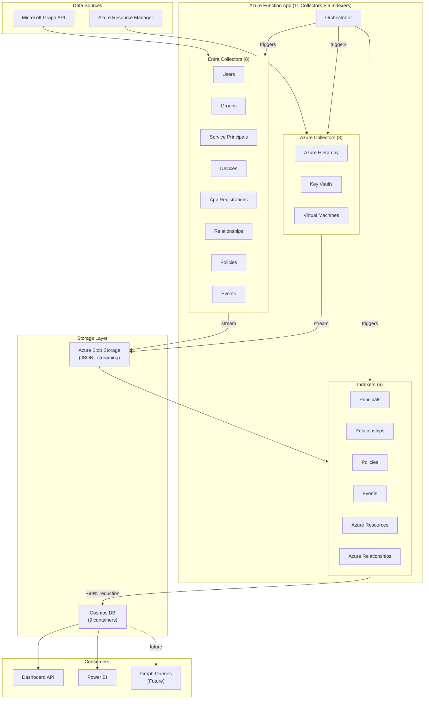
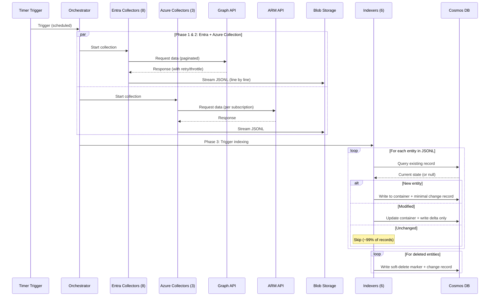
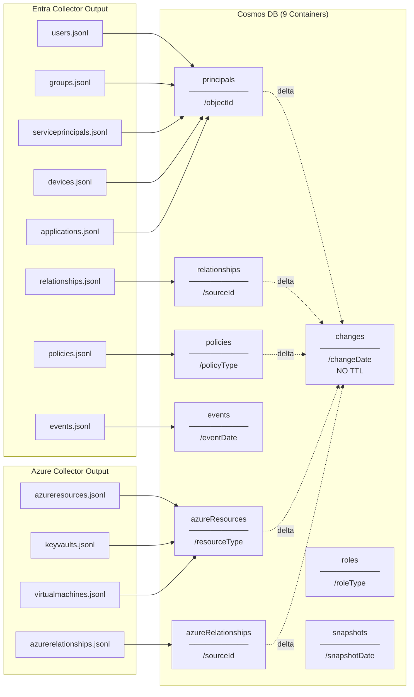
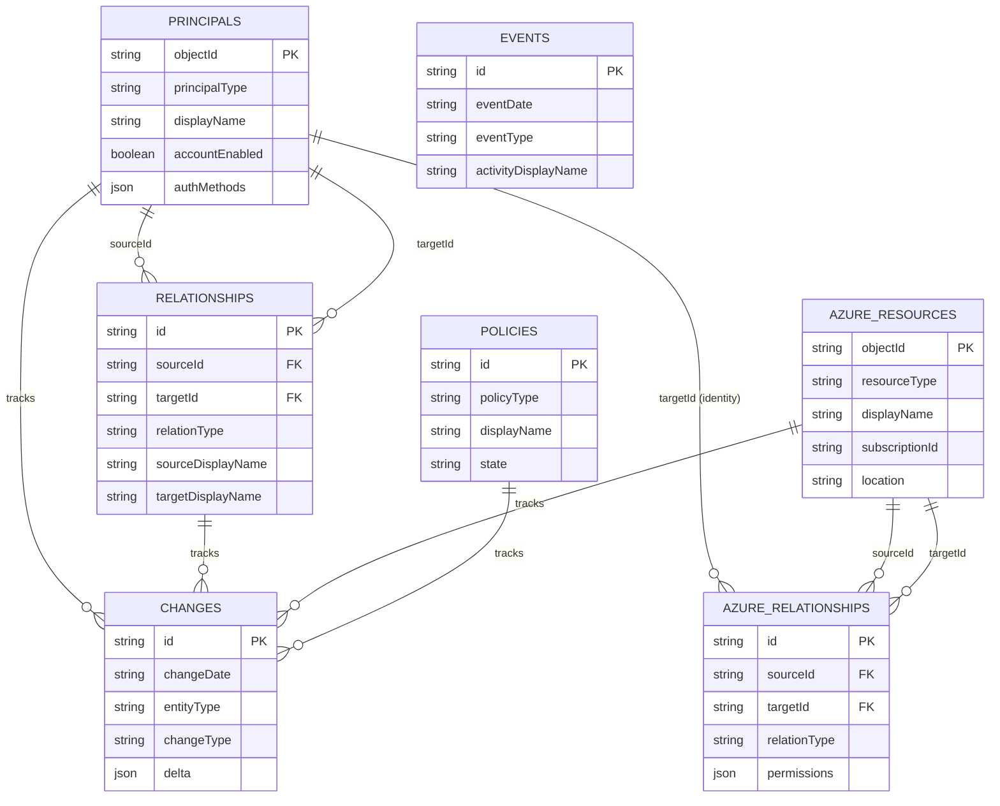

# Entra Risk Data Architecture (V2.1)

> **Version:** 2.1
> **Last Updated:** 2026-01-07
> **Purpose:** Architecture specification for the Entra Risk data collection and analysis platform.

---

## Overview

A data collection and analysis platform that:
- Collects Entra ID and Azure security data via Microsoft Graph API and Azure Resource Manager API
- Stores data in Cosmos DB with intelligent delta detection (~99% write reduction)
- Enables historical trend analysis, audit correlation, and attack path discovery
- Powers dashboards and Power BI reporting

### High-Level Architecture



---

## What's New in V2.1

| Change | Description |
|--------|-------------|
| **Azure Resource Collection** | 3 new collectors for Azure hierarchy, Key Vaults, and VMs |
| **9 Cosmos Containers** | Added `azureResources` and `azureRelationships` containers |
| **Attack Path Foundation** | Managed identity linking, Key Vault access policies, containment hierarchy |
| **Change Log Optimization** | Delta-only storage for changes (~80% size reduction) |
| **21 Relationship Types** | Added `contains`, `keyVaultAccess`, `hasManagedIdentity` |

---

## Design Principles

| # | Principle | Description |
|---|-----------|-------------|
| 1 | **Collect Everything** | All properties, all relationships - comprehensive data capture |
| 2 | **Collect Once** | Each relationship from the most efficient API direction only |
| 3 | **Denormalize Generously** | Include displayNames and filter fields in relationships |
| 4 | **Wide Tables** | Minimize joins, maximize queryability for Power BI |
| 5 | **Delta Detection** | Only write changes to Cosmos (~99% reduction after first run) |
| 6 | **Historical Tracking** | Keep ALL changes permanently - enable trend analysis over years |
| 7 | **Minimal Change Records** | Store only delta (changed fields), not full entity copies |

**Key insight:** ObjectIDs are immutable (never change), making them ideal for partition keys and stable references. DisplayNames are denormalized for convenience but relationships are keyed by ObjectID.

---

## Data Flow


---

### Orchestration Phases

| Phase | Collectors | Parallelism |
|-------|------------|-------------|
| **Phase 1** | Users, Groups, SPs, Devices, Apps | 5 parallel |
| **Phase 2** | Relationships, Policies, Events | 3 parallel |
| **Phase 2.5** | Azure Hierarchy, Key Vaults, VMs | 3 parallel |
| **Phase 3** | All 6 indexers | Sequential per type |

### Key Patterns
- **Streaming to blob** - Memory efficient, handles any data volume
- **Delta detection** - Field-based comparison, ~99% write reduction
- **Retry with backoff** - Handles Graph API throttling 
- **Parallel collection** - Multiple collectors run concurrently
- **Minimal change records** - Only store deltas, not full entity copies

---

## Storage Structure

### Cosmos DB Containers (9)


---

| Container | Partition Key | Contents | TTL |
|-----------|---------------|----------|-----|
| `principals` | `/objectId` | Users, Groups, Service Principals, Apps, Devices | None |
| `relationships` | `/sourceId` | All Entra memberships, roles, permissions, licenses | None |
| `policies` | `/policyType` | CA policies, role management policies, named locations | None |
| `events` | `/eventDate` | Sign-ins, audits, risk detections | 90 days |
| `changes` | `/changeDate` | Unified change log - **NO TTL** (permanent history) | None |
| `azureResources` | `/resourceType` | Tenant, MGs, Subscriptions, RGs, Key Vaults, VMs | None |
| `azureRelationships` | `/sourceId` | Contains, keyVaultAccess, hasManagedIdentity | None |
| `roles` | `/roleType` | Directory roles, Azure roles, License SKUs (reference) | None |
| `snapshots` | `/snapshotDate` | Collection run metadata | None |

### Type Discriminators

Every document includes a type discriminator field:

| Container | Discriminator | Values |
|-----------|---------------|--------|
| `principals` | `principalType` | `user`, `group`, `servicePrincipal`, `application`, `device` |
| `relationships` | `relationType` | `groupMember`, `directoryRole`, `pimEligible`, `azureRbac`, ... (18 types) |
| `azureResources` | `resourceType` | `tenant`, `managementGroup`, `subscription`, `resourceGroup`, `keyVault`, `virtualMachine` |
| `azureRelationships` | `relationType` | `contains`, `keyVaultAccess`, `hasManagedIdentity` |
| `policies` | `policyType` | `conditionalAccess`, `roleManagement`, `namedLocation` |
| `events` | `eventType` | `signIn`, `audit` |

---

## Entity Relationship Model



---

## Collectors

### Entra Collectors (8)

| Collector | Output File | Principal Type | Key Fields |
|-----------|-------------|----------------|------------|
| `CollectUsersWithAuthMethods` | users.jsonl | `user` | UPN, MFA state, auth methods, sign-in activity |
| `CollectEntraGroups` | groups.jsonl | `group` | Security/mail enabled, membership rule, member counts |
| `CollectEntraServicePrincipals` | serviceprincipals.jsonl | `servicePrincipal` | App ID, SP type, credentials, OAuth scopes |
| `CollectDevices` | devices.jsonl | `device` | OS, compliance, trust type, last sign-in |
| `CollectAppRegistrations` | applications.jsonl | `application` | API permissions, federated credentials, publisher |
| `CollectRelationships` | relationships.jsonl | N/A | All Entra relationships (18 types) |
| `CollectPolicies` | policies.jsonl | N/A | CA policies, role policies, named locations |
| `CollectEvents` | events.jsonl | N/A | Sign-ins, audit logs |

### Azure Collectors (3)

| Collector | Output Files | Resource Types | Key Fields |
|-----------|--------------|----------------|------------|
| `CollectAzureHierarchy` | azureresources.jsonl, azurerelationships.jsonl | `tenant`, `managementGroup`, `subscription`, `resourceGroup` | Hierarchy containment |
| `CollectKeyVaults` | keyvaults.jsonl, keyvault-relationships.jsonl | `keyVault` | Access policies, RBAC, soft delete, network rules |
| `CollectVirtualMachines` | virtualmachines.jsonl, vm-relationships.jsonl | `virtualMachine` | Managed identity, power state, OS, network |

---

## Relationship Types

### Entra Relationships (18 types)

| Type | Source | Target | Collection Direction | API |
|------|--------|--------|---------------------|-----|
| `groupMember` | user/group/SP/device | group | Groups → members | `/groups/{id}/members` |
| `groupMemberTransitive` | user | group | Groups → transitiveMembers | `/groups/{id}/transitiveMembers` |
| `groupOwner` | user | group | Groups → owners | `/groups/{id}/owners` |
| `directoryRole` | user/group/SP | role | Roles → members (bulk) | `/directoryRoles?$expand=members` |
| `pimEligible` | user/group | role | Bulk | `/roleManagement/directory/roleEligibilitySchedules` |
| `pimActive` | user/group | role | Bulk | `/roleManagement/directory/roleAssignmentSchedules` |
| `pimGroupEligible` | user | group | Bulk | `/identityGovernance/privilegedAccess/group/eligibilitySchedules` |
| `pimGroupActive` | user | group | Bulk | `/identityGovernance/privilegedAccess/group/assignmentSchedules` |
| `azureRbac` | user/group/SP | azureRole | Per subscription | Azure RM API |
| `appRoleAssignment` | user/group/SP | SP | Bulk or per SP | `/servicePrincipals/{id}/appRoleAssignedTo` |
| `oauth2PermissionGrant` | user | SP | Bulk | `/oauth2PermissionGrants` |
| `manager` | user | user | FREE with users | `/users?$expand=manager` |
| `license` | user | license | Per user | `/users/{id}/licenseDetails` |
| `deviceOwner` | user | device | Devices → owners | `/devices/{id}/registeredOwners` |
| `appOwner` | user/SP | application | Apps → owners | `/applications/{id}/owners` |
| `spOwner` | user/SP | servicePrincipal | SPs → owners | `/servicePrincipals/{id}/owners` |
| `adminUnitMember` | user/group/device | AU | AUs → members | `/administrativeUnits/{id}/members` |

### Azure Relationships (3 types)

| Type | Source | Target | Description |
|------|--------|--------|-------------|
| `contains` | MG/Sub/RG | Child resource | Azure hierarchy containment |
| `keyVaultAccess` | principal | keyVault | Access policy permissions (get/set secrets, keys, certs) |
| `hasManagedIdentity` | VM | servicePrincipal | System or user-assigned managed identity link |

---

## Schemas

### Principals Container

All principals share common fields plus type-specific fields.

#### Common Fields
```json
{
  "id": "{objectId}",
  "objectId": "{objectId}",
  "principalType": "user | group | servicePrincipal | application | device",
  "displayName": "...",
  "createdDateTime": "ISO-8601",
  "deleted": false,
  "deletedDateTime": null,
  "collectionTimestamp": "ISO-8601",
  "snapshotId": "run-timestamp"
}
```

#### User-Specific Fields
```json
{
  "principalType": "user",
  "userPrincipalName": "john@contoso.com",
  "userType": "Member | Guest",
  "accountEnabled": true,
  "lastSignInDateTime": "ISO-8601",
  "passwordPolicies": "DisablePasswordExpiration | ...",
  "usageLocation": "US",

  "onPremisesSyncEnabled": true,
  "onPremisesSamAccountName": "jdoe",
  "onPremisesUserPrincipalName": "jdoe@contoso.local",
  "onPremisesSecurityIdentifier": "S-1-5-...",
  "onPremisesExtensionAttributes": {...},

  "externalUserState": "Accepted | PendingAcceptance | null",
  "lastPasswordChangeDateTime": "ISO-8601",
  "signInSessionsValidFromDateTime": "ISO-8601",
  "refreshTokensValidFromDateTime": "ISO-8601",

  "perUserMfaState": "disabled | enabled | enforced",
  "hasAuthenticator": true,
  "hasPhone": true,
  "hasFido2": false,
  "hasEmail": true,
  "hasPassword": true,
  "hasTap": false,
  "hasWindowsHello": false,
  "hasSoftwareOath": false,
  "authMethodCount": 4,
  "authMethodTypes": ["authenticator", "phone", ...]
}
```

#### Group-Specific Fields
```json
{
  "principalType": "group",
  "description": "All engineers",
  "mail": "engineering@contoso.com",
  "mailEnabled": true,
  "securityEnabled": true,
  "groupTypes": ["Unified", "DynamicMembership"],
  "membershipRule": "user.department -eq \"Engineering\"",
  "visibility": "Private | Public | HiddenMembership",
  "classification": "Confidential | Internal | Public",
  "isAssignableToRole": false,

  "onPremisesSyncEnabled": true,
  "onPremisesSecurityIdentifier": "S-1-5-...",

  "memberCountDirect": 25,
  "userMemberCount": 20,
  "groupMemberCount": 3,
  "servicePrincipalMemberCount": 1,
  "deviceMemberCount": 1
}
```

#### Service Principal-Specific Fields
```json
{
  "principalType": "servicePrincipal",
  "appId": "app-guid",
  "appDisplayName": "Contoso API",
  "servicePrincipalType": "Application | ManagedIdentity | Legacy | SocialIdp",
  "accountEnabled": true,
  "appRoleAssignmentRequired": true,
  "servicePrincipalNames": ["api://contoso", "https://app.contoso.com"],
  "tags": ["WindowsAzureActiveDirectoryIntegratedApp"],
  "notes": "Production API",
  "oauth2PermissionScopes": [...],
  "addIns": [...],
  "resourceSpecificApplicationPermissions": [...]
}
```

#### Application-Specific Fields
```json
{
  "principalType": "application",
  "appId": "app-guid",
  "signInAudience": "AzureADMyOrg | AzureADMultipleOrgs | ...",
  "publisherDomain": "contoso.com",
  "verifiedPublisher": {
    "displayName": "Contoso Inc",
    "verifiedPublisherId": "..."
  },
  "isPublisherVerified": true,

  "passwordCredentials": [...],
  "keyCredentials": [...],
  "secretCount": 2,
  "certificateCount": 1,

  "requiredResourceAccess": [...],
  "apiPermissionCount": 5,

  "federatedIdentityCredentials": [...],
  "hasFederatedCredentials": true,
  "federatedCredentialCount": 2
}
```

#### Device-Specific Fields
```json
{
  "principalType": "device",
  "deviceId": "device-guid",
  "operatingSystem": "Windows | iOS | Android | macOS | Linux",
  "operatingSystemVersion": "10.0.22621",
  "trustType": "AzureAd | ServerAd | Workplace",
  "profileType": "RegisteredDevice | SecureVM | Printer | Shared | IoT",
  "isCompliant": true,
  "isManaged": true,
  "manufacturer": "Microsoft Corporation",
  "model": "Surface Pro",
  "approximateLastSignInDateTime": "ISO-8601",
  "registrationDateTime": "ISO-8601"
}
```

---

### Azure Resources Container

#### Common Fields
```json
{
  "id": "{resourceId}",
  "objectId": "{resourceId}",
  "resourceType": "tenant | managementGroup | subscription | resourceGroup | keyVault | virtualMachine",
  "displayName": "...",
  "location": "eastus",
  "subscriptionId": "sub-guid",
  "resourceGroupName": "rg-name",
  "tags": {...},
  "collectionTimestamp": "ISO-8601"
}
```

#### Tenant Fields
```json
{
  "resourceType": "tenant",
  "tenantId": "tenant-guid",
  "tenantType": "AAD | AAD B2C",
  "defaultDomain": "contoso.onmicrosoft.com",
  "verifiedDomains": [
    { "name": "contoso.com", "type": "Managed", "isDefault": true }
  ]
}
```

#### Management Group Fields
```json
{
  "resourceType": "managementGroup",
  "managementGroupId": "mg-name",
  "parentId": "/providers/Microsoft.Management/managementGroups/root",
  "parentDisplayName": "Root Management Group",
  "childCount": 3
}
```

#### Subscription Fields
```json
{
  "resourceType": "subscription",
  "subscriptionId": "sub-guid",
  "state": "Enabled | Disabled | Warned | Deleted",
  "authorizationSource": "RoleBased"
}
```

#### Key Vault Fields
```json
{
  "resourceType": "keyVault",
  "vaultUri": "https://kv-prod.vault.azure.net/",
  "sku": { "family": "A", "name": "standard" },
  "enableRbacAuthorization": false,
  "enableSoftDelete": true,
  "enablePurgeProtection": true,
  "softDeleteRetentionInDays": 90,
  "publicNetworkAccess": "Enabled",
  "networkAcls": { "defaultAction": "Allow", "bypass": "AzureServices" },
  "accessPolicies": [...],
  "accessPolicyCount": 5
}
```

#### Virtual Machine Fields
```json
{
  "resourceType": "virtualMachine",
  "vmId": "vm-guid",
  "vmSize": "Standard_D4s_v3",
  "osType": "Windows | Linux",
  "osName": "Microsoft WindowsServer 2022-Datacenter",
  "computerName": "vm-web-prod",
  "powerState": "running | deallocated | stopped",
  "identityType": "SystemAssigned | UserAssigned | SystemAssigned,UserAssigned | None",
  "hasSystemAssignedIdentity": true,
  "systemAssignedPrincipalId": "sp-object-id",
  "hasUserAssignedIdentity": false,
  "userAssignedIdentities": [],
  "networkInterfaces": [...]
}
```

---

### Azure Relationships Container

#### Contains Relationship
```json
{
  "id": "{sourceId}_{targetId}_contains",
  "relationType": "contains",
  "sourceId": "/subscriptions/xxx",
  "sourceType": "subscription",
  "sourceDisplayName": "Production",
  "targetId": "/subscriptions/xxx/resourceGroups/rg-web",
  "targetType": "resourceGroup",
  "targetDisplayName": "rg-web",
  "targetLocation": "eastus"
}
```

#### Key Vault Access Relationship
```json
{
  "id": "{principalId}_{kvId}_keyVaultAccess",
  "relationType": "keyVaultAccess",
  "sourceId": "user-object-id",
  "sourceType": "principal",
  "targetId": "/subscriptions/.../vaults/kv-prod",
  "targetType": "keyVault",
  "targetDisplayName": "kv-prod",
  "accessType": "accessPolicy",
  "keyPermissions": ["get", "list"],
  "secretPermissions": ["get", "list", "set"],
  "certificatePermissions": [],
  "canGetSecrets": true,
  "canSetSecrets": true,
  "canDecryptWithKey": false
}
```

#### Managed Identity Relationship
```json
{
  "id": "{vmId}_{spId}_hasManagedIdentity",
  "relationType": "hasManagedIdentity",
  "sourceId": "/subscriptions/.../virtualMachines/vm-web",
  "sourceType": "virtualMachine",
  "sourceDisplayName": "vm-web",
  "targetId": "sp-object-id",
  "targetType": "servicePrincipal",
  "identityType": "SystemAssigned | UserAssigned"
}
```

---

### Changes Container

Optimized delta-only storage for permanent change history.

```json
{
  "id": "change-unique-id",
  "changeDate": "2026-01-07",
  "changeTimestamp": "2026-01-07T14:00:00Z",
  "snapshotId": "2026-01-07T14-00-00Z",

  "entityType": "principal | relationship | policy | azureResource | azureRelationship",
  "principalType": "user | group | ...",
  "changeType": "new | modified | deleted",

  "objectId": "affected-object-id",
  "displayName": "John Doe",

  "changedFields": ["accountEnabled", "lastSignInDateTime"],
  "delta": {
    "accountEnabled": { "old": true, "new": false },
    "lastSignInDateTime": { "old": "2026-01-01T...", "new": "2026-01-07T..." }
  }
}
```

**Change Record Storage Optimization:**
- **NEW entities**: Only metadata (objectId, displayName, timestamps) - full entity is in primary container
- **MODIFIED entities**: Metadata + delta (only changed fields with old/new values)
- **DELETED entities**: Only metadata - entity is soft-deleted in primary container

This achieves ~80% storage reduction compared to storing full entity copies.

---

## Delta Detection

### How It Works

Delta detection is **field-based**, not container-based. The system compares specific fields to determine if a record has changed.

```
1. Collector writes JSONL (streaming to blob)
   - All entities with type discriminator

2. Indexer triggered
   - Reads JSONL from blob
   - Queries existing entities from Cosmos

3. For each entity in blob:
   - Exists in Cosmos?
     - No → NEW (write to container + minimal change record)
     - Yes → Compare fields
       - Different → MODIFIED (update container + write delta only)
       - Same → UNCHANGED (skip ~99% of records)

4. For each entity in Cosmos not in blob:
   - DELETED (write soft-delete marker + minimal change record)
```

### Configuration (IndexerConfigs.psd1)

Each entity type has its own configuration:

```powershell
principals = @{
    EntityType = 'principals'
    CompareFields = @(
        'principalType', 'displayName', 'accountEnabled', 'deleted',
        'userPrincipalName', 'userType', 'lastSignInDateTime',
        'securityEnabled', 'mailEnabled', 'groupTypes',
        'servicePrincipalType', 'appId', ...
    )
    ArrayFields = @('groupTypes', 'servicePrincipalNames', 'authMethodTypes', ...)
    WriteDeletes = $true
    IncludeDeleteMarkers = $true
}

azureResources = @{
    EntityType = 'azureResources'
    CompareFields = @(
        'resourceType', 'displayName', 'location', 'subscriptionId',
        'enableRbacAuthorization', 'enableSoftDelete', 'powerState',
        'hasSystemAssignedIdentity', 'userAssignedIdentityCount', ...
    )
    WriteDeletes = $true
    IncludeDeleteMarkers = $true
}
```

---

## Example Queries

### "All users with no MFA registered"
```sql
SELECT * FROM principals p
WHERE p.principalType = 'user'
  AND p.authMethodCount <= 1
  AND p.deleted = false
```

### "Service principals with managed identity"
```sql
SELECT * FROM principals p
WHERE p.principalType = 'servicePrincipal'
  AND p.servicePrincipalType = 'ManagedIdentity'
  AND p.deleted = false
```

### "Key Vaults with public access and no RBAC"
```sql
SELECT * FROM azureResources ar
WHERE ar.resourceType = 'keyVault'
  AND ar.publicNetworkAccess = 'Enabled'
  AND ar.enableRbacAuthorization = false
```

### "VMs with system-assigned managed identity"
```sql
SELECT * FROM azureResources ar
WHERE ar.resourceType = 'virtualMachine'
  AND ar.hasSystemAssignedIdentity = true
```

### "Who has secrets access to production Key Vaults?"
```sql
SELECT ar.sourceId, ar.targetDisplayName, ar.secretPermissions
FROM azureRelationships ar
WHERE ar.relationType = 'keyVaultAccess'
  AND ar.canGetSecrets = true
```

### "Azure hierarchy under a subscription"
```sql
SELECT * FROM azureRelationships ar
WHERE ar.relationType = 'contains'
  AND ar.sourceId = '/subscriptions/{sub-id}'
```

### "Changes to privileged users in last 7 days"
```sql
SELECT * FROM changes c
WHERE c.entityType = 'principal'
  AND c.principalType = 'user'
  AND c.changeDate >= '2026-01-01'
ORDER BY c.changeTimestamp DESC
```

---

## Cost Estimates

> **Note:** Cost estimates will be updated after fresh data collection (target: 2026-01-10)

### Placeholder Cost Model

| Component | Small Tenant<br/>(~100 users) | Medium Tenant<br/>(~1,000 users) | Large Tenant<br/>(~10,000 users) |
|-----------|-------------------------------|----------------------------------|-----------------------------------|
| **Blob Storage** | $X.XX/month | $X.XX/month | $X.XX/month |
| **Cosmos DB (RUs)** | $X.XX/month | $X.XX/month | $X.XX/month |
| **Cosmos DB (Storage)** | $X.XX/month | $X.XX/month | $X.XX/month |
| **Function App** | $X.XX/month | $X.XX/month | $X.XX/month |
| **Total Estimated** | **$X.XX/month** | **$X.XX/month** | **$X.XX/month** |

### Cost Factors

| Factor | Impact |
|--------|--------|
| **Delta detection** | ~99% write reduction after first run |
| **Change log optimization** | ~80% reduction in changes container size |
| **Blob lifecycle policy** | Hot → Cool (7d) → Archive (30d) → Delete (90d) |
| **Serverless Cosmos** | Pay only for actual RU consumption |
| **Collection frequency** | Default: 4x daily (every 6 hours) |

### Storage Estimates (to be validated)

| Container | Est. Size per 1K Users | Notes |
|-----------|------------------------|-------|
| `principals` | ~X MB | Delta-updated, current state only |
| `relationships` | ~X MB | Delta-updated |
| `changes` | ~X MB/month | Delta-only storage |
| `events` | ~X MB/month | 90-day retention |
| `azureResources` | ~X MB | Varies by Azure footprint |
| `azureRelationships` | ~X MB | Varies by Azure footprint |

---

## Summary

| Aspect | Value |
|--------|-------|
| Collectors | 11 (8 Entra + 3 Azure) |
| Indexers | 6 |
| Cosmos containers | 9 |
| Entra relationship types | 18 |
| Azure relationship types | 3 |
| Azure resource types | 6 |
| Partition strategy | ObjectID/ResourceID for entities, SourceID for relationships |
| Delta detection | ~99% write reduction |
| Change log optimization | ~80% storage reduction |
| Historical tracking | Permanent (no TTL on changes) |
| Denormalization | DisplayNames + filter fields in relationships (DisplayNames are denormalized for convenience but relationships are keyed by ObjectID) |

### Key Architectural Decisions

1. **ObjectID as partition key** - Immutable, stable reference
2. **Denormalize displayNames in relationships** - Power BI doesn't need joins
3. **No TTL on changes** - Enable historical queries over months/years
4. **Partition changes by /changeDate** - Efficient time-range queries
5. **Delta-only change records** - Minimize storage, full state in primary containers
6. **Collect relationships from efficient direction** - Groups → members, not users → groups
7. **Separate Azure containers** - Clear separation between Entra and Azure data
8. **Type discriminators** - Enable filtering within unified containers

---

**End of Architecture Document**

---
---
---
---
---
---


# FUTURE WORK 
