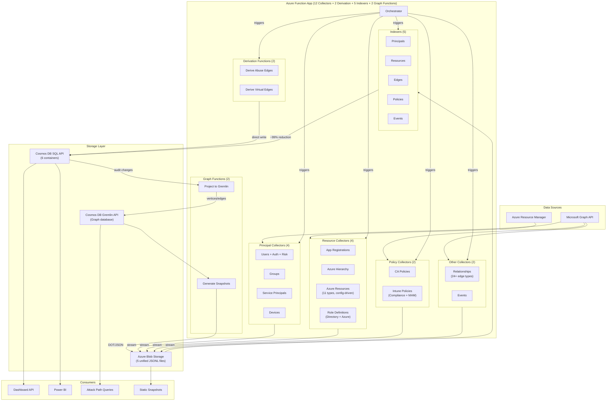
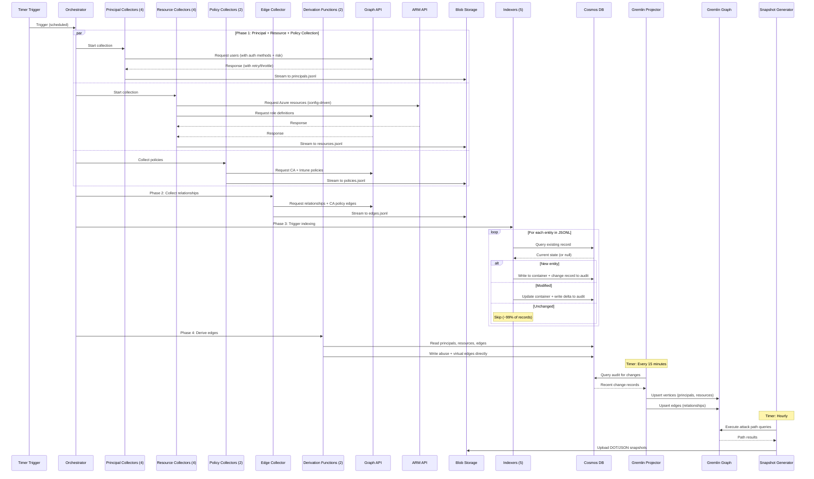
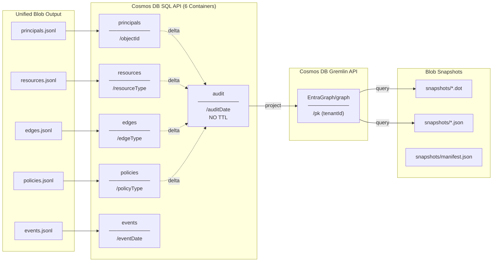
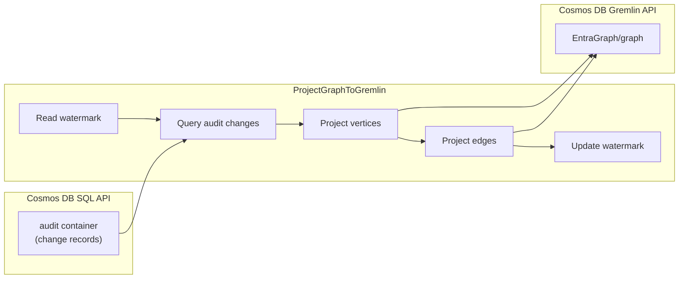
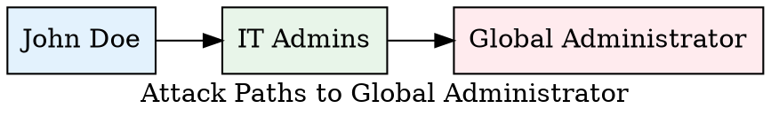

# Entra Risk Data Architecture (V3.5)

> **Version:** 3.5
> **Last Updated:** 2026-01-08
> **Branch:** Version-3
> **Purpose:** Architecture specification for the Entra Risk data collection, analysis, and attack path discovery platform.

---

## Overview

A data collection and analysis platform that:
- Collects Entra ID and Azure security data via Microsoft Graph API and Azure Resource Manager API
- Stores data in Cosmos DB with intelligent delta detection (~99% write reduction)
- Enables historical trend analysis, audit correlation, and attack path discovery
- Projects data to Gremlin graph database for attack path traversal
- Generates pre-rendered attack path snapshots (DOT/SVG)
- Powers dashboards and Power BI reporting

### High-Level Architecture



---

## What's New in V3.5

| Change | Description |
|--------|-------------|
| **Collector Consolidation** | Reduced from 17 to 12 collectors via configuration-driven collection |
| **CollectAzureResources** | Single collector for 11 Azure resource types via `AzureResourceTypes.psd1` |
| **CollectRoleDefinitions** | Unified Directory + Azure role definitions in one collector |
| **CollectIntunePolicies** | Combined Compliance + App Protection (MAM) policy collection |
| **Embedded Risk Data** | User risk level/state from Identity Protection embedded in user documents |
| **DeriveAbuseEdges** | Attack path capability edges derived from dangerous permissions |
| **DeriveVirtualEdges** | Intune policy targeting edges (compliance + app protection) |
| **Attack Path Snapshots** | Pre-rendered Gremlin query results for common attack patterns (DOT format) |
| **Gremlin Graph Projection** | Timer-triggered sync from audit container to Gremlin graph database |
| **30+ Edge Types** | Original 24 + abuse edges (6) + Intune policy edges (2) |
| **Synthetic Vertices** | Role definitions as queryable vertices with `isPrivileged` flags |
| **CA Policy Analysis** | Edges show which principals are targeted/excluded from CA policies |
| **PIM Policy Analysis** | Edges show role activation requirements (MFA, approval, justification) |

### V3 Features (Retained)

| Change | Description |
|--------|-------------|
| **Semantic Correctness** | Applications moved from `principals` to `resources` container (they're resources, not principals) |
| **Unified Edges** | All relationships (Entra + Azure) consolidated into single `edges` container with `edgeType` discriminator |
| **Unified Resources** | Applications + all Azure resources in single `resources` container with `resourceType` discriminator |
| **Temporal Fields** | `effectiveFrom`/`effectiveTo` on all entities for historical queries |
| **Unified Blobs** | 5 consolidated JSONL files instead of 15+ separate files |
| **6 Cosmos Containers** | Down from 9 (principals, resources, edges, policies, events, audit) |
| **roleManagement API** | Migrated from legacy DirectoryRole API to unified roleManagement API |
| **8 Azure Collectors** | Automation Accounts, Function Apps, Logic Apps, Web Apps |

---

## Design Principles

| # | Principle | Description |
|---|-----------|-------------|
| 1 | **Collect Everything** | All properties, all relationships - comprehensive data capture |
| 2 | **Collect Once** | Each relationship from the most efficient API direction only |
| 3 | **Denormalize Generously** | Include displayNames and filter fields in relationships |
| 4 | **Wide Tables** | Minimize joins, maximize queryability for Power BI |
| 5 | **Delta Detection** | Only write changes to Cosmos (~99% reduction after first run) |
| 6 | **Historical Tracking** | Keep ALL changes permanently - enable trend analysis over years |
| 7 | **Minimal Change Records** | Store only delta (changed fields), not full entity copies |
| 8 | **Gremlin-Ready** | Unified edges container designed for graph projection |
| 9 | **Attack Path First** | Edge types capture security-relevant relationships for path traversal |

**Key insight:** ObjectIDs are immutable (never change), making them ideal for partition keys and stable references. DisplayNames are denormalized for convenience but relationships are keyed by ObjectID.

---

## Data Flow



---

### Orchestration Phases

| Phase | Collectors | Output | Parallelism |
|-------|------------|--------|-------------|
| **Phase 1** | CollectUsers, CollectEntraGroups, CollectEntraServicePrincipals, CollectDevices | principals.jsonl | 4 parallel |
| **Phase 1** | CollectAppRegistrations, CollectAzureHierarchy, CollectAzureResources, CollectRoleDefinitions | resources.jsonl | 4 parallel |
| **Phase 1** | CollectPolicies (CA), CollectIntunePolicies (Compliance + MAM) | policies.jsonl | 2 parallel |
| **Phase 1** | CollectEvents | events.jsonl | 1 |
| **Phase 2** | CollectRelationships (24+ edge types incl. CA policy edges) | edges.jsonl | 1 |
| **Phase 3** | All 5 indexers | → Cosmos DB | Sequential per type |
| **Phase 4** | DeriveAbuseEdges, DeriveVirtualEdges | → edges container | 2 parallel |

### Graph Functions (Timer-Triggered)

| Function | Schedule | Purpose |
|----------|----------|---------|
| `ProjectGraphToGremlin` | Every 15 min | Sync audit changes to Gremlin graph |
| `GenerateGraphSnapshots` | Hourly | Generate attack path snapshots (DOT/JSON) |

### Key Patterns
- **Streaming to blob** - Memory efficient, handles any data volume
- **Append blob with If-None-Match** - Prevents race conditions when multiple collectors write to same file
- **Delta detection** - Field-based comparison, ~99% write reduction
- **Retry with backoff** - Handles Graph API throttling
- **Parallel collection** - Multiple collectors run concurrently
- **Temporal tracking** - `effectiveFrom`/`effectiveTo` for point-in-time queries
- **Watermark-based sync** - Gremlin projector tracks last sync timestamp
- **Fold/coalesce upserts** - Idempotent Gremlin vertex/edge operations

---

## Storage Structure

### Cosmos DB Containers (6 SQL + 1 Gremlin)



| Container | Partition Key | Contents | TTL |
|-----------|---------------|----------|-----|
| `principals` | `/objectId` | Users, Groups, Service Principals, Devices | None |
| `resources` | `/resourceType` | Applications, Role Definitions, Tenant, Subscriptions, RGs, Key Vaults, VMs, Automation Accounts, Function Apps, Logic Apps, Web Apps | None |
| `edges` | `/edgeType` | ALL relationships unified (Entra + Azure + CA Policy + Role Policy) | None |
| `policies` | `/policyType` | CA policies, role management policies, named locations | None |
| `events` | `/eventDate` | Sign-ins, audits | 90 days |
| `audit` | `/auditDate` | Unified change log - **NO TTL** (permanent history) | None |
| `EntraGraph/graph` | `/pk` (tenantId) | Gremlin vertices and edges | None |

### Type Discriminators

Every document includes a type discriminator field:

| Container | Discriminator | Values |
|-----------|---------------|--------|
| `principals` | `principalType` | `user`, `group`, `servicePrincipal`, `device` |
| `resources` | `resourceType` | `application`, `directoryRoleDefinition`, `azureRoleDefinition`, `tenant`, `managementGroup`, `subscription`, `resourceGroup`, `keyVault`, `virtualMachine`, `automationAccount`, `functionApp`, `logicApp`, `webApp`, `storageAccount`, `aksCluster`, `containerRegistry`, `vmScaleSet`, `dataFactory` |
| `edges` | `edgeType` | `groupMember`, `directoryRole`, `pimEligible`, `azureRbac`, `hasManagedIdentity`, `caPolicyTargetsPrincipal`, `rolePolicyAssignment`, `canResetPassword`, `canManageCredentials`, `canModifyMembership`, `compliancePolicyTargets`, `appProtectionPolicyTargets`, ... (32+ types) |
| `policies` | `policyType` | `conditionalAccess`, `roleManagement`, `namedLocation`, `compliancePolicy`, `appProtectionPolicy` |
| `events` | `eventType` | `signIn`, `audit` |

### Blob Structure

```
raw-data/{timestamp}/
├── {timestamp}-principals.jsonl    ← Users, Groups, SPs, Devices
├── {timestamp}-resources.jsonl     ← Apps + Role Definitions + ALL Azure resources
├── {timestamp}-edges.jsonl         ← ALL relationships unified (incl. CA/PIM edges)
├── {timestamp}-policies.jsonl
├── {timestamp}-events.jsonl
└── snapshots/
    ├── manifest.json
    ├── paths-to-global-admin.json
    ├── paths-to-global-admin.dot
    ├── dangerous-service-principals.json
    ├── dangerous-service-principals.dot
    └── ...
```

---

## Collectors

### Principal Collectors (4)

| Collector | Output | principalType | Key Fields |
|-----------|--------|---------------|------------|
| `CollectUsers` | principals.jsonl | `user` | UPN, MFA state, auth methods, sign-in activity, **riskLevel, riskState, isAtRisk** (embedded) |
| `CollectEntraGroups` | principals.jsonl | `group` | Security/mail enabled, membership rule, member counts |
| `CollectEntraServicePrincipals` | principals.jsonl | `servicePrincipal` | App ID, SP type, credentials, OAuth scopes |
| `CollectDevices` | principals.jsonl | `device` | OS, compliance, trust type, last sign-in |

### Resource Collectors (4)

| Collector | Output | resourceType | Key Fields |
|-----------|--------|--------------|------------|
| `CollectAppRegistrations` | resources.jsonl | `application` | API permissions, federated credentials, publisher |
| `CollectAzureHierarchy` | resources.jsonl, edges.jsonl | `tenant`, `managementGroup`, `subscription`, `resourceGroup` | Hierarchy containment |
| `CollectAzureResources` | resources.jsonl, edges.jsonl | 11 types (see below) | **Config-driven via AzureResourceTypes.psd1** |
| `CollectRoleDefinitions` | resources.jsonl | `directoryRoleDefinition`, `azureRoleDefinition` | Role name, isBuiltIn, isPrivileged, permissions |

#### CollectAzureResources - Configuration-Driven Collection

Collects 11 Azure resource types via `AzureResourceTypes.psd1`:

| resourceType | ARM Provider | Security Fields |
|--------------|--------------|-----------------|
| `keyVault` | Microsoft.KeyVault/vaults | enableRbacAuthorization, enableSoftDelete |
| `virtualMachine` | Microsoft.Compute/virtualMachines | identity (managed identity) |
| `storageAccount` | Microsoft.Storage/storageAccounts | allowBlobPublicAccess, minimumTlsVersion |
| `automationAccount` | Microsoft.Automation/automationAccounts | publicNetworkAccess |
| `functionApp` | Microsoft.Web/sites (kind=functionapp) | identity, httpsOnly |
| `logicApp` | Microsoft.Logic/workflows | identity |
| `webApp` | Microsoft.Web/sites (kind=app) | identity, httpsOnly, clientCertEnabled |
| `aksCluster` | Microsoft.ContainerService/managedClusters | enablePrivateCluster, disableLocalAccounts |
| `containerRegistry` | Microsoft.ContainerRegistry/registries | adminUserEnabled |
| `vmScaleSet` | Microsoft.Compute/virtualMachineScaleSets | identity |
| `dataFactory` | Microsoft.DataFactory/factories | publicNetworkAccess |

### Policy Collectors (2)

| Collector | Output | policyType | Key Fields |
|-----------|--------|------------|------------|
| `CollectPolicies` | policies.jsonl | `conditionalAccess`, `roleManagement`, `namedLocation` | CA policies, role policies, named locations |
| `CollectIntunePolicies` | policies.jsonl | `compliancePolicy`, `appProtectionPolicy` | Device compliance + App protection (MAM) policies |

### Other Collectors (2)

| Collector | Output | Notes |
|-----------|--------|-------|
| `CollectRelationships` | edges.jsonl | All Entra relationships (24+ edge types incl. CA/PIM policy edges) |
| `CollectEvents` | events.jsonl | Sign-ins, audit logs |

### Derivation Functions (2)

| Function | Output | Description |
|----------|--------|-------------|
| `DeriveAbuseEdges` | → edges container | Attack path capabilities from dangerous permissions (Graph API, Directory Roles, Ownership) |
| `DeriveVirtualEdges` | → edges container | Intune policy targeting edges (compliance + app protection policy → group) |

---

## Edge Types (32+ total)

### Entra Edges (15 types)

| edgeType | Source | Target | API |
|----------|--------|--------|-----|
| `groupMember` | user/group/SP/device | group | `/groups/{id}/members` |
| `groupMemberTransitive` | user | group | `/groups/{id}/transitiveMembers` |
| `groupOwner` | user | group | `/groups/{id}/owners` |
| `directoryRole` | user/group/SP | role | `/roleManagement/directory/roleAssignments` |
| `pimEligible` | user/group | role | `/roleManagement/directory/roleEligibilitySchedules` |
| `pimActive` | user/group | role | `/roleManagement/directory/roleAssignmentSchedules` |
| `pimGroupEligible` | user | group | `/identityGovernance/privilegedAccess/group/eligibilitySchedules` |
| `pimGroupActive` | user | group | `/identityGovernance/privilegedAccess/group/assignmentSchedules` |
| `azureRbac` | user/group/SP | azureRole | Azure RM API |
| `appRoleAssignment` | user/group/SP | SP | `/servicePrincipals/{id}/appRoleAssignedTo` |
| `oauth2PermissionGrant` | user/tenant | SP | `/oauth2PermissionGrants` |
| `license` | user | license | `/users/{id}/licenseDetails` |
| `deviceOwner` | user | device | `/devices/{id}/registeredOwners` |
| `appOwner` | user/SP | application | `/applications/{id}/owners` |
| `spOwner` | user/SP | servicePrincipal | `/servicePrincipals/{id}/owners` |

### Azure Edges (3 types)

| edgeType | Source | Target | Description |
|----------|--------|--------|-------------|
| `contains` | MG/Sub/RG | Child resource | Azure hierarchy containment |
| `keyVaultAccess` | principal | keyVault | Access policy permissions (get/set secrets, keys, certs) |
| `hasManagedIdentity` | Azure resource | servicePrincipal | System or user-assigned managed identity link |

### Conditional Access Policy Edges (5 types) - NEW in V3.5

| edgeType | Source | Target | Description |
|----------|--------|--------|-------------|
| `caPolicyTargetsPrincipal` | CA Policy | User/Group/Role | Policy applies to this principal |
| `caPolicyExcludesPrincipal` | CA Policy | User/Group/Role | Principal excluded (bypass) from policy |
| `caPolicyTargetsApplication` | CA Policy | App/SP | Policy applies to this application |
| `caPolicyExcludesApplication` | CA Policy | App/SP | Application excluded from policy |
| `caPolicyUsesLocation` | CA Policy | Named Location | Policy references this location condition |

### Role Management Policy Edges (1 type)

| edgeType | Source | Target | Description |
|----------|--------|--------|-------------|
| `rolePolicyAssignment` | Role Mgmt Policy | Directory Role | PIM policy assigned to role |

### Abuse Edges (6 types) - NEW in V3.5

Derived by `DeriveAbuseEdges` from dangerous permissions defined in `DangerousPermissions.psd1`:

| edgeType | Source | Target | Capability |
|----------|--------|--------|------------|
| `canResetPassword` | Principal | User | Can reset user's password (password reset permissions) |
| `canManageCredentials` | Principal | SP/App | Can add credentials to service principal or app |
| `canModifyMembership` | Principal | Group | Can add/remove members from group |
| `canModifyOwnership` | Principal | Object | Can add/remove owners |
| `canGrantConsent` | Principal | SP | Can grant admin consent for app permissions |
| `canEscalatePrivilege` | Principal | Role | Can assign users to privileged roles |

**Source Categories:**
- **Graph API Permissions**: User.ReadWrite.All, Application.ReadWrite.All, Group.ReadWrite.All, etc.
- **Directory Roles**: User Administrator, Privileged Role Administrator, Application Administrator, etc.
- **Ownership**: Owner of group/app/SP

### Virtual Edges (2 types) - NEW in V3.5

Derived by `DeriveVirtualEdges` from Intune policies:

| edgeType | Source | Target | Description |
|----------|--------|--------|-------------|
| `compliancePolicyTargets` | Compliance Policy | Group | Device compliance policy targets this group |
| `appProtectionPolicyTargets` | App Protection Policy | Group | MAM/app protection policy targets this group |

---

## Edge Properties

### CA Policy Edge Properties

```json
{
  "id": "{policyId}_{targetId}_{edgeType}",
  "edgeType": "caPolicyTargetsPrincipal",
  "sourceId": "ca-policy-guid",
  "sourceType": "conditionalAccessPolicy",
  "sourceDisplayName": "Require MFA for all users",
  "targetId": "user-or-group-guid",
  "targetType": "user | group | allUsers | allGuestUsers | directoryRole",
  "targetDisplayName": "Engineering Team",
  "policyState": "enabled | disabled | enabledForReportingButNotEnforced",
  "requiresMfa": true,
  "blocksAccess": false,
  "requiresCompliantDevice": false,
  "requiresHybridAzureADJoin": false,
  "requiresApprovedApp": false,
  "requiresAppProtection": false,
  "clientAppTypes": ["browser", "mobileAppsAndDesktopClients"],
  "hasLocationCondition": true,
  "hasRiskCondition": false,
  "effectiveFrom": "ISO-8601",
  "effectiveTo": null,
  "collectionTimestamp": "ISO-8601"
}
```

### Role Policy Edge Properties

```json
{
  "id": "{policyId}_{roleDefinitionId}_rolePolicyAssignment",
  "edgeType": "rolePolicyAssignment",
  "sourceId": "role-mgmt-policy-guid",
  "sourceType": "roleManagementPolicy",
  "sourceDisplayName": "Global Administrator Policy",
  "targetId": "62e90394-69f5-4237-9190-012177145e10",
  "targetType": "directoryRole",
  "targetDisplayName": "Global Administrator",
  "requiresMfaOnActivation": true,
  "requiresApproval": true,
  "requiresJustification": true,
  "requiresTicketInfo": false,
  "maxActivationDurationHours": 8,
  "permanentAssignmentAllowed": false,
  "eligibleAssignmentMaxDurationDays": 365,
  "effectiveFrom": "ISO-8601",
  "effectiveTo": null,
  "collectionTimestamp": "ISO-8601"
}
```

---

## Synthetic Vertices (Role Definitions)

V3.5 adds role definitions as first-class vertices in the graph, enabling attack path queries through roles.

### Directory Role Definition

```json
{
  "id": "{roleDefinitionId}",
  "objectId": "{roleDefinitionId}",
  "resourceType": "directoryRoleDefinition",
  "displayName": "Global Administrator",
  "description": "Can manage all aspects of Azure AD and Microsoft services...",
  "roleTemplateId": "62e90394-69f5-4237-9190-012177145e10",
  "isBuiltIn": true,
  "isEnabled": true,
  "isPrivileged": true,
  "rolePermissions": [...],
  "effectiveFrom": "ISO-8601",
  "effectiveTo": null,
  "collectionTimestamp": "ISO-8601"
}
```

### Azure Role Definition

```json
{
  "id": "{roleDefinitionId}",
  "objectId": "{roleDefinitionId}",
  "resourceType": "azureRoleDefinition",
  "displayName": "Contributor",
  "description": "Grants full access to manage all resources...",
  "roleName": "Contributor",
  "roleType": "BuiltInRole",
  "isBuiltIn": true,
  "isPrivileged": true,
  "permissions": [...],
  "assignableScopes": ["/"],
  "effectiveFrom": "ISO-8601",
  "effectiveTo": null,
  "collectionTimestamp": "ISO-8601"
}
```

### Privileged Role Detection

| Type | Privileged Role Template IDs / Names |
|------|--------------------------------------|
| **Entra Roles** | Global Administrator, Privileged Role Administrator, Security Administrator, Application Administrator, Cloud Application Administrator, Privileged Authentication Administrator, User Administrator, Exchange Administrator, SharePoint Administrator, Password Administrator |
| **Azure Roles** | Owner, Contributor, User Access Administrator, Virtual Machine Contributor, Key Vault Administrator, Key Vault Secrets Officer, Storage Account Contributor, Automation Contributor |

---

## Indexers (5)

| Indexer | Input | Output Container | Partition Key |
|---------|-------|------------------|---------------|
| `IndexPrincipalsInCosmosDB` | principals.jsonl | principals | /objectId |
| `IndexResourcesInCosmosDB` | resources.jsonl | resources | /resourceType |
| `IndexEdgesInCosmosDB` | edges.jsonl | edges | /edgeType |
| `IndexPoliciesInCosmosDB` | policies.jsonl | policies | /policyType |
| `IndexEventsInCosmosDB` | events.jsonl | events | /eventDate |

All indexers write change records to the `audit` container (partitioned by `/auditDate`).

---

## Gremlin Graph Projection

### Architecture

The `ProjectGraphToGremlin` function runs every 15 minutes to sync changes from the audit container to the Gremlin graph database.



### Gremlin Data Model

**Vertices:**
- `id`: objectId
- `label`: principalType or resourceType (user, group, servicePrincipal, directoryRoleDefinition, etc.)
- `pk`: tenantId (partition key)
- `displayName`: display name

**Edges:**
- `id`: sourceId_targetId_edgeType
- `label`: edgeType (groupMember, directoryRole, caPolicyTargetsPrincipal, etc.)
- Edge properties copied from edges container

### Upsert Pattern

Uses Gremlin `fold().coalesce()` pattern for idempotent operations:

```gremlin
// Vertex upsert
g.V('object-id')
  .fold()
  .coalesce(
    unfold(),
    addV('user').property(id, 'object-id').property('pk', 'tenant-id')
  )

// Edge upsert
g.V('source-id')
  .coalesce(
    outE('edgeType').where(inV().hasId('target-id')),
    addE('edgeType').to(g.V('target-id'))
  )
```

---

## Attack Path Snapshots

### Architecture

The `GenerateGraphSnapshots` function runs hourly to generate pre-computed attack path snapshots.

### Snapshot Types

| Snapshot | Gremlin Query | Purpose |
|----------|---------------|---------|
| `paths-to-global-admin` | `g.V().hasLabel('directoryRoleDefinition').has('roleTemplateId','62e90394...').repeat(__.in().simplePath()).emit().limit(50).path()` | All paths leading to Global Admin role |
| `dangerous-service-principals` | `g.V().hasLabel('servicePrincipal').where(out('hasRole').hasLabel('directoryRoleDefinition').has('isPrivileged',true)).limit(30).path()` | SPs with privileged roles |
| `external-user-exposure` | `g.V().has('userType','Guest').repeat(out().simplePath()).until(hasLabel('directoryRoleDefinition').has('isPrivileged',true)).limit(30).path()` | Guest users with paths to privileged roles |
| `mfa-coverage-gaps` | `g.V().hasLabel('user','group').where(inE('caPolicyExcludesPrincipal').has('requiresMfa',true)).limit(50)` | Principals excluded from MFA policies |
| `pim-activation-risks` | `g.E().hasLabel('rolePolicyAssignment').has('requiresMfaOnActivation',false).limit(50)` | Roles without MFA on activation |
| `group-nested-paths` | `g.V().hasLabel('group').repeat(out('memberOf').simplePath()).emit().times(4).path().limit(30)` | Deep group nesting |
| `app-to-privileged-role` | `g.V().hasLabel('application').out('hasServicePrincipal').where(out('hasRole').hasLabel('directoryRoleDefinition').has('isPrivileged',true)).limit(30).path()` | Apps with privileged SPs |

### Output Format

Each snapshot generates:

1. **JSON file** (`{snapshot-name}.json`):
```json
{
  "name": "paths-to-global-admin",
  "title": "Attack Paths to Global Administrator",
  "description": "Paths from any principal to Global Administrator role",
  "timestamp": "2026-01-08T14-00-00Z",
  "pathCount": 15,
  "paths": [...]
}
```

2. **DOT file** (`{snapshot-name}.dot`):


3. **Manifest** (`manifest.json`):
```json
{
  "generatedAt": "2026-01-08T14-00-00Z",
  "snapshotCount": 7,
  "totalPaths": 42,
  "errors": 0,
  "snapshots": [
    { "name": "paths-to-global-admin", "title": "...", "pathCount": 15 },
    ...
  ]
}
```

---

## Temporal Fields

V3.5 retains temporal tracking on all entities and edges:

```json
{
  "objectId": "user-guid",
  "displayName": "John Doe",
  "effectiveFrom": "2026-01-01T00:00:00Z",
  "effectiveTo": null,
  ...
}
```

| Field | Description |
|-------|-------------|
| `effectiveFrom` | Timestamp when entity was first seen (or re-appeared) |
| `effectiveTo` | Timestamp when entity was deleted (`null` = current/active) |

This enables point-in-time queries:
```sql
-- All users that were active on a specific date
SELECT * FROM principals p
WHERE p.principalType = 'user'
  AND p.effectiveFrom <= '2026-01-15T00:00:00Z'
  AND (p.effectiveTo IS NULL OR p.effectiveTo > '2026-01-15T00:00:00Z')
```

---

## Example Queries

### Cosmos DB SQL Queries

#### "All users with no MFA registered"
```sql
SELECT * FROM principals p
WHERE p.principalType = 'user'
  AND p.authMethodCount <= 1
  AND p.effectiveTo = null
```

#### "Principals excluded from MFA policies"
```sql
SELECT e.targetDisplayName, e.sourceDisplayName as policyName
FROM edges e
WHERE e.edgeType = 'caPolicyExcludesPrincipal'
  AND e.requiresMfa = true
  AND e.effectiveTo = null
```

#### "Roles without MFA on PIM activation"
```sql
SELECT e.targetDisplayName as roleName, e.maxActivationDurationHours
FROM edges e
WHERE e.edgeType = 'rolePolicyAssignment'
  AND e.requiresMfaOnActivation = false
  AND e.effectiveTo = null
```

#### "Privileged directory role definitions"
```sql
SELECT r.displayName, r.roleTemplateId
FROM resources r
WHERE r.resourceType = 'directoryRoleDefinition'
  AND r.isPrivileged = true
```

### Gremlin Graph Queries

#### "Who can reach Global Admin?"
```gremlin
g.V().hasLabel('directoryRoleDefinition').has('roleTemplateId', '62e90394-69f5-4237-9190-012177145e10')
  .repeat(__.in()).emit().path()
```

#### "What can this compromised user access?"
```gremlin
g.V('user-id').repeat(out()).emit().path()
```

#### "Attack path: User → Group → VM → Managed Identity → KeyVault"
```gremlin
g.V('user-id').out('groupMember').out('azureRbac').out('hasManagedIdentity').out('keyVaultAccess')
```

#### "Service principals excluded from MFA policies"
```gremlin
g.V().hasLabel('servicePrincipal')
  .where(inE('caPolicyExcludesPrincipal').has('requiresMfa', true))
```

#### "Roles that can be activated without MFA"
```gremlin
g.E().hasLabel('rolePolicyAssignment')
  .has('requiresMfaOnActivation', false)
  .inV()
```

---

## Summary

| Aspect | Value |
|--------|-------|
| Collectors | 12 (4 Principal + 4 Resource + 2 Policy + 2 Other) |
| Derivation Functions | 2 (DeriveAbuseEdges + DeriveVirtualEdges) |
| Indexers | 5 |
| Graph Functions | 2 (ProjectGraphToGremlin + GenerateGraphSnapshots) |
| Cosmos SQL containers | 6 |
| Cosmos Gremlin container | 1 |
| Edge types | 32+ (15 Entra + 3 Azure + 5 CA Policy + 1 Role Policy + 6 Abuse + 2 Virtual) |
| Resource types | 17 (application, 2 role defs, tenant, MG, sub, RG, + 11 Azure resources) |
| Principal types | 4 (user, group, servicePrincipal, device) |
| Policy types | 5 (conditionalAccess, roleManagement, namedLocation, compliancePolicy, appProtectionPolicy) |
| Blob files per run | 5 (principals, resources, edges, policies, events) |
| Snapshot types | 7 attack path patterns |
| Partition strategy | principalType/resourceType/edgeType for efficient queries |
| Delta detection | ~99% write reduction |
| Historical tracking | Permanent (no TTL on audit container) |
| Temporal fields | effectiveFrom/effectiveTo on all entities |
| Gremlin sync | Every 15 minutes from audit container |
| Snapshot generation | Hourly |

### Key Architectural Decisions (V3.5)

1. **Applications are resources, not principals** - Semantic correctness
2. **Unified edges container** - All relationships in one place for graph queries
3. **Unified resources container** - Apps + Azure resources + Role definitions together
4. **Temporal fields** - Enable point-in-time queries
5. **Append blob with If-None-Match** - Race-safe parallel writes to same file
6. **roleManagement API** - Consistent, includes custom roles
7. **Gremlin projection from audit** - Changes sync to graph via audit container
8. **Separate Gremlin Cosmos account** - SQL and Gremlin APIs require separate accounts
9. **CA/PIM policy edges** - Security policy coverage as graph relationships
10. **Role definitions as vertices** - Enables path traversal through roles
11. **Attack path snapshots** - Pre-computed common attack patterns
12. **DOT format output** - Standard format for graph visualization tools
13. **Configuration-driven Azure collection** - AzureResourceTypes.psd1 enables adding resources without code changes
14. **Embedded risk data** - User risk from Identity Protection embedded in user documents, not separate collection
15. **Abuse edge derivation** - DangerousPermissions.psd1 maps Graph permissions and roles to attack capabilities
16. **Collector consolidation** - Reduced from 17 to 12 collectors for operational simplicity

---

## Future Roadmap (P4: Graph Visualization)

> **Status:** NOT STARTED - Low Priority

The following features are planned for future versions:

| Feature | Description | Effort |
|---------|-------------|--------|
| **BloodHound JSON Export** | Export graph data in BloodHound-compatible format | Medium |
| **Neo4j Integration** | Optional sync to Neo4j for users who prefer Cypher queries | Medium |
| **Cytoscape.js UI** | Web-based graph visualization with path discovery | High |
| **Path Discovery Queries** | Pre-built attack path queries (Cypher/Gremlin) | Medium |

### Potential Query Examples

```cypher
// Find all paths from User X to Global Admin
MATCH path = (u:User {objectId: 'xxx'})-[*1..6]->(r:Role {name: 'Global Administrator'})
RETURN path

// Find shortest path to any privileged role
MATCH path = shortestPath(
    (u:User {objectId: 'xxx'})-[*1..10]->(r:Role {isPrivileged: true})
)
RETURN path

// Find all principals that can add secrets to apps
MATCH (p)-[:canManageCredentials]->(target)
RETURN p, target
```

### Visualization Options

| Option | Pros | Cons |
|--------|------|------|
| **BloodHound Export** | Mature UI, path algorithms built-in | Requires Neo4j, data duplication |
| **Neo4j + Custom UI** | Native Cypher, proven scale | Additional infrastructure |
| **Cytoscape.js** | No new infra, web-native | Must implement path algorithms |

---

**End of Architecture Document**
