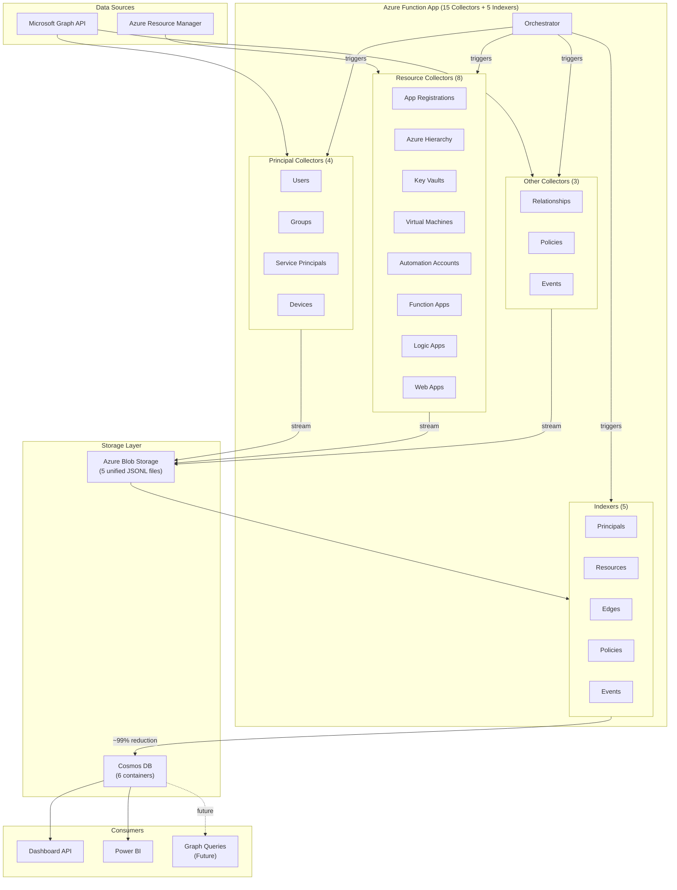
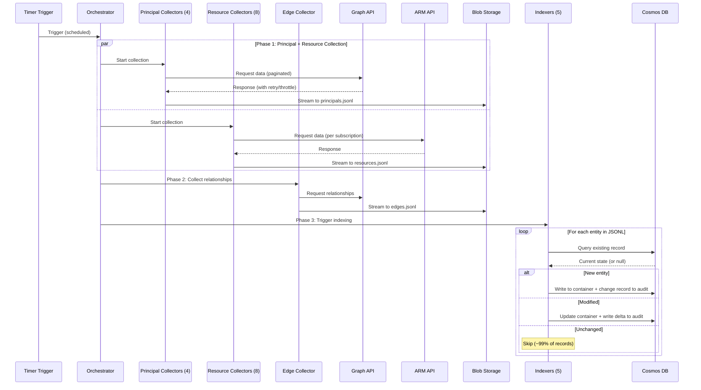
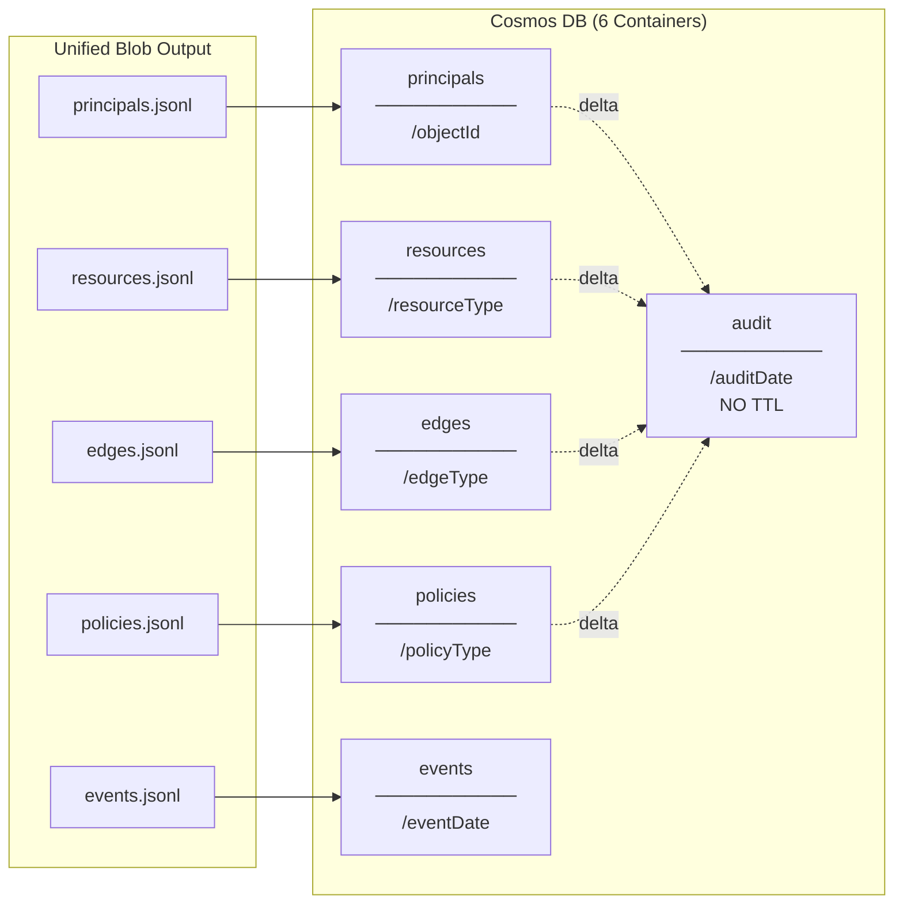

# Entra Risk Data Architecture (V3)

> **Version:** 3.0
> **Last Updated:** 2026-01-08
> **Branch:** experimental-version3
> **Purpose:** Architecture specification for the Entra Risk data collection and analysis platform.

---

## Overview

A data collection and analysis platform that:
- Collects Entra ID and Azure security data via Microsoft Graph API and Azure Resource Manager API
- Stores data in Cosmos DB with intelligent delta detection (~99% write reduction)
- Enables historical trend analysis, audit correlation, and attack path discovery
- Powers dashboards and Power BI reporting
- Designed for Gremlin graph projection (future)

### High-Level Architecture



---

## What's New in V3

| Change | Description |
|--------|-------------|
| **Semantic Correctness** | Applications moved from `principals` to `resources` container (they're resources, not principals) |
| **Unified Edges** | All relationships (Entra + Azure) consolidated into single `edges` container with `edgeType` discriminator |
| **Unified Resources** | Applications + all Azure resources in single `resources` container with `resourceType` discriminator |
| **Temporal Fields** | `effectiveFrom`/`effectiveTo` on all entities for historical queries |
| **Unified Blobs** | 5 consolidated JSONL files instead of 15+ separate files |
| **6 Cosmos Containers** | Down from 9 (principals, resources, edges, policies, events, audit) |
| **roleManagement API** | Migrated from legacy DirectoryRole API to unified roleManagement API |
| **AI Foundry Removed** | Simplified architecture (deferred to V4) |
| **8 Azure Collectors** | Added Automation Accounts, Function Apps, Logic Apps, Web Apps |

---

## Design Principles

| # | Principle | Description |
|---|-----------|-------------|
| 1 | **Collect Everything** | All properties, all relationships - comprehensive data capture |
| 2 | **Collect Once** | Each relationship from the most efficient API direction only |
| 3 | **Denormalize Generously** | Include displayNames and filter fields in relationships |
| 4 | **Wide Tables** | Minimize joins, maximize queryability for Power BI |
| 5 | **Delta Detection** | Only write changes to Cosmos (~99% reduction after first run) |
| 6 | **Historical Tracking** | Keep ALL changes permanently - enable trend analysis over years |
| 7 | **Minimal Change Records** | Store only delta (changed fields), not full entity copies |
| 8 | **Gremlin-Ready** | Unified edges container designed for graph projection |

**Key insight:** ObjectIDs are immutable (never change), making them ideal for partition keys and stable references. DisplayNames are denormalized for convenience but relationships are keyed by ObjectID.

---

## Data Flow



---

### Orchestration Phases

| Phase | Collectors | Output | Parallelism |
|-------|------------|--------|-------------|
| **Phase 1** | Users, Groups, SPs, Devices | principals.jsonl | 4 parallel |
| **Phase 1** | Apps, Azure Hierarchy, Key Vaults, VMs, Automation, Functions, Logic Apps, Web Apps | resources.jsonl | 8 parallel |
| **Phase 1** | Policies | policies.jsonl | 1 |
| **Phase 1** | Events | events.jsonl | 1 |
| **Phase 2** | Relationships (all edge types) | edges.jsonl | 1 |
| **Phase 3** | All 5 indexers | → Cosmos DB | Sequential per type |

### Key Patterns
- **Streaming to blob** - Memory efficient, handles any data volume
- **Append blob with If-None-Match** - Prevents race conditions when multiple collectors write to same file
- **Delta detection** - Field-based comparison, ~99% write reduction
- **Retry with backoff** - Handles Graph API throttling
- **Parallel collection** - Multiple collectors run concurrently
- **Temporal tracking** - `effectiveFrom`/`effectiveTo` for point-in-time queries

---

## Storage Structure

### Cosmos DB Containers (6)



| Container | Partition Key | Contents | TTL |
|-----------|---------------|----------|-----|
| `principals` | `/objectId` | Users, Groups, Service Principals, Devices | None |
| `resources` | `/resourceType` | Applications, Tenant, Subscriptions, RGs, Key Vaults, VMs, Automation Accounts, Function Apps, Logic Apps, Web Apps | None |
| `edges` | `/edgeType` | ALL relationships unified (Entra + Azure) | None |
| `policies` | `/policyType` | CA policies, role management policies, named locations | None |
| `events` | `/eventDate` | Sign-ins, audits | 90 days |
| `audit` | `/auditDate` | Unified change log - **NO TTL** (permanent history) | None |

### Type Discriminators

Every document includes a type discriminator field:

| Container | Discriminator | Values |
|-----------|---------------|--------|
| `principals` | `principalType` | `user`, `group`, `servicePrincipal`, `device` |
| `resources` | `resourceType` | `application`, `tenant`, `managementGroup`, `subscription`, `resourceGroup`, `keyVault`, `virtualMachine`, `automationAccount`, `functionApp`, `logicApp`, `webApp` |
| `edges` | `edgeType` | `groupMember`, `directoryRole`, `pimEligible`, `azureRbac`, `hasManagedIdentity`, ... (18 types) |
| `policies` | `policyType` | `conditionalAccess`, `roleManagement`, `namedLocation` |
| `events` | `eventType` | `signIn`, `audit` |

### Blob Structure

```
raw-data/{timestamp}/
├── {timestamp}-principals.jsonl    ← Users, Groups, SPs, Devices
├── {timestamp}-resources.jsonl     ← Apps + ALL Azure resources
├── {timestamp}-edges.jsonl         ← ALL relationships unified
├── {timestamp}-policies.jsonl
└── {timestamp}-events.jsonl
```

---

## Collectors

### Principal Collectors (4)

| Collector | Output | principalType | Key Fields |
|-----------|--------|---------------|------------|
| `CollectUsersWithAuthMethods` | principals.jsonl | `user` | UPN, MFA state, auth methods, sign-in activity |
| `CollectEntraGroups` | principals.jsonl | `group` | Security/mail enabled, membership rule, member counts |
| `CollectEntraServicePrincipals` | principals.jsonl | `servicePrincipal` | App ID, SP type, credentials, OAuth scopes |
| `CollectDevices` | principals.jsonl | `device` | OS, compliance, trust type, last sign-in |

### Resource Collectors (8)

| Collector | Output | resourceType | Key Fields |
|-----------|--------|--------------|------------|
| `CollectAppRegistrations` | resources.jsonl | `application` | API permissions, federated credentials, publisher |
| `CollectAzureHierarchy` | resources.jsonl, edges.jsonl | `tenant`, `managementGroup`, `subscription`, `resourceGroup` | Hierarchy containment |
| `CollectKeyVaults` | resources.jsonl, edges.jsonl | `keyVault` | Access policies, RBAC, soft delete, network rules |
| `CollectVirtualMachines` | resources.jsonl, edges.jsonl | `virtualMachine` | Managed identity, power state, OS, network |
| `CollectAutomationAccounts` | resources.jsonl, edges.jsonl | `automationAccount` | Managed identity, local auth, runbooks |
| `CollectFunctionApps` | resources.jsonl, edges.jsonl | `functionApp` | Managed identity, HTTPS, auth settings |
| `CollectLogicApps` | resources.jsonl, edges.jsonl | `logicApp` | Managed identity, triggers, actions |
| `CollectWebApps` | resources.jsonl, edges.jsonl | `webApp` | Managed identity, HTTPS, client certs |

### Other Collectors (3)

| Collector | Output | Notes |
|-----------|--------|-------|
| `CollectRelationships` | edges.jsonl | All Entra relationships (15 edge types) |
| `CollectPolicies` | policies.jsonl | CA policies, role policies, named locations |
| `CollectEvents` | events.jsonl | Sign-ins, audit logs |

---

## Edge Types (18 total)

### Entra Edges (15 types)

| edgeType | Source | Target | API |
|----------|--------|--------|-----|
| `groupMember` | user/group/SP/device | group | `/groups/{id}/members` |
| `groupMemberTransitive` | user | group | `/groups/{id}/transitiveMembers` |
| `groupOwner` | user | group | `/groups/{id}/owners` |
| `directoryRole` | user/group/SP | role | `/roleManagement/directory/roleAssignments` |
| `pimEligible` | user/group | role | `/roleManagement/directory/roleEligibilitySchedules` |
| `pimActive` | user/group | role | `/roleManagement/directory/roleAssignmentSchedules` |
| `pimGroupEligible` | user | group | `/identityGovernance/privilegedAccess/group/eligibilitySchedules` |
| `pimGroupActive` | user | group | `/identityGovernance/privilegedAccess/group/assignmentSchedules` |
| `azureRbac` | user/group/SP | azureRole | Azure RM API |
| `appRoleAssignment` | user/group/SP | SP | `/servicePrincipals/{id}/appRoleAssignedTo` |
| `oauth2PermissionGrant` | user/tenant | SP | `/oauth2PermissionGrants` |
| `license` | user | license | `/users/{id}/licenseDetails` |
| `deviceOwner` | user | device | `/devices/{id}/registeredOwners` |
| `appOwner` | user/SP | application | `/applications/{id}/owners` |
| `spOwner` | user/SP | servicePrincipal | `/servicePrincipals/{id}/owners` |

### Azure Edges (3 types)

| edgeType | Source | Target | Description |
|----------|--------|--------|-------------|
| `contains` | MG/Sub/RG | Child resource | Azure hierarchy containment |
| `keyVaultAccess` | principal | keyVault | Access policy permissions (get/set secrets, keys, certs) |
| `hasManagedIdentity` | Azure resource | servicePrincipal | System or user-assigned managed identity link |

---

## Indexers (5)

| Indexer | Input | Output Container | Partition Key |
|---------|-------|------------------|---------------|
| `IndexPrincipalsInCosmosDB` | principals.jsonl | principals | /objectId |
| `IndexResourcesInCosmosDB` | resources.jsonl | resources | /resourceType |
| `IndexEdgesInCosmosDB` | edges.jsonl | edges | /edgeType |
| `IndexPoliciesInCosmosDB` | policies.jsonl | policies | /policyType |
| `IndexEventsInCosmosDB` | events.jsonl | events | /eventDate |

All indexers write change records to the `audit` container (partitioned by `/auditDate`).

---

## Temporal Fields

V3 adds temporal tracking to all entities and edges:

```json
{
  "objectId": "user-guid",
  "displayName": "John Doe",
  "effectiveFrom": "2026-01-01T00:00:00Z",
  "effectiveTo": null,
  ...
}
```

| Field | Description |
|-------|-------------|
| `effectiveFrom` | Timestamp when entity was first seen (or re-appeared) |
| `effectiveTo` | Timestamp when entity was deleted (`null` = current/active) |

This enables point-in-time queries:
```sql
-- All users that were active on a specific date
SELECT * FROM principals p
WHERE p.principalType = 'user'
  AND p.effectiveFrom <= '2026-01-15T00:00:00Z'
  AND (p.effectiveTo IS NULL OR p.effectiveTo > '2026-01-15T00:00:00Z')
```

---

## Schemas

### Principals Container

All principals share common fields plus type-specific fields.

#### Common Fields
```json
{
  "id": "{objectId}",
  "objectId": "{objectId}",
  "principalType": "user | group | servicePrincipal | device",
  "displayName": "...",
  "createdDateTime": "ISO-8601",
  "deleted": false,
  "deletedDateTime": null,
  "effectiveFrom": "ISO-8601",
  "effectiveTo": null,
  "collectionTimestamp": "ISO-8601"
}
```

#### User-Specific Fields
```json
{
  "principalType": "user",
  "userPrincipalName": "john@contoso.com",
  "userType": "Member | Guest",
  "accountEnabled": true,
  "lastSignInDateTime": "ISO-8601",
  "passwordPolicies": "DisablePasswordExpiration | ...",
  "usageLocation": "US",
  "mail": "john@contoso.com",
  "department": "Engineering",
  "jobTitle": "Software Engineer",

  "onPremisesSyncEnabled": true,
  "onPremisesSamAccountName": "jdoe",

  "perUserMfaState": "disabled | enabled | enforced",
  "hasAuthenticator": true,
  "hasPhone": true,
  "hasFido2": false,
  "authMethodCount": 4,
  "authMethodTypes": ["authenticator", "phone", ...]
}
```

#### Group-Specific Fields
```json
{
  "principalType": "group",
  "description": "All engineers",
  "mail": "engineering@contoso.com",
  "mailEnabled": true,
  "securityEnabled": true,
  "groupTypes": ["Unified", "DynamicMembership"],
  "membershipRule": "user.department -eq \"Engineering\"",
  "visibility": "Private | Public | HiddenMembership",
  "isAssignableToRole": false,

  "memberCountDirect": 25,
  "userMemberCount": 20,
  "groupMemberCount": 3,
  "servicePrincipalMemberCount": 1,
  "deviceMemberCount": 1
}
```

#### Service Principal-Specific Fields
```json
{
  "principalType": "servicePrincipal",
  "appId": "app-guid",
  "appDisplayName": "Contoso API",
  "servicePrincipalType": "Application | ManagedIdentity | Legacy | SocialIdp",
  "accountEnabled": true,
  "appRoleAssignmentRequired": true,
  "servicePrincipalNames": ["api://contoso", "https://app.contoso.com"],
  "verifiedPublisher": {...},
  "preferredSingleSignOnMode": "saml | oidc | password"
}
```

#### Device-Specific Fields
```json
{
  "principalType": "device",
  "deviceId": "device-guid",
  "operatingSystem": "Windows | iOS | Android | macOS | Linux",
  "operatingSystemVersion": "10.0.22621",
  "trustType": "AzureAd | ServerAd | Workplace",
  "isCompliant": true,
  "isManaged": true,
  "approximateLastSignInDateTime": "ISO-8601"
}
```

---

### Resources Container

#### Application Fields (moved from principals)
```json
{
  "resourceType": "application",
  "objectId": "app-object-id",
  "appId": "app-guid",
  "displayName": "Contoso App",
  "signInAudience": "AzureADMyOrg | AzureADMultipleOrgs | ...",
  "publisherDomain": "contoso.com",
  "verifiedPublisher": {...},
  "isPublisherVerified": true,

  "passwordCredentials": [...],
  "keyCredentials": [...],
  "secretCount": 2,
  "certificateCount": 1,

  "requiredResourceAccess": [...],
  "apiPermissionCount": 5,

  "federatedIdentityCredentials": [...],
  "hasFederatedCredentials": true,
  "federatedCredentialCount": 2,

  "effectiveFrom": "ISO-8601",
  "effectiveTo": null
}
```

#### Azure Resource Common Fields
```json
{
  "id": "{resourceId}",
  "objectId": "{resourceId}",
  "resourceType": "keyVault | virtualMachine | functionApp | ...",
  "displayName": "...",
  "location": "eastus",
  "subscriptionId": "sub-guid",
  "resourceGroupName": "rg-name",
  "tags": {...},
  "effectiveFrom": "ISO-8601",
  "effectiveTo": null,
  "collectionTimestamp": "ISO-8601"
}
```

#### Key Vault Fields
```json
{
  "resourceType": "keyVault",
  "vaultUri": "https://kv-prod.vault.azure.net/",
  "enableRbacAuthorization": false,
  "enableSoftDelete": true,
  "enablePurgeProtection": true,
  "publicNetworkAccess": "Enabled",
  "accessPolicies": [...],
  "accessPolicyCount": 5
}
```

#### Virtual Machine Fields
```json
{
  "resourceType": "virtualMachine",
  "vmId": "vm-guid",
  "vmSize": "Standard_D4s_v3",
  "osType": "Windows | Linux",
  "powerState": "running | deallocated | stopped",
  "identityType": "SystemAssigned | UserAssigned | SystemAssigned,UserAssigned | None",
  "hasSystemAssignedIdentity": true,
  "systemAssignedPrincipalId": "sp-object-id",
  "hasUserAssignedIdentity": false
}
```

#### Function App / Web App Fields
```json
{
  "resourceType": "functionApp | webApp",
  "kind": "functionapp,linux",
  "httpsOnly": true,
  "clientCertEnabled": false,
  "identityType": "SystemAssigned",
  "hasSystemAssignedIdentity": true,
  "systemAssignedPrincipalId": "sp-object-id"
}
```

---

### Edges Container

#### Edge Common Fields
```json
{
  "id": "{sourceId}_{targetId}_{edgeType}",
  "edgeType": "groupMember | directoryRole | hasManagedIdentity | ...",
  "sourceId": "source-object-id",
  "sourceType": "user | group | servicePrincipal | device | functionApp | ...",
  "sourceDisplayName": "John Doe",
  "targetId": "target-object-id",
  "targetType": "group | directoryRole | application | keyVault | ...",
  "targetDisplayName": "Engineering Team",
  "effectiveFrom": "ISO-8601",
  "effectiveTo": null,
  "collectionTimestamp": "ISO-8601"
}
```

#### Managed Identity Edge
```json
{
  "id": "{resourceId}_{spId}_hasManagedIdentity",
  "edgeType": "hasManagedIdentity",
  "sourceId": "/subscriptions/.../functionApps/func-prod",
  "sourceType": "functionApp",
  "sourceDisplayName": "func-prod",
  "targetId": "sp-object-id",
  "targetType": "servicePrincipal",
  "identityType": "SystemAssigned | UserAssigned"
}
```

#### Key Vault Access Edge
```json
{
  "id": "{principalId}_{kvId}_keyVaultAccess",
  "edgeType": "keyVaultAccess",
  "sourceId": "user-object-id",
  "sourceType": "user",
  "targetId": "/subscriptions/.../vaults/kv-prod",
  "targetType": "keyVault",
  "accessType": "accessPolicy",
  "keyPermissions": ["get", "list"],
  "secretPermissions": ["get", "list", "set"],
  "canGetSecrets": true,
  "canSetSecrets": true
}
```

---

### Audit Container

Optimized delta-only storage for permanent change history.

```json
{
  "id": "change-unique-id",
  "auditDate": "2026-01-07",
  "changeTimestamp": "2026-01-07T14:00:00Z",
  "snapshotId": "2026-01-07T14-00-00Z",

  "entityType": "principal | resource | edge | policy",
  "principalType": "user | group | ...",
  "resourceType": "application | keyVault | ...",
  "edgeType": "groupMember | hasManagedIdentity | ...",
  "changeType": "new | modified | deleted",

  "objectId": "affected-object-id",
  "displayName": "John Doe",

  "changedFields": ["accountEnabled", "lastSignInDateTime"],
  "delta": {
    "accountEnabled": { "old": true, "new": false },
    "lastSignInDateTime": { "old": "2026-01-01T...", "new": "2026-01-07T..." }
  }
}
```

---

## Delta Detection

### How It Works

Delta detection is **field-based**, not container-based. The system compares specific fields to determine if a record has changed.

```
1. Collector writes JSONL (streaming to blob)
   - All entities with type discriminator
   - Uses append blob with If-None-Match header for race protection

2. Indexer triggered
   - Reads JSONL from blob
   - Queries existing entities from Cosmos

3. For each entity in blob:
   - Exists in Cosmos?
     - No → NEW (write to container + audit record, set effectiveFrom = now)
     - Yes → Compare fields
       - Different → MODIFIED (update container + write delta to audit)
       - Same → UNCHANGED (skip ~99% of records)

4. For each entity in Cosmos not in blob:
   - DELETED (set effectiveTo = now + write audit record)
```

---

## Example Queries

### "All users with no MFA registered"
```sql
SELECT * FROM principals p
WHERE p.principalType = 'user'
  AND p.authMethodCount <= 1
  AND p.effectiveTo = null
```

### "Applications with expiring secrets"
```sql
SELECT * FROM resources r
WHERE r.resourceType = 'application'
  AND r.secretCount > 0
  AND r.effectiveTo = null
```

### "Azure resources with managed identity"
```sql
SELECT * FROM resources r
WHERE r.hasSystemAssignedIdentity = true
  AND r.effectiveTo = null
```

### "Attack path: Who has access to Key Vaults?"
```sql
SELECT e.sourceDisplayName, e.targetDisplayName, e.secretPermissions
FROM edges e
WHERE e.edgeType = 'keyVaultAccess'
  AND e.canGetSecrets = true
```

### "All Function Apps with managed identities and their permissions"
```sql
-- Step 1: Get managed identity edges
SELECT e.sourceDisplayName, e.targetId as servicePrincipalId
FROM edges e
WHERE e.edgeType = 'hasManagedIdentity'
  AND e.sourceType = 'functionApp'

-- Step 2: Get what the SP can access
SELECT e2.*
FROM edges e2
WHERE e2.sourceId = @servicePrincipalId
  AND e2.edgeType IN ('appRoleAssignment', 'azureRbac', 'keyVaultAccess')
```

---

## Gremlin Design (Future)

The unified `edges` container is Gremlin-ready by design:

1. **Consistent edge format:** `{sourceId}_{targetId}_{edgeType}` maps directly to Gremlin edges
2. **Type discriminator as label:** `edgeType` becomes Gremlin edge label
3. **Minimal projection:** Gremlin only needs id, sourceId, targetId, edgeType

**Attack path queries enabled:**
```gremlin
// "Who can reach Global Admin?"
g.V().hasLabel('directoryRole').has('roleTemplateId', 'global-admin-id')
  .repeat(__.in()).emit().path()

// "What can this compromised user access?"
g.V('user-id').repeat(out()).emit().path()

// "Attack path: User → Group → VM → Managed Identity → KeyVault"
g.V('user-id').out('groupMember').out('azureRbac').out('hasManagedIdentity').out('keyVaultAccess')
```

---

## Summary

| Aspect | Value |
|--------|-------|
| Collectors | 15 (4 Principal + 8 Resource + 3 Other) |
| Indexers | 5 |
| Cosmos containers | 6 |
| Edge types | 18 (15 Entra + 3 Azure) |
| Azure resource types | 11 |
| Blob files per run | 5 (principals, resources, edges, policies, events) |
| Partition strategy | principalType/resourceType/edgeType for efficient queries |
| Delta detection | ~99% write reduction |
| Historical tracking | Permanent (no TTL on audit container) |
| Temporal fields | effectiveFrom/effectiveTo on all entities |

### Key Architectural Decisions (V3)

1. **Applications are resources, not principals** - Semantic correctness
2. **Unified edges container** - All relationships in one place for graph queries
3. **Unified resources container** - Apps + Azure resources together
4. **Temporal fields** - Enable point-in-time queries
5. **Append blob with If-None-Match** - Race-safe parallel writes to same file
6. **roleManagement API** - Consistent, includes custom roles
7. **Gremlin-ready design** - Edge format maps directly to graph

---

**End of Architecture Document**
