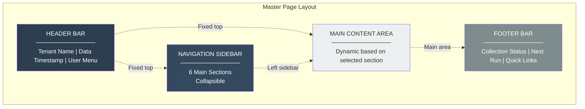
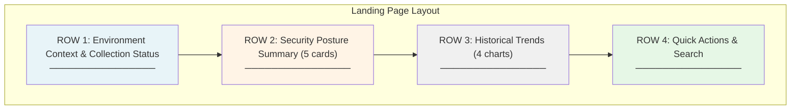
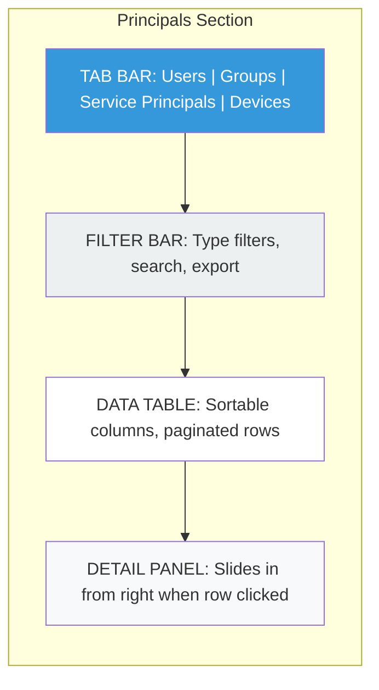
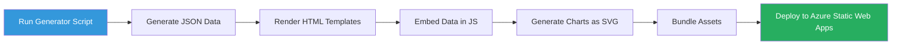

# Notes
## Relationship notes 
- we have great data for relationships/edges.
- but gremlin won’t be implemented in this version…
- how do we make the most of the relationship data in the dashboard/website???
- I don’t feel as if we’re utilizing it enough 

## Visualizations
- Row3["ROW 3: Historical Trends (4 charts)<br/>────────────────"]
- D --> E[Generate Charts as SVG]
- etc

Need more details for how to implement this


# Website and Dashboard Design Document - Version 1.0

-----

## Table of Contents

1. [Design Overview](#1-design-overview)
1. [Page Layout Structure](#2-page-layout-structure)
1. [Landing Page Design](#3-landing-page-design)
1. [Navigation Sections Design](#4-navigation-sections-design)
1. [Visual Design System](#5-visual-design-system)
1. [Responsive Behavior](#6-responsive-behavior)
1. [Static Demo Website](#7-static-demo-website)

-----

## 1. Design Overview

### 1.1 Design Philosophy

The dashboard prioritizes **information density and functional clarity** over visual embellishment. Security analysts need to process large datasets efficiently, requiring:

- Dense tabular layouts with sorting and filtering
- Minimal chrome and decoration
- High contrast for readability during long analysis sessions
- Fast scanning patterns with clear visual hierarchy

### 1.2 Core Design Constraint

**Daily Collection Model:** All UI elements must communicate that data represents a daily snapshot, not real-time state. Timestamps and data freshness indicators appear prominently throughout the interface.

-----

## 2. Page Layout Structure

### 2.1 Master Page Layout



### 2.2 Header Bar Design

```
┌─────────────────────────────────────────────────────────────────────┐
│     Contoso Tenant (contoso.onmicrosoft.com)                   │
│                                                                     │
│         🟢 Data collected 6 hours ago (Jan 10, 2026 2:00 AM)       │
│                                                           [User ▼]  │
└─────────────────────────────────────────────────────────────────────┘
```

**Elements:**

- **Tenant Identifier:** Current tenant name and domain (prominent)
- **Data Freshness Indicator:**
  - Status dot (green/yellow/red)
  - Relative time (“6 hours ago”)
  - Absolute timestamp on hover

**Fixed Position:** Header remains visible during scroll

## Relationship notes 
- we have great data
- but gremlin won’t be implemented in this version…
- how do we make the most of the relationship data???
- I don’t feel as if we’re utilizing it enough 


### 2.3 Navigation Sidebar Design

```
┌────────────────────┐
│ NAVIGATION         │
├────────────────────┤
│                    │
│ 📊 Dashboard       │
│                    │
│ 👥 Principals      │
│   ├─ Users         │
│   ├─ Groups        │
│   ├─ Service Pr... │
│   └─ Devices       │
│                    │
│ 📦 Resources       │
│   ├─ Applications  │
│   ├─ Role Defs     │
│   ├─ Azure Hier... │
│   └─ Azure Res...  │
│                    │
│ 🔗 Relationships   │
│   ├─ By Edge Type  │
│   └─ All Edges     │
│                    │
│ 📋 Policies        │
│   ├─ Cond. Access  │
│   ├─ Role Mgmt     │
│   ├─ Intune        │
│   └─ More... (9)   │
│                    │
│ ⚙️ Administration  │
│   ├─ Audit Logs    │
│   ├─ Collection    │
│   └─ System Health │
│                    │
└────────────────────┘
```

**Features:**

- Collapsible sections (expand/collapse subsections)
- Active section highlighted
- Icon + text labels
- Width: 240px (expandable to 280px on hover)

### 2.4 Footer Bar Design

```
┌─────────────────────────────────────────────────────────────────────┐
│ Collection Status: ✓ Completed Jan 10 2:14 AM (14m 32s)            │
│ Next Collection: Jan 11 2:00 AM (in 17h 46m) | Help | Feedback     │
└─────────────────────────────────────────────────────────────────────┘
```

**Fixed Position:** Footer remains visible (sticky bottom)

-----

## 3. Landing Page Design

### 3.1 Landing Page Layout



### 3.2 Row 1: Context & Status (2-column layout)

```
┌──────────────────────────────────┬──────────────────────────────────┐
│ ENVIRONMENT CONTEXT              │ COLLECTION STATUS                │
├──────────────────────────────────┼──────────────────────────────────┤
│                                  │                                  │
│ Tenant: Contoso Corporation      │ Last Run: Jan 10, 2026 2:00 AM   │
│ Tenant ID: a1b2c3d4-...          │ Duration: 14 minutes 32 seconds  │
│                                  │ Status: ✓ Success                │
│ Data Snapshot:                   │                                  │
│ January 10, 2026 2:14 AM         │ Entities Collected:              │
│                                  │ • 2,847 Principals               │
│ Data Age: 6 hours 23 minutes     │ • 1,532 Resources                │
│                                  │ • 8,421 Edges                    │
│ [View Collection Details →]      │ • 89 Policies                    │
│                                  │                                  │
│                                  │ Next Run: Jan 11, 2026 2:00 AM   │
│                                  │ (in 17 hours 46 minutes)         │
│                                  │                                  │
│                                  │ ⚠️ 2 Warnings [View Logs →]      │
└──────────────────────────────────┴──────────────────────────────────┘
```

**Design Notes:**

- Equal-width columns (50/50 split)
- Light background color to distinguish from main content
- Prominent data age display
- Warning/error count with link to logs

### 3.3 Row 2: Security Posture Summary (5-card layout)

```
┌─────────────┬─────────────┬─────────────┬─────────────┬─────────────┐
│ PRIVILEGED  │ AUTHENTI-   │ CONDITIONAL │ AZURE       │ APPLICATION │
│ ACCESS      │ CATION      │ ACCESS      │ RESOURCES   │ SECURITY    │
├─────────────┼─────────────┼─────────────┼─────────────┼─────────────┤
│             │             │             │             │             │
│ 47          │ 23          │ 12          │ 8           │ 5           │
│ Role        │ Users w/o   │ Policies    │ Resources   │ Apps w/     │
│ Assignments │ MFA         │ Enabled     │ w/o Managed │ Expiring    │
│             │             │             │ Identity    │ Creds       │
│ ────────    │ ────────    │ ────────    │ ────────    │ ────────    │
│ • 12 Perm   │ 🔴 HIGH     │ 78% MFA     │ 32 Key      │ 🔴 CRITICAL │
│ • 35 Time   │   RISK      │ Coverage    │ Vaults      │   ATTENTION │
│             │             │             │             │             │
│ 8 Eligible  │ 156 w/      │ 5 Policy    │ 14 Storage  │ 12 SPs w/   │
│ (snapshot)  │ Legacy Auth │ Exclusions  │ w/ Public   │ Priv Roles  │
│             │             │             │ Access      │             │
│ 3 Global    │ 7 Risky     │ 3 Location  │             │ 8 Inactive  │
│ Admins      │ Users       │ Policies    │             │ 90+ days    │
│             │             │             │             │             │
│ [Details →] │ [Details →] │ [Details →] │ [Details →] │ [Details →] │
└─────────────┴─────────────┴─────────────┴─────────────┴─────────────┘
```

**Design Notes:**

- Equal-width cards (20% each)
- Large number at top (primary metric)
- Color-coded severity indicators (red/yellow/green)
- 3-4 sub-metrics per card
- Each card clickable (drills to filtered view)
- Visual separator between metrics (────────)

### 3.4 Row 3: Historical Trends (4-chart layout)

```
┌─────────────────────────┬─────────────────────────┐
│ PRIVILEGED ROLE GROWTH  │ NEW RISKY USERS         │
│ (90-day trend)          │ (per week)              │
├─────────────────────────┼─────────────────────────┤
│                         │                         │
│     [Line Chart]        │     [Bar Chart]         │
│                         │                         │
│  47 assignments today   │  7 users this week      │
│  ▲ +3 from 90 days ago  │  ▼ -2 from last week    │
│                         │                         │
└─────────────────────────┴─────────────────────────┘
┌─────────────────────────┬─────────────────────────┐
│ CA POLICY MODIFICATIONS │ AZURE RESOURCE CHANGES  │
│ (monthly frequency)     │ (90-day trend)          │
├─────────────────────────┼─────────────────────────┤
│                         │                         │
│     [Bar Chart]         │     [Line Chart]        │
│                         │                         │
│  2 changes this month   │  1,532 resources today  │
│  ─ Same as last month   │  ▲ +18 from 90 days ago │
│                         │                         │
└─────────────────────────┴─────────────────────────┘
```

**Design Notes:**

- 2x2 grid layout (4 charts)
- Each chart with title and time range
- Current value + delta from comparison period
- Trend indicator (▲ up, ▼ down, ─ stable)
- Charts use consistent color scheme

### 3.5 Row 4: Quick Search & Actions

```
┌─────────────────────────────────────────────────────────────────────┐
│ QUICK SEARCH                                                        │
├─────────────────────────────────────────────────────────────────────┤
│                                                                     │
│  [🔍 Search by UPN, display name, object ID, or app name...]       │
│                                                                     │
│  Recent Searches: john.doe@contoso.com | HR-App | Device-ABC123    │
│                                                                     │
└─────────────────────────────────────────────────────────────────────┘
```

**Design Notes:**

- Full-width search bar
- Auto-complete suggestions
- Recent searches for quick re-access
- Search results open in modal or navigate to entity detail

-----

## 4. Navigation Sections Design

### 4.1 Principals Section Layout



**Tab Bar Design:**

```
┌─────────────────────────────────────────────────────────────────────┐
│ [Users (2,847)] [Groups (412)] [Service Principals (1,823)] [...] │
└─────────────────────────────────────────────────────────────────────┘
```

**Filter Bar Design:**

```
┌─────────────────────────────────────────────────────────────────────┐
│ Filters: [Account Enabled ▼] [Has MFA ▼] [Risk Level ▼]            │
│                                                                     │
│ Search: [🔍 Filter table...]          [↓ Export to CSV] [⟳ Refresh]│
└─────────────────────────────────────────────────────────────────────┘
```

**Data Table Design (Users Example):**

```
┌──────────────┬─────────────────────────┬──────────────┬──────────┬─────────┬──────────────┐
│ Display Name │ User Principal Name     │ Last Sign-In │ MFA      │ Risk    │ Licenses     │
├──────────────┼─────────────────────────┼──────────────┼──────────┼─────────┼──────────────┤
│ John Doe     │ john.doe@contoso.com    │ 2 hours ago  │ ✓ Phone  │ None    │ E5, P2       │
│ Jane Smith   │ jane.smith@contoso.com  │ 1 day ago    │ ✗ None   │ 🔴 High │ E3           │
│ Bob Johnson  │ bob.j@contoso.com       │ 3 days ago   │ ✓ App    │ None    │ E5           │
│ ...          │ ...                     │ ...          │ ...      │ ...     │ ...          │
├──────────────┴─────────────────────────┴──────────────┴──────────┴─────────┴──────────────┤
│ Showing 1-50 of 2,847           [← Previous] Page 1 of 57 [Next →]                        │
└────────────────────────────────────────────────────────────────────────────────────────────┘
```

**Design Notes:**

- Column headers clickable for sorting (▲▼ indicators)
- Alternating row colors for readability
- Icons for boolean values (✓/✗)
- Color coding for risk levels
- Pagination controls at bottom
- Row hover highlights
- Click row to open detail panel

**Detail Panel Design (Slides in from right):**

```
                                    ┌─────────────────────────────┐
                                    │ [X Close]                   │
                                    ├─────────────────────────────┤
                                    │ USER DETAILS                │
                                    │                             │
                                    │ John Doe                    │
                                    │ john.doe@contoso.com        │
                                    │                             │
                                    │ ─────────────────────────   │
                                    │ Account Status: Enabled     │
                                    │ Created: Jan 15, 2024       │
                                    │ Last Sign-In: 2 hours ago   │
                                    │                             │
                                    │ MFA Status: ✓ Registered    │
                                    │ Auth Methods: Phone, App    │
                                    │                             │
                                    │ Risk: None                  │
                                    │ Licenses: E5, P2            │
                                    │                             │
                                    │ ─────────────────────────   │
                                    │ RELATIONSHIPS               │
                                    │                             │
                                    │ • 3 Group Memberships       │
                                    │ • 1 Directory Role          │
                                    │ • 0 Azure RBAC Assignments  │
                                    │                             │
                                    │ [View All Relationships →]  │
                                    │                             │
                                    │ [View Audit History →]      │
                                    └─────────────────────────────┘
```

**Width:** 400px overlay panel

### 4.2 Relationships Section Layout

```
┌─────────────────────────────────────────────────────────────────────┐
│ RELATIONSHIP EXPLORER                                               │
├─────────────────────────────────────────────────────────────────────┤
│ Edge Type: [All Edge Types ▼]                       [Export] [⟳]    │
├─────────────────────────────────────────────────────────────────────┤
│                                                                     │
│ Quick Filters:                                                      │
│ [Directory Roles] [PIM Eligible] [Azure RBAC] [CA Policies]        │
│ [Group Membership] [Ownership] [App Roles] [OAuth2 Grants]         │
│ [Abuse Edges] [Virtual Edges] [All]                                │
│                                                                     │
├─────────────────────────────────────────────────────────────────────┤
│                                                                     │
│ SOURCE               EDGE TYPE          TARGET                      │
│ ─────────────────────────────────────────────────────────────────  │
│ John Doe         ──[directoryRole]──→   Global Administrator       │
│ Jane Smith       ──[pimEligible]────→   User Administrator         │
│ HR-App-SP        ──[azureRbac]──────→   Contoso-Subscription       │
│ Engineering      ──[groupMember]────→   All-Developers             │
│ ...                                                                 │
│                                                                     │
│ Showing 1-50 of 8,421           [← Previous] Page 1 of 169 [Next →]│
└─────────────────────────────────────────────────────────────────────┘
```

**Design Notes:**

- Visual edge representation (arrows)
- Quick filter buttons for common edge types
- Dropdown for all 33+ edge types
- Click row to see edge properties in detail panel

### 4.3 Policies Section Layout

```
┌─────────────────────────────────────────────────────────────────────┐
│ POLICIES                                                            │
├─────────────────────────────────────────────────────────────────────┤
│ [Conditional Access] [Role Management] [PIM Groups] [Intune Comp]  │
│ [App Protection] [Auth Methods] [Security Defaults] [Authorization]│
│ [Cross-Tenant] [Permission Grant] [Admin Consent] [Named Locations]│
└─────────────────────────────────────────────────────────────────────┘

Currently Viewing: Conditional Access Policies (12 policies)

┌──────────────────────┬──────────┬─────────────────────┬──────────────┐
│ Policy Name          │ State    │ Targets             │ Controls     │
├──────────────────────┼──────────┼─────────────────────┼──────────────┤
│ Require MFA for All  │ ✓ Enable │ All Users           │ MFA Required │
│ Block Legacy Auth    │ ✓ Enable │ All Users           │ Block Access │
│ Require Compliance   │ ⚠ Report │ Finance Group       │ Compliant    │
│ Guest Restrictions   │ ✗ Disable│ Guest Users         │ MFA Required │
│ ...                  │ ...      │ ...                 │ ...          │
└──────────────────────┴──────────┴─────────────────────┴──────────────┘
```

**Design Notes:**

- Pill-style tab selector for 12 policy types
- Visual state indicators (✓ enabled, ⚠ report-only, ✗ disabled)
- Each policy type has custom columns relevant to that type
- Click policy row to see full details

-----

## 5. Visual Design System

### 5.1 Color Palette

```
PRIMARY COLORS:
- Header/Nav:     #2c3e50 (dark blue-gray)
- Accent:         #3498db (blue)
- Background:     #ecf0f1 (light gray)

STATUS COLORS:
- Success/Green:  #27ae60
- Warning/Yellow: #f39c12
- Error/Red:      #e74c3c
- Info/Blue:      #3498db

RISK LEVEL COLORS:
- None:           #95a5a6 (gray)
- Low:            #f39c12 (yellow)
- Medium:         #e67e22 (orange)
- High:           #e74c3c (red)
- Critical:       #c0392b (dark red)

TEXT COLORS:
- Primary:        #2c3e50
- Secondary:      #7f8c8d
- Inverse:        #ffffff
```

### 5.2 Typography

```
FONT FAMILY:
- Primary: 'Segoe UI', Tahoma, Geneva, Verdana, sans-serif
- Monospace: 'Consolas', 'Courier New', monospace (for GUIDs, timestamps)

FONT SIZES:
- H1 (Page Title):     28px, bold
- H2 (Section):        22px, semi-bold
- H3 (Subsection):     18px, semi-bold
- Body:                14px, regular
- Small:               12px, regular
- Large Metrics:       36px, bold (for summary cards)

LINE HEIGHT:
- Headers:             1.2
- Body:                1.5
- Tables:              1.4
```

### 5.3 Spacing System

```
SPACING SCALE (consistent spacing units):
- xs:  4px
- sm:  8px
- md:  16px
- lg:  24px
- xl:  32px
- 2xl: 48px

USAGE:
- Card padding:        lg (24px)
- Table cell padding:  sm (8px)
- Section margins:     xl (32px)
- Button padding:      sm md (8px 16px)
```

### 5.4 Component Styling

**Cards:**

```
background: #ffffff
border: 1px solid #e0e0e0
border-radius: 4px
box-shadow: 0 2px 4px rgba(0,0,0,0.1)
padding: 24px
```

**Tables:**

```
border-collapse: collapse
border: 1px solid #e0e0e0

Headers:
  background: #f8f9fa
  font-weight: 600
  text-align: left
  padding: 12px 8px
  border-bottom: 2px solid #dee2e6

Rows:
  padding: 8px
  border-bottom: 1px solid #e0e0e0
  
  Hover:
    background: #f8f9fa
    cursor: pointer
  
  Alternating:
    background: #ffffff / #fafafa
```

**Buttons:**

```
Primary:
  background: #3498db
  color: #ffffff
  border: none
  border-radius: 4px
  padding: 8px 16px
  
  Hover:
    background: #2980b9

Secondary:
  background: #ffffff
  color: #2c3e50
  border: 1px solid #bdc3c7
  border-radius: 4px
  padding: 8px 16px
  
  Hover:
    background: #ecf0f1
```

-----

## 6. Responsive Behavior

### 6.1 Breakpoints

```
Desktop:  > 1200px  (full layout)
Tablet:   768-1199px (condensed sidebar)
Mobile:   < 768px   (stacked layout, hamburger menu)
```

-----

# LOW PRIORITY IDEAS

*This stuff is to be disregarded and ignored!!!*

It’s only so i have it noted down

*IGNORE THIS SECTION!!!*

### Mobile Layout Adaptations

```
MOBILE VIEW (< 768px):

┌─────────────────────────┐
│ [☰]        🟢 6h ago   │
├─────────────────────────┤
│                         │
│ ENVIRONMENT CONTEXT     │
│ (full width card)       │
│                         │
├─────────────────────────┤
│                         │
│ COLLECTION STATUS       │
│ (full width card)       │
│                         │
├─────────────────────────┤
│                         │
│ PRIVILEGED ACCESS       │
│ (full width card)       │
│                         │
├─────────────────────────┤
│                         │
│ AUTHENTICATION          │
│ (full width card)       │
│                         │
├─────────────────────────┤
│ (cards stack vertically)│
│                         │
└─────────────────────────┘
```

**Mobile Adaptations:**

- Hamburger menu for navigation
- Cards stack vertically (100% width)
- Tables scroll horizontally or show condensed columns
- Charts scale to fit width
- Detail panels become full-screen modals

## 7. Static Demo Website

### 7.1 Synthetic Data Strategy

**Approach:** Generate completely fictional data that demonstrates realistic security postures without exposing any real tenant information.

**Data Generation Script:**

```javascript
// Pseudo-code for data generator

const generateSyntheticData = () => {
  return {
    tenant: {
      name: "Contoso Corporation",
      domain: "contoso-demo.onmicrosoft.com",
      tenantId: "12345678-1234-1234-1234-123456789abc"
    },
    
    users: generateUsers(100), // 100 fictional users
    groups: generateGroups(30),
    servicePrincipals: generateSPs(50),
    devices: generateDevices(75),
    
    applications: generateApps(20),
    azureResources: generateResources(150),
    
    edges: generateEdges(), // Based on above entities
    policies: generatePolicies(),
    
    metrics: calculateMetrics(), // Derived from entities
    trends: generateTrends() // 90 days of historical data
  };
};

const generateUsers = (count) => {
  const users = [];
  const firstNames = ["John", "Jane", "Bob", "Alice", "Charlie", "Diana"];
  const lastNames = ["Smith", "Doe", "Johnson", "Williams", "Brown", "Davis"];
  
  for (let i = 0; i < count; i++) {
    const firstName = faker.random.arrayElement(firstNames);
    const lastName = faker.random.arrayElement(lastNames);
    
    users.push({
      id: faker.datatype.uuid(),
      displayName: `${firstName} ${lastName}`,
      userPrincipalName: `${firstName.toLowerCase()}.${lastName.toLowerCase()}@contoso-demo.com`,
      accountEnabled: faker.datatype.boolean(0.95), // 95% enabled
      hasMFA: faker.datatype.boolean(0.75), // 75% have MFA
      riskLevel: faker.random.arrayElement(["None", "Low", "Medium", "High"]),
      lastSignIn: faker.date.recent(30),
      licenses: faker.random.arrayElements(["E3", "E5", "P1", "P2"], 2)
    });
  }
  
  return users;
};

// Similar functions for groups, SPs, devices, etc.
```

### 7.2 Static Site Build Process

**Build Pipeline:**



**Steps:**

1. **Run Data Generator:**
   
   ```bash
   node generate-demo-data.js
   # Outputs: demo-data.json
   ```
1. **Build Static Site:**
   
   ```bash
   npm run build
   # Renders all pages with embedded data
   # Output: dist/ folder with static HTML/CSS/JS
   ```
1. **Deploy:**
   
   ```bash
   # GitHub Actions workflow auto-deploys on push
   # OR manual: az staticwebapp deploy
   ```

### 7.4 Demo Site Tech Stack

**Recommended Stack:**

```
Generator:
  - Node.js + Faker.js for synthetic data generation

Frontend:
  - Plain HTML5/CSS3/JavaScript (no framework dependency)
  - Chart.js for visualizations
  - Alpine.js for lightweight interactivity (optional)

Hosting:
  - Azure Static Web Apps (free tier)
  - GitHub Pages (alternative)

Deployment:
  - GitHub Actions for CI/CD
```

**File Structure:**

```
demo-site/
├── generate-data.js          # Synthetic data generator
├── build.js                  # Static site builder
├── src/
│   ├── templates/
│   │   ├── index.html        # Landing page template
│   │   ├── principals.html   # Principals section template
│   │   └── ...
│   ├── styles/
│   │   └── main.css          # All styles
│   └── scripts/
│       └── app.js            # Client-side interactivity
├── dist/                     # Built site (deployed)
│   ├── index.html
│   ├── data.js               # Embedded synthetic data
│   ├── styles.css
│   └── app.js
└── package​​​​​​​​​​​​​​​​
```