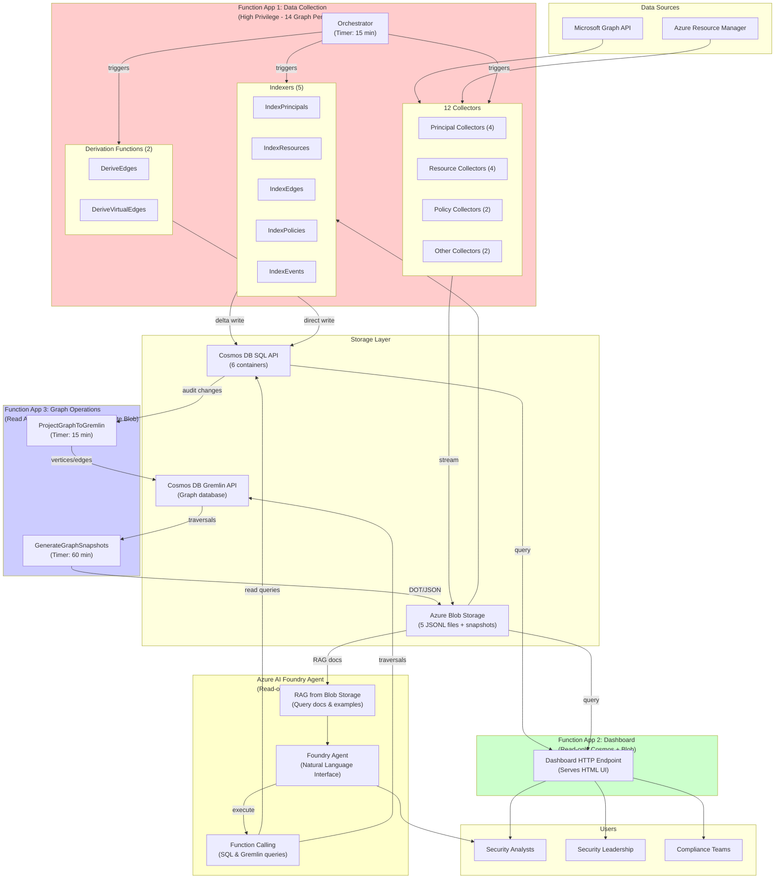
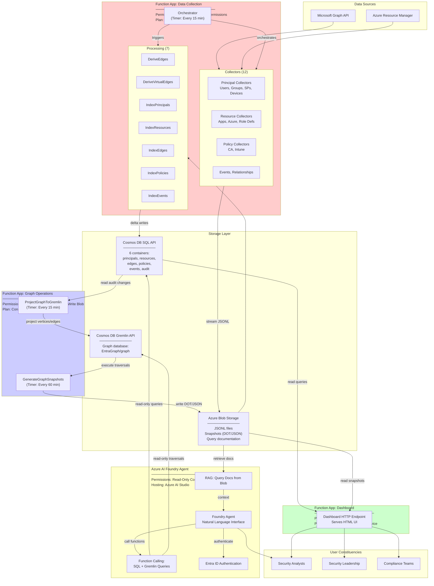

# Function App Architecture Analysis

## Should Components Be Separated Into Multiple Function Apps?

The current architecture consolidates all functionality into a single Function App containing twelve collectors, two derivation functions, five indexers, and the dashboard HTTP endpoint. Separating concerns into multiple Function Apps offers architectural advantages that outweigh the operational complexity of managing additional Azure resources.

### Security Isolation

Your observation about privilege separation represents the most compelling argument for Function App separation. The data collection Function App requires extensive Microsoft Graph API permissions including User.Read.All, Group.Read.All, Application.Read.All, Directory.Read.All, RoleManagement.Read.All, IdentityRiskyUser.Read.All, DeviceManagementConfiguration.Read.All, DeviceManagementApps.Read.All, and Policy.Read.All among others. The managed identity for this Function App holds fourteen Graph API application permissions representing broad read access across the entire tenant.

The dashboard Function App requires only read access to Cosmos DB containers and blob storage to serve HTML responses containing collected data. No Graph API permissions are necessary since the dashboard consumes already-collected data rather than querying Microsoft Graph directly. Separating the dashboard into its own Function App with dedicated managed identity limits the blast radius if the dashboard endpoint experiences security compromise. An attacker exploiting a vulnerability in the dashboard HTTP endpoint gains only Cosmos DB read access rather than the comprehensive Graph API permissions held by the collection Function App.

The Gremlin projection and snapshot generation functions require read access to the audit container and write access to the Gremlin graph database plus blob storage for snapshot outputs. These functions need no Graph API permissions since they process already-collected data from Cosmos DB. Isolating graph operations into a separate Function App with managed identity holding only Cosmos DB and Gremlin database permissions further reduces attack surface.

The Azure AI Foundry integration requires the most restrictive permission set of any component. The natural language query interface should execute read-only queries against Cosmos SQL containers and Gremlin graph database without any write permissions. The Foundry component absolutely should not hold Graph API permissions that would enable it to make real-time calls to Microsoft Graph based on user prompts. Separating Foundry into its own Function App with read-only data access permissions prevents potential prompt injection attacks from accessing privileged Graph API operations. An attacker cannot trick the AI into modifying Entra ID or Azure resources if the component lacks permissions for write operations.

### Scalability and Resource Allocation

Function Apps scale independently based on execution load. The data collection orchestration runs on a timer trigger every six hours executing twelve collectors in parallel followed by sequential indexing operations. This workload pattern creates periodic spikes in compute demand as collectors execute Graph API calls, parse responses, stream JSONL to blob storage, and index results into Cosmos DB. The collection Function App benefits from compute resources optimized for parallel execution with sufficient memory to buffer JSONL output and handle Cosmos DB batch operations.

The dashboard Function App serves HTTP requests with entirely different performance characteristics. User requests arrive sporadically throughout the day requiring low-latency responses to maintain acceptable user experience. The dashboard queries Cosmos DB containers, formats HTML tables, and returns responses without computationally expensive operations. This workload pattern benefits from keeping instances warm to minimize cold start latency when users access the interface. Consumption plan cold starts introduce multi-second delays that degrade user experience for infrequently accessed dashboards.

The Gremlin projection function runs every six hours similar to the collection orchestration but processes audit container changes rather than calling external APIs. The snapshot generation function executes hourly running expensive graph traversals that may consume significant compute time for large graphs with complex attack paths. These workloads benefit from independent scaling preventing graph traversal operations from competing for resources with data collection or dashboard serving.

The Azure AI Foundry component experiences unpredictable load patterns driven by user interaction. Natural language query processing involves multiple round trips between the user, the language model, and the data layer as the AI generates queries, executes them, interprets results, and formulates responses. Query complexity varies dramatically based on user questions ranging from simple entity lookups to complex attack path analysis. Isolating Foundry into dedicated Function App allows scaling tuned to AI inference patterns without affecting data collection reliability.

### Deployment Independence

Separate Function Apps enable independent deployment cycles for different platform components. Data collection logic changes frequently during initial development as new collectors are added, edge types are refined, and derivation logic evolves. Deploying collection updates requires careful testing to prevent data corruption or collection failures that could leave gaps in audit history. Dashboard modifications involve HTML formatting, table column ordering, and visualization improvements that carry lower risk of data integrity issues. Deploying dashboard changes separately from collection logic reduces the risk that a dashboard bug interrupts scheduled data collection.

The Gremlin integration represents a major architectural addition that will undergo iterative refinement as graph queries are optimized and snapshot types are adjusted based on user feedback. Deploying graph-related changes to a separate Function App isolates potential issues preventing disruption to the proven data collection pipeline. Similarly, the Azure AI Foundry integration will require continuous prompt engineering refinement, query validation logic updates, and result formatting improvements. Deploying Foundry updates independently prevents experimentation with AI behavior from affecting production data collection.

### Cost Optimization

Separate Function Apps enable granular cost tracking and optimization for different workload types. The collection Function App executes on a predictable schedule with resource consumption driven by entity counts and API pagination. This workload could potentially benefit from Premium plan deployment with reserved instances if consumption plan costs become prohibitive as tenant size grows. The dashboard Function App serving sporadic user requests suits consumption plan deployment where costs scale with actual usage rather than reserved capacity.

The Gremlin projection and snapshot generation functions may warrant Premium plan deployment if graph database operations require longer execution times exceeding consumption plan limits. Graph traversal queries for large tenants with complex attack paths could approach or exceed the ten-minute maximum execution duration for consumption plan functions. Premium plan deployment removes execution time constraints and provides dedicated compute resources preventing throttling during expensive traversals. Separating these workloads into dedicated Function App allows Premium plan deployment for graph operations while keeping collection and dashboard on consumption plans.

The Azure AI Foundry component incurs costs from both Azure OpenAI API consumption and Function App execution time. Separating Foundry enables detailed cost tracking showing how much organizations spend on natural language querying versus data collection and storage. This visibility supports informed decisions about whether AI-assisted analysis delivers sufficient value to justify the incremental cost compared to manual query construction.

### Recommended Architecture

The platform should separate into four distinct Function Apps based on functional boundaries and security isolation requirements. The data collection Function App contains all twelve collectors, the orchestrator, the five indexers, and the two derivation functions. This Function App holds the comprehensive Graph API permissions required for data collection and runs on timer trigger executing the scheduled orchestration workflow. The managed identity for this Function App represents the highest privilege level in the architecture requiring careful protection and monitoring.

The dashboard Function App contains only the dashboard HTTP endpoint serving the web interface. This Function App holds read-only permissions to Cosmos DB containers and blob storage with no Graph API permissions. The managed identity isolation limits damage if dashboard vulnerabilities are exploited. This Function App deploys on consumption plan with always-on disabled accepting cold start latency for infrequent access or deploys on Basic App Service Plan if maintaining warm instances becomes cost effective for usage patterns.

The graph operations Function App contains the ProjectGraphToGremlin timer function and the GenerateGraphSnapshots timer function. This Function App holds read permissions to the Cosmos DB audit container and read-write permissions to the Gremlin database plus write permissions to blob storage for snapshot outputs. No Graph API permissions are granted. This Function App may deploy on Premium plan if graph traversal operations require extended execution times or dedicated compute resources.

The Azure AI Foundry Function App contains the natural language query HTTP endpoint and any supporting functions for query generation, validation, and result formatting. This Function App holds read-only permissions to Cosmos DB SQL containers and Gremlin database with absolutely no write permissions and no Graph API permissions. The isolation prevents prompt injection attacks from modifying data or accessing privileged APIs. This Function App likely deploys on consumption plan since AI inference workload patterns suit pay-per-execution pricing.

## Azure AI Foundry Deployment Model

The Azure AI Foundry component should not be implemented as an Azure Function App at all. The Foundry agent framework provides superior architecture for natural language data querying compared to custom Function App implementation. Foundry agents support multi-turn conversations with built-in state management, integrate retrieval augmented generation from blob storage containing query documentation and examples, provide function calling capabilities for executing SQL and Gremlin queries, and handle token counting and conversation history management automatically.

Deploying Foundry as an agent rather than custom Function App eliminates substantial implementation complexity. You avoid building conversation state management, token usage tracking, prompt construction logic, query validation frameworks, and result formatting code. The Foundry agent framework provides these capabilities through managed services accessed via Azure AI Studio. The agent consumes your query documentation stored in blob storage through automatic retrieval augmented generation without requiring custom embedding generation or vector search implementation.

The agent deployment model also simplifies authentication and authorization. Foundry agents integrate with Azure Active Directory enabling you to control which users can access the natural language query interface through standard Entra ID group membership. Function App custom authentication implementation requires additional code handling token validation, user identity extraction, and permission enforcement. Foundry provides this functionality through managed integration with Entra ID.

The function calling capability in Foundry agents maps naturally to your SQL and Gremlin query execution pattern. You define functions representing different query types such as query Cosmos container by entity type, execute Gremlin traversal for attack paths, retrieve specific entity by object identifier, and filter relationships by edge type. The agent receives query documentation through retrieval augmented generation showing examples of how to construct queries for different question patterns. When users ask questions, the agent determines which functions to call, constructs appropriate parameters, executes queries, and synthesizes natural language responses from results.

The cost transparency you identified as critical concern becomes easier to implement through Foundry agent deployment. Azure AI Studio provides built-in token usage tracking and cost estimation showing how much each conversation consumes in Azure OpenAI API calls. You can surface this information directly to users through the Foundry interface without building custom metering infrastructure. Organizations understand their spending on natural language querying through native Azure billing integration showing Foundry agent consumption separately from other platform components.

The deployment architecture uses Foundry agent hosted in Azure AI Studio with function calling executing read-only queries against your Cosmos DB containers and Gremlin database. The agent identity holds read-only permissions to data stores with no write access and no Graph API permissions. Users authenticate to the Foundry agent through Entra ID with access controlled through group membership. The agent retrieves query documentation from blob storage through automatic retrieval augmented generation providing examples and schema information for query construction. Function definitions specify available query operations with parameter schemas and return types. The agent generates function calls based on user questions, executes queries through the function calling framework, and synthesizes responses from query results.

This architecture delivers the natural language query capability you envision while minimizing implementation complexity, providing superior conversation management, enabling straightforward cost tracking, and maintaining strong security isolation through read-only permissions and managed authentication.

## Updated Architecture Diagram

The updated architecture diagram illustrates the separation into four distinct deployment units. Function App 1 for data collection receives the comprehensive Graph API permissions required for collecting users, groups, service principals, devices, applications, Azure resources, policies, and events. This Function App contains the orchestrator, collectors, indexers, and derivation functions representing the core data pipeline. The managed identity for this Function App holds the highest privilege level in the system requiring strict access controls and audit logging.

Function App 2 for the dashboard holds only read permissions to Cosmos DB and blob storage serving the HTML user interface. This Function App has no Graph API permissions and cannot modify collected data. The isolation limits damage if dashboard vulnerabilities are exploited preventing attackers from accessing Graph API or corrupting stored data. The dashboard Function App can deploy on consumption plan or Basic App Service Plan depending on whether maintaining warm instances justifies the cost for expected usage patterns.

Function App 3 for graph operations contains the Gremlin projection and snapshot generation functions running on timer triggers. This Function App reads from the audit container, writes to the Gremlin database, and outputs snapshot files to blob storage. No Graph API permissions are granted since these functions process already-collected data. This Function App may warrant Premium plan deployment if graph traversal operations require extended execution times exceeding consumption plan limits or benefit from reserved compute capacity.

The Azure AI Foundry agent replaces what would have been Function App 4, deploying instead as managed agent in Azure AI Studio. The agent holds read-only permissions to Cosmos SQL containers and Gremlin database with absolutely no write permissions and no Graph API permissions. The agent leverages retrieval augmented generation from blob storage containing query documentation and examples. Function calling enables execution of SQL queries against Cosmos containers and Gremlin traversals for attack path analysis. Users authenticate through Entra ID with access controlled via group membership. The Foundry agent provides superior conversation management, built-in token tracking, and native cost visibility compared to custom Function App implementation.

This four-component architecture delivers security isolation through privilege separation, enables independent scaling for different workload types, supports independent deployment cycles reducing risk of cross-component interference, provides granular cost tracking for different functional areas, and positions each component on appropriate Azure service tier based on execution characteristics and resource requirements.​​​​​​​​​​​​​​​​

# Function App Separation Analysis

## Opinion on Architecture Separation

Yes, the dashboard, Gremlin, and Foundry components should be separated into distinct Function Apps. The security isolation you identified represents the primary justification, but operational and cost benefits also support separation.

The data collection Function App currently holds fourteen Microsoft Graph API permissions including User.Read.All, Directory.Read.All, RoleManagement.Read.All, and IdentityRiskyUser.Read.All among others. This managed identity possesses comprehensive read access across your entire Entra tenant. The dashboard component requires only read access to Cosmos DB containers and blob storage to serve HTML responses. Consolidating these components means the dashboard HTTP endpoint inherits the collection Function App’s extensive Graph permissions despite never using them. If an attacker exploits a vulnerability in the dashboard code, they gain the broad Graph API access rather than being limited to reading already-collected data from Cosmos.

The Gremlin projection and snapshot generation functions need read access to the audit container and read-write access to the Gremlin graph database. These functions process data already collected from Microsoft Graph rather than making their own API calls. Separating graph operations into a dedicated Function App with a managed identity holding only Cosmos and Gremlin permissions further reduces the attack surface. The graph operations identity cannot access Microsoft Graph even if code vulnerabilities are exploited.

The Foundry component absolutely should run with the most restrictive permissions of any platform component. The natural language query interface executes user-directed queries that could potentially be manipulated through prompt injection attacks. If the Foundry component shares the collection Function App’s managed identity, a successful prompt injection could theoretically access Graph API endpoints or modify Cosmos data. Isolating Foundry with read-only permissions to Cosmos SQL containers and Gremlin database prevents any write operations or Graph API access regardless of prompt manipulation.

Beyond security isolation, separate Function Apps enable independent scaling based on different workload characteristics. The collection orchestration runs on a timer trigger every six hours creating predictable periodic load spikes as twelve collectors execute in parallel followed by sequential indexing operations. The dashboard serves sporadic HTTP requests throughout the day requiring low-latency responses to maintain acceptable user experience. The Gremlin projection runs every six hours similar to collection but processes audit changes rather than calling external APIs. The snapshot generation executes hourly running potentially expensive graph traversals. The Foundry component experiences unpredictable load driven by user interaction patterns. Each workload pattern benefits from independent scaling policies and potentially different hosting plans.

Separate Function Apps also enable independent deployment cycles reducing risk that changes to one component affect others. Dashboard formatting improvements can deploy without risking disruption to the proven data collection pipeline. Gremlin query optimization can proceed iteratively without affecting collection reliability. Foundry prompt engineering refinements can deploy frequently without touching production data collection code. This deployment independence becomes increasingly valuable as the platform matures and different components evolve at different rates.

Cost tracking granularity represents another advantage of separation. Independent Function Apps enable precise cost attribution showing how much organizations spend on data collection versus dashboard serving versus graph operations versus natural language querying. This visibility supports informed decisions about resource allocation and helps justify platform value to stakeholders who need to understand where their Azure spending goes.

The operational complexity of managing multiple Function Apps is manageable given modern infrastructure as code practices. Your deployment scripts can provision all four Function Apps with their respective managed identities, permissions, and configuration through a single coordinated deployment. The added complexity of managing four resources instead of one is minimal compared to the security and operational benefits separation provides.

## Recommended Separation Strategy

The platform should separate into four distinct deployment units based on functional boundaries and security requirements.

Function App one contains all data collection components including the orchestrator, twelve collectors, five indexers, and two derivation functions. This Function App holds the comprehensive Graph API permissions required for collecting users, groups, service principals, devices, applications, Azure resources, policies, and events. The managed identity for this Function App represents the highest privilege level requiring strict access controls and monitoring. This Function App deploys on consumption plan given the predictable timer-triggered execution pattern, though Premium plan becomes worth evaluating if tenant scale causes memory pressure during parallel collection phases.

Function App two contains only the dashboard HTTP endpoint serving the web interface. This Function App holds read-only permissions to Cosmos DB containers and blob storage with no Graph API permissions whatsoever. The managed identity isolation ensures that dashboard vulnerabilities cannot be leveraged to access Microsoft Graph or modify collected data. This Function App can deploy on consumption plan accepting cold start latency for infrequent dashboard access, or on Basic App Service Plan if maintaining warm instances proves cost effective for observed usage patterns. The decision depends on whether users access the dashboard continuously throughout the day or only sporadically for specific investigations.

Function App three contains the Gremlin projection and snapshot generation functions. The ProjectGraphToGremlin function runs every six hours reading from the audit container and writing to the Gremlin graph database. The GenerateGraphSnapshots function executes hourly running graph traversals and writing DOT and JSON files to blob storage. This Function App holds read permissions to the Cosmos audit container, read-write permissions to the Gremlin database, and write permissions to blob storage. No Graph API permissions are granted since these functions process already-collected data. This Function App may warrant Premium plan deployment if graph traversal operations for large tenants require extended execution times exceeding consumption plan limits or if dedicated compute resources improve traversal performance.

The fourth component for Azure AI Foundry should not be implemented as a Function App at all but rather as a Foundry agent hosted in Azure AI Studio. This architectural decision addresses your second question about whether to use Foundry agentic features. The answer is yes, the agentic framework provides substantially better architecture than custom Function App implementation for natural language querying.

## Foundry Agent versus Function App

The Azure AI Foundry agent framework offers several architectural advantages over implementing natural language querying as a custom Function App. The agent framework provides built-in conversation state management, automatic retrieval augmented generation from documentation stored in blob storage, native function calling for executing queries, token usage tracking and cost estimation, and managed authentication through Entra ID. Building equivalent functionality in a custom Function App requires implementing conversation history persistence, document embedding and vector search for retrieval augmented generation, query validation and execution frameworks, token counting and billing logic, and authentication middleware. The Foundry agent eliminates this implementation complexity through managed services.

The conversation state management in Foundry agents handles multi-turn dialogues where users refine their questions based on previous results. The agent maintains conversation history automatically allowing it to reference prior context when interpreting follow-up questions. Custom Function App implementation requires designing database schema for conversation storage, implementing session management to correlate requests to conversations, handling conversation cleanup after inactivity periods, and building logic to inject relevant conversation history into prompts. The Foundry framework manages these concerns through built-in capabilities.

The retrieval augmented generation integration allows the Foundry agent to automatically pull relevant query documentation and examples from blob storage when processing user questions. You store comprehensive SQL and Gremlin query examples covering common question patterns in blob storage. The agent retrieves relevant examples based on semantic similarity to user questions without requiring custom embedding generation or vector database deployment. Custom Function App implementation requires choosing an embedding model, generating embeddings for documentation, deploying vector search infrastructure like Azure AI Search, implementing retrieval logic, and managing embedding updates when documentation changes. The Foundry agent handles retrieval through managed integration.

The function calling capability maps naturally to your query execution pattern. You define functions representing different query operations such as query Cosmos container by entity type, execute Gremlin traversal for attack paths, retrieve entity by object identifier, and filter relationships by edge type. The function definitions specify parameters, types, and descriptions enabling the agent to determine which functions to call and how to construct appropriate parameters based on user questions. The agent executes functions, receives results, and synthesizes natural language responses incorporating the query output. Custom Function App implementation requires building prompt engineering logic to generate queries from natural language, implementing query validation to prevent malformed or dangerous queries, handling query execution with error recovery, and formatting results into natural language responses. The function calling framework provides structured approach to these concerns.

The cost transparency you identified as critical becomes straightforward through Foundry agent deployment. Azure AI Studio provides native token usage tracking showing how many tokens each conversation consumes in Azure OpenAI API calls. You can display this information directly to users through the Foundry interface or export it for billing integration. Organizations understand their spending on natural language querying through Azure billing showing Foundry consumption separately from Function App execution costs. Custom Function App implementation requires instrumenting Azure OpenAI SDK calls to track token consumption, persisting usage data for billing analysis, and building interfaces to display costs to users. The Foundry framework surfaces this information through managed dashboards.

The authentication and authorization integration with Entra ID allows you to control which users can access the natural language query interface through standard Azure Active Directory group membership. The Foundry agent authenticates users automatically and can enforce different permission levels based on group membership. Custom Function App implementation requires adding authentication middleware, validating bearer tokens, extracting user identity, checking group membership, and enforcing authorization policies. The Foundry integration provides these capabilities through managed authentication.

The deployment model uses Foundry agent hosted in Azure AI Studio with function calling executing read-only queries against Cosmos DB containers and Gremlin database. The agent service principal holds read-only permissions to data stores with absolutely no write access and no Graph API permissions. This ensures that even successful prompt injection attacks cannot modify data or access privileged APIs. Users authenticate to the Foundry agent through Entra ID with access controlled through group membership preventing unauthorized access. The agent retrieves query documentation from blob storage through automatic retrieval augmented generation providing examples and schema information that guide query construction. Function definitions specify available query operations with parameter schemas and return types. The agent generates function calls based on user questions, executes queries through the function calling framework, and synthesizes responses from query results.

This architecture delivers the natural language query capability while minimizing implementation work, providing superior conversation management compared to custom solutions, enabling straightforward cost tracking through native tooling, and maintaining strong security isolation through read-only permissions and managed authentication. The Foundry agent represents the correct architectural choice for the natural language interface component.

## Updated Architecture Diagram

The diagram illustrates the four-component architecture with clear separation of concerns and privilege boundaries. Function App one for data collection shown in red holds the high-privilege Graph API permissions required for comprehensive data gathering. This component contains the orchestrator coordinating timer-triggered execution, the twelve collectors fetching data from Microsoft Graph and Azure Resource Manager, and the processing functions including derivation and indexing. The managed identity for this Function App receives the fourteen Graph API application permissions documented in your architecture specification.

Function App two for dashboard shown in green operates with restricted permissions limited to read access on Cosmos DB and blob storage. This component serves the HTML user interface without requiring any Graph API access. The security isolation prevents dashboard vulnerabilities from providing access to privileged Graph operations. The dashboard queries Cosmos containers for entity and relationship data, retrieves snapshot files from blob storage, and formats HTML responses for browser consumption.

Function App three for graph operations shown in blue holds permissions for reading the audit container, reading and writing the Gremlin graph database, and writing snapshot files to blob storage. This component runs the ProjectGraphToGremlin function synchronizing audit changes to the graph database every six hours and the GenerateGraphSnapshots function executing attack path traversals and generating DOT and JSON outputs every hour. No Graph API permissions are granted since graph operations process already-collected data from Cosmos rather than making their own API calls.

The Azure AI Foundry agent shown in yellow represents the natural language query interface deployed through Azure AI Studio rather than as a custom Function App. The agent holds read-only permissions to Cosmos SQL containers and Gremlin database with absolutely no write access and no Graph API permissions. The agent leverages retrieval augmented generation pulling query documentation from blob storage to guide query construction. Function calling enables execution of SQL queries against Cosmos containers and Gremlin traversals for attack path discovery. Entra ID authentication controls access with group membership determining who can use the natural language interface.

This architecture delivers defense in depth through privilege separation where each component operates with minimum required permissions. The isolation limits blast radius for security incidents ensuring that compromise of one component cannot leverage permissions intended for other components. The separation also enables independent scaling, deployment, and cost tracking as each component evolves to meet changing requirements.​​​​​​​​​​​​​​​​

# Security Hardening Strategy for Enterprise Deployment

## Foundry Agent System Prompt Requirements

The Azure AI Foundry agent system prompt must explicitly prohibit providing offensive security tooling guidance, exploit development instructions, or attack execution techniques. The agent serves security operations teams performing defensive analysis rather than penetration testers requiring offensive capabilities. The system prompt should establish clear boundaries preventing the agent from crossing the line between explaining security concepts for defensive understanding versus providing actionable attack instructions.

The system prompt should include explicit instructions that the agent may explain attack paths discovered in the graph database by describing the logical sequence of privilege escalation steps based on collected relationships and permissions. The agent can articulate that a user holds group membership in a security group that possesses directory role assignment enabling password reset capabilities over administrative accounts. This explanation helps defenders understand the risk without providing step-by-step instructions for exploiting the identified path.

The system prompt must prohibit the agent from providing command-line syntax for offensive tools like Metasploit, Cobalt Strike, BloodHound exploitation modules, or PowerShell exploitation frameworks. The agent should not generate scripts that automate privilege escalation, credential theft, or lateral movement even when users explicitly request such content. If users ask how to exploit discovered attack paths, the agent should redirect the conversation toward remediation strategies that close the identified gaps rather than explaining how adversaries would leverage the paths.

The prompt should establish that the agent’s purpose involves helping security teams identify misconfiguration, detect excessive permissions, understand policy coverage gaps, and prioritize remediation efforts based on discovered attack paths. When users ask about specific attack paths, the agent should focus responses on why the path exists, what security controls failed to prevent it, and what remediation actions would eliminate the path. This defensive framing ensures the agent supports blue team objectives rather than red team activities.

The system prompt should include examples of acceptable versus prohibited responses. An acceptable response to discovering a path from external guest user to Global Administrator role would explain that the guest user holds membership in a group with PIM eligible assignment to the privileged role, that the role management policy does not require multi-factor authentication for activation, and that remediation involves either removing the guest user from the group, changing the group to excluded from the PIM assignment, or enforcing MFA requirements in the role management policy. A prohibited response would explain how to authenticate as the guest user, activate the PIM assignment using specific API calls or PowerShell commands, and leverage Global Administrator privileges to reset passwords or add credentials to applications.

The prompt must also address data exfiltration concerns. The agent should not provide guidance on extracting collected data from Cosmos DB or blob storage for purposes other than legitimate security analysis within the organization’s context. The agent should refuse requests to generate scripts that bulk export entity data, download all relationship information, or package collected data for transfer outside the environment. These restrictions prevent misuse of the platform for reconnaissance against the organization deploying it.

## Network Isolation Architecture

The entire platform infrastructure requires network isolation preventing unauthorized access from public internet while enabling authorized internal access for security operations teams. Azure Private Endpoints provide the foundation for this isolation by placing all Azure services on private IP addresses within a virtual network rather than exposing them on public internet endpoints.

The Cosmos DB accounts for both SQL API and Gremlin API should disable public network access entirely and configure private endpoints in a dedicated subnet within your virtual network. This configuration ensures that all Cosmos DB traffic flows over private IP addresses accessible only from resources within the virtual network or connected networks. The private endpoint configuration includes private DNS zones that resolve Cosmos DB hostnames to private IP addresses preventing any possibility of traffic routing through public internet even if public endpoints were somehow re-enabled.

The Azure Storage account containing blob storage for JSONL files, attack path snapshots, and query documentation should similarly disable public blob access and configure private endpoints. The blob containers holding collected data should not be accessible from public internet under any circumstances. The private endpoint configuration ensures that the data collection Function App, dashboard Function App, graph operations Function App, and Foundry agent all access blob storage through private IP addresses within the virtual network.

The Function Apps themselves require more nuanced network configuration because they need outbound internet access to call Microsoft Graph API and Azure Resource Manager API for data collection while restricting inbound access to authorized users only. The data collection Function App needs outbound internet connectivity to reach Microsoft Graph API endpoints for collecting users, groups, service principals, devices, applications, and policies. Restricting this Function App to private network only would break data collection unless you deploy Azure Private Link for Microsoft Graph which represents significant additional complexity and cost.

The recommended approach places the data collection Function App on a Premium or Dedicated App Service Plan enabling virtual network integration for outbound traffic while using access restrictions to limit inbound traffic. The virtual network integration routes outbound traffic from the Function App through a subnet in your virtual network enabling it to reach private endpoints for Cosmos DB and Storage while still accessing Microsoft Graph over public internet. The access restrictions block all inbound HTTP traffic except from specific IP addresses or service tags representing your corporate network.

The dashboard Function App requires different network configuration because it serves HTTP traffic to users while accessing private endpoints for Cosmos DB and blob storage. The dashboard should deploy with virtual network integration for outbound traffic enabling private endpoint access and with access restrictions limiting inbound traffic to authorized networks. The access restrictions should permit inbound HTTPS traffic only from your corporate network IP ranges, Azure Front Door if you deploy it for global acceleration and DDoS protection, or Azure Application Gateway if you deploy it for web application firewall capabilities.

The graph operations Function App runs timer-triggered functions rather than serving HTTP traffic making its network configuration simpler. This Function App needs virtual network integration for outbound traffic to reach private endpoints for Cosmos DB and blob storage but requires no inbound access restrictions since it exposes no HTTP endpoints. The timer triggers execute based on schedules rather than external requests eliminating inbound attack surface.

The Azure AI Foundry agent requires careful network configuration because it serves natural language query interface to users while accessing private endpoints for Cosmos DB and Gremlin database. The Foundry agent should integrate with your virtual network through Azure AI Studio’s managed virtual network capabilities enabling private endpoint access for data stores. The access to the Foundry chat interface itself should restrict to corporate network IP ranges through Azure Front Door or Application Gateway with web application firewall rules blocking common attack patterns.

## Virtual Network Topology

The virtual network topology should segment different functional areas into separate subnets enabling network security group rules that enforce traffic flow policies. A subnet dedicated to private endpoints contains the private endpoint network interfaces for Cosmos DB SQL API, Cosmos DB Gremlin API, and Azure Storage. This subnet’s network security group should allow inbound traffic only from the Function App subnets and Foundry subnet while denying all other inbound traffic. Outbound rules should permit traffic to the service endpoints but deny general internet egress.

A subnet for the data collection Function App contains the virtual network integration for that Function App enabling it to reach private endpoints while maintaining outbound internet access for Microsoft Graph API calls. The network security group for this subnet should allow outbound traffic to both the private endpoint subnet and to internet for Graph API access. Inbound rules should deny all traffic since timer-triggered functions require no inbound access. Service endpoints for Microsoft Graph could be considered but Microsoft does not currently offer service endpoints for Graph API making private link or internet access the only options.

A subnet for the dashboard Function App contains virtual network integration enabling private endpoint access for data retrieval. The network security group should allow outbound traffic to the private endpoint subnet while restricting inbound traffic to the subnet serving Azure Application Gateway or Front Door. This configuration ensures users access the dashboard through the gateway or Front Door rather than directly reaching the Function App.

A subnet for the graph operations Function App follows the same pattern as the data collection subnet with outbound access to private endpoints and no inbound access requirements since timer triggers execute based on schedule. The network security group permits outbound traffic to the private endpoint subnet and denies all inbound traffic.

A subnet for Azure Application Gateway or Front Door provides the ingress point for user traffic accessing the dashboard and Foundry agent. The network security group allows inbound HTTPS traffic from your corporate network IP ranges while blocking traffic from other sources. Outbound rules permit traffic to the dashboard and Foundry subnets. The Application Gateway or Front Door configuration includes web application firewall rules blocking SQL injection attempts, cross-site scripting attacks, and other common web attack patterns.

## Authentication and Authorization

All components require Azure Active Directory authentication with multi-factor authentication enforced through Conditional Access policies. The dashboard HTTP endpoint should use Azure App Service built-in authentication integrated with Entra ID requiring users to authenticate before accessing the interface. The authentication configuration should map Entra ID groups to authorization roles determining which users can view different sections of the dashboard. Security analysts might receive read access to all dashboard sections while compliance teams receive access only to policy and audit sections.

The Azure AI Foundry agent should integrate with Entra ID authentication requiring users to sign in before accessing the natural language query interface. The Foundry configuration should check group membership determining which users can execute queries against the data stores. Organizations might create separate groups for analysts who can query all data versus junior staff who can query only their assigned organizational units through query filters the agent enforces based on group membership.

The Conditional Access policies governing access to the dashboard and Foundry agent should enforce requirements including multi-factor authentication for all sign-ins, compliant device status verified through Intune, trusted network locations excluding public internet access points, and session controls limiting sign-in frequency. These policies ensure that users accessing sensitive security posture data authenticate strongly from managed devices on trusted networks.

The managed identities for the Function Apps should follow least privilege principles where each identity holds only the minimum permissions required for its specific functions. The data collection Function App managed identity holds the comprehensive Graph API permissions but the identity cannot be used for interactive sign-in and exists only for the Function App to call Graph API. The dashboard managed identity holds only read permissions to Cosmos DB and blob storage without any Graph API permissions. The graph operations managed identity holds permissions for the audit container and Gremlin database without Graph API access. The Foundry agent identity holds only read permissions to Cosmos SQL and Gremlin without any write access or Graph API permissions.

## Data Encryption and Key Management

All data at rest requires encryption using customer-managed keys stored in Azure Key Vault providing additional control over encryption key lifecycle and access policies beyond platform-managed encryption. The Cosmos DB accounts should configure customer-managed keys for data encryption ensuring that data persisted in database files encrypts with keys under your control. The Azure Storage account should similarly configure customer-managed keys for blob encryption protecting the JSONL files and attack path snapshots.

The Key Vault storing encryption keys should deploy with private endpoint eliminating public network access and integrating into the virtual network topology. The Key Vault access policies should grant the Cosmos DB and Storage service principals permissions to use the encryption keys while denying access to all other principals including administrative users. This configuration ensures that even global administrators cannot directly access encryption keys reducing insider threat risk.

The Key Vault should enable soft delete and purge protection preventing accidental or malicious deletion of encryption keys that would render encrypted data inaccessible. The audit logging for Key Vault should integrate with Azure Monitor enabling detection of suspicious key access patterns or unauthorized key operation attempts. Alerts should trigger when key operations occur outside expected patterns such as key access from unexpected IP addresses or key decryption during non-business hours.

All data in transit requires TLS encryption with minimum TLS version 1.2 enforced across all services. The Cosmos DB accounts should disable insecure protocols ensuring all client connections use TLS 1.2 or higher. The Storage account should enforce HTTPS for blob access rejecting HTTP requests. The Function Apps should require HTTPS for all inbound traffic with HTTP to HTTPS redirection disabled since HTTP should never be accepted.

## Monitoring and Threat Detection

The entire platform requires comprehensive monitoring and threat detection capabilities identifying suspicious activity patterns that might indicate compromise or misuse. Azure Monitor and Application Insights should collect metrics and logs from all Function Apps tracking execution patterns, error rates, and performance characteristics. Baseline activity patterns establish normal behavior enabling detection of anomalies like unexpected Function App executions, execution duration exceeding normal ranges, or error rate spikes indicating potential attacks.

The Cosmos DB accounts should enable diagnostic logging sending all data plane operations to a Log Analytics workspace. These logs capture every query executed against the containers including query text, execution time, request units consumed, and source IP address. Alert rules should trigger on suspicious query patterns including queries with unusual predicate filters, queries executing outside expected time windows, queries originating from unexpected IP addresses, or queries consuming excessive request units suggesting inefficient or malicious access patterns.

The blob storage diagnostic logs should track all access to containers holding sensitive data including JSONL files and attack path snapshots. Alerts should trigger when blob downloads occur from unexpected IP addresses, when unusual access patterns emerge like bulk downloads of many blobs in short time periods, or when access occurs during unexpected time windows. These indicators might reveal data exfiltration attempts by compromised accounts or malicious insiders.

The Azure Activity Log should integrate with Azure Sentinel providing security information and event management capabilities that correlate events across the entire platform infrastructure. Sentinel analytics rules should detect suspicious patterns including changes to network security group rules that might weaken isolation, modifications to private endpoint configurations, attempts to enable public network access on restricted services, role assignment changes granting excessive permissions, or Key Vault access policy modifications.

The Foundry agent interactions require specialized monitoring given the prompt injection risks inherent in natural language interfaces. The agent should log all user queries, generated function calls, and returned results enabling audit trails showing what questions users asked and what data they accessed. Analytics rules should detect suspicious query patterns including attempts to access data outside authorized scope, queries attempting to extract bulk data beyond legitimate analysis needs, repeated queries with syntax suggesting SQL injection attempts even though function calling should prevent such attacks, or queries containing instructions attempting to override the system prompt security boundaries.

## Disaster Recovery and Business Continuity

The platform requires disaster recovery capabilities ensuring continued operation after infrastructure failures or security incidents requiring component isolation. The Cosmos DB accounts should configure multi-region replication with automatic failover enabling continued data access if the primary region becomes unavailable. The replication should use the same private endpoint configuration in secondary regions ensuring network isolation persists across failover scenarios.

The blob storage account should enable geo-redundant storage replicating JSONL files and attack path snapshots to a secondary region. The replication ensures collected data survives regional failures and provides additional protection against data loss from accidental deletion or ransomware attacks targeting the primary region. The secondary region storage should also implement private endpoints preventing public internet access even for replicated data.

The Function Apps should deploy infrastructure as code through Azure DevOps or GitHub Actions enabling rapid redeployment if components require recreation after security incidents. The deployment pipeline should provision all Function Apps, managed identities, network configurations, and service connections from code stored in version control. This capability supports disaster recovery scenarios requiring complete environment rebuild and also supports security incident response where compromised components must be destroyed and recreated from known-good configuration.

The backup strategy should include regular exports of critical data enabling restoration to specific points in time if data corruption or malicious modification occurs. The Cosmos DB containers should use point-in-time restore capabilities enabling recovery to any point within the configured retention period. The blob storage should use soft delete and versioning protecting against accidental deletion while preserving previous versions of files enabling recovery from unauthorized modifications.

## Incident Response Procedures

The security operations team requires documented incident response procedures specific to the platform enabling rapid response to detected threats. The procedures should address scenarios including suspected data exfiltration attempts where unusual query patterns or blob downloads indicate unauthorized data access, compromised user accounts where authentication logs show suspicious sign-in activity, Function App compromise where execution logs show unexpected behavior, and network security group modifications weakening isolation controls.

The incident response playbook should define immediate containment actions including disabling suspected compromised user accounts through Conditional Access policies, revoking Function App managed identity permissions temporarily blocking further access, enabling firewall rules blocking suspicious IP addresses, and isolating affected resources by moving them to quarantine subnets with heavily restricted network security group rules.

The investigation procedures should leverage the comprehensive audit logging identifying attack timeline, scope of unauthorized access, and potential data exfiltration. The investigation should examine Cosmos DB query logs determining what data the attacker accessed, blob storage access logs identifying what files were downloaded, Function App execution logs revealing what operations executed under compromised identity, and network flow logs showing traffic patterns during the incident timeframe.

The recovery procedures should restore affected components to known-good states through infrastructure as code redeployment, restore data to pre-incident state using point-in-time restore capabilities, rotate all managed identity credentials, regenerate encryption keys after ensuring attackers no longer hold access, and validate network isolation configurations before returning components to production.

This comprehensive security hardening strategy transforms the platform from a collection of Azure services into a defense-in-depth architecture where multiple layers of security controls protect sensitive security posture data. The network isolation prevents unauthorized internet access, the authentication and authorization enforce identity verification and least privilege access, the encryption protects data at rest and in transit, the monitoring detects suspicious activity, and the disaster recovery capabilities ensure resilience against failures and attacks. The architecture enables organizations to deploy the platform with confidence that collected security data receives protection appropriate to its sensitivity and that the platform itself does not introduce new attack surface into their environment.​​​​​​​​​​​​​​​​